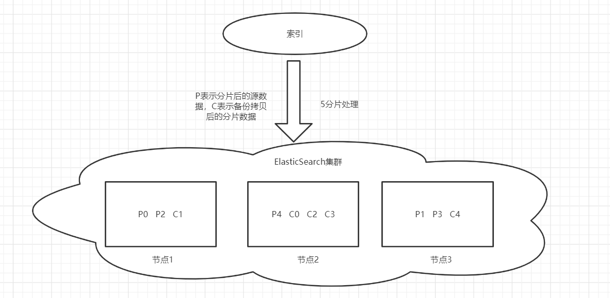
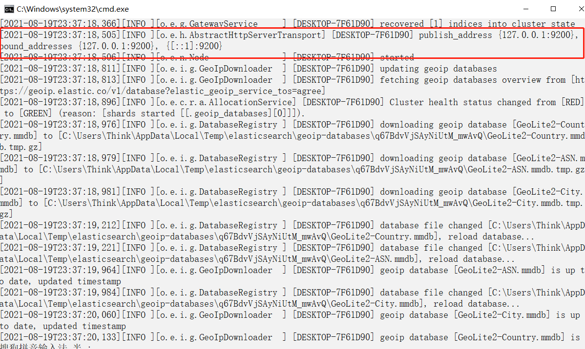
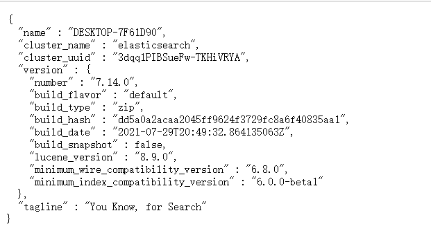
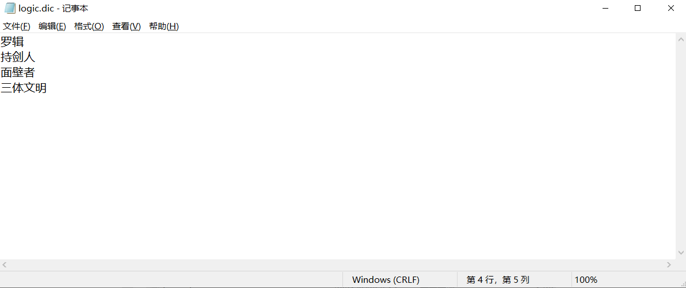
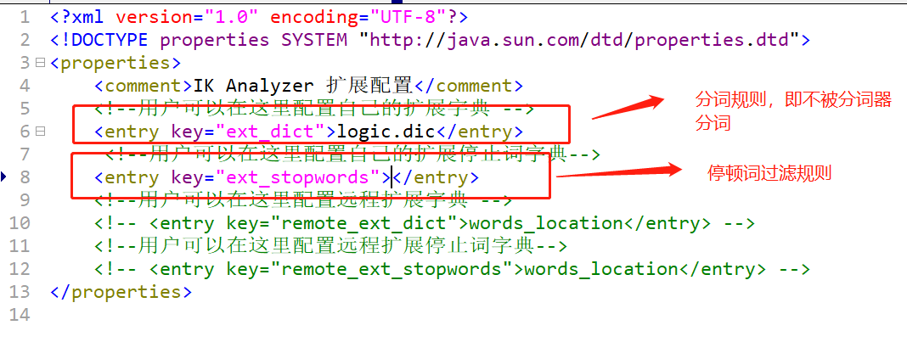
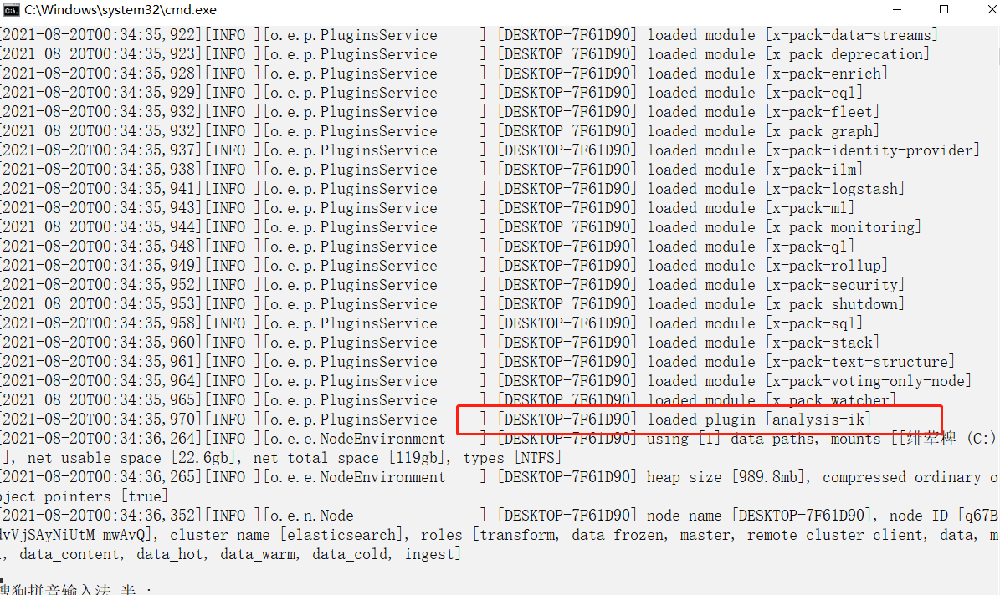
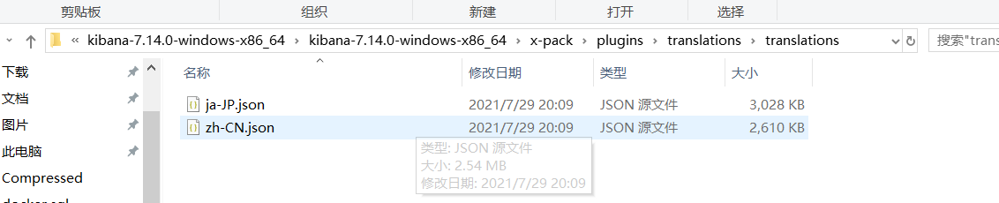
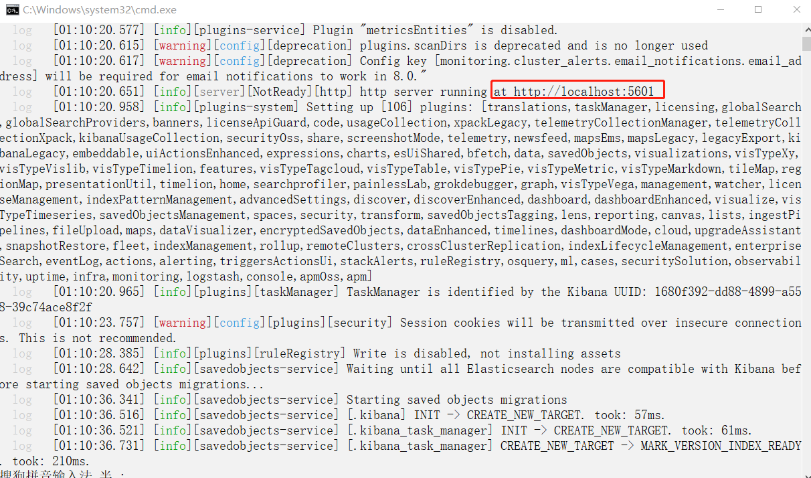
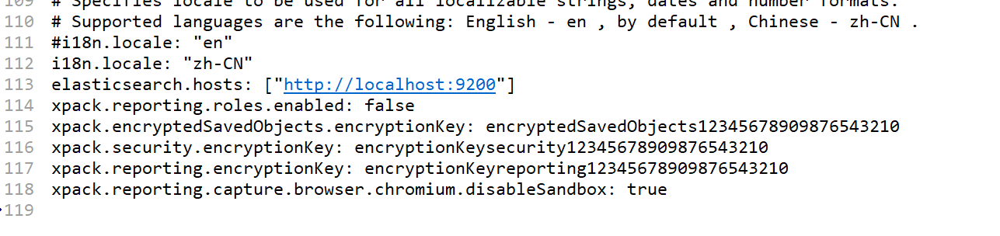
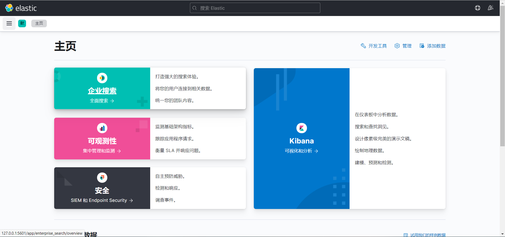

# ElasticSearch

> 这篇文章是基于狂神的ElasticSearch教程而来，B站搜索：[遇见狂神说](https://space.bilibili.com/95256449)

ElasticSearch是一个基于Lucene技术的，使用Restful web接口风格的，使用Java语言编写的分布式多用户的全文搜索引擎技术。

## 聊聊ElasticSearch的前世今生

众所周知，ElasticSearch是基于Lucene，Lucene是一个开放源代码的全文检索引擎工具包，它提供了完整的查询引擎和索引引擎，但并不是完整的一个搜索引擎，但它是搜索引擎的核心部分。并且Lucene技术源于大名鼎鼎的Doug Cutting，一位资深的全文索引/检索专家。（Doug Cutting有一种神奇的能力，那就是可以根据一篇技术论文使一项基于该技术理论的产品落地，真的是非常非常的厉害呀！）和ElasticSearch一样基于Lucene实现的搜索引擎技术还有solr（ElasticSearch的前辈）。solr是老牌的搜索引擎的技术，其社区比较活跃，并且支持的检索格式不仅仅有JSON格式，还有XML等格式，而ElasticSearch仅仅支持JSON格式（现在基本上都是JSON格式）。而且solr不仅仅支持ElasticSearch仅支持的Restful web风格的接口，还支持老式的web Service风格的接口（现在基本使用的都是restful web风格的接口了）。但由于如今的大数据时代，数据更加的庞杂且混乱，而使用solr检索数据并没有ElasticSearch那样的高效，因此在大数据环境下就显得有些捉襟见肘了。并且ElasticSearch还比solr更易上手使用。基于这点，ElasticSearch在一经推出便收获了大量的用户使用，类似于百度，淘宝，京东等大型网站都是使用它作为搜索引擎技术的核心。

## 进一步了解ElasticSearch

### 构成

ElasticSearch是由索引、类别（类别在ElasticSearch7版本中已被废弃，而在ElasticSearch8中将被彻底废除）、文档构成。

对应的其实就是MySQL中的库、表、行数据。理解起来不难。

如果是在ElasticSearch集群中，则还将涉及到ElasticSearch节点和分片的概念。在分布式集群中，每台ElasticSearch服务器都是一个节点，而每个索引都不会单独保存在一个ElasticSearch节点上，这样不安全而且太大了，因此会将一个索引分片并给每一个分片拷贝一个备份分片按照一定的容灾逻辑分别保存在不同的服务器上，使得在一台服务器宕机后不影响该索引的使用！如果根据ElasticSearch默认的5个分片，并且给该集群配置三台ElasticSearch服务器的话，那么，如下图模拟的一种节点分配分片的方式就是可以的：



ElasticSearch中还有一个十分重要的概念，那就是**倒排索引**，又称为反向索引（其实这是Lucene的特性，solr也有），这也是ElasticSearch这么快的原因之一。我们正常的生活中人的思维模式一般都是正向索引，例如通过某篇小说的名字记起该小说中的内容，但要是让你根据小说中的某个章节或者某段话来记起该小说的具体内容时，那将是比较困难的。如果有这样一篇小说，你能根据其中的文字推断出该文章的具体内容，那就可以说是在脑海中建立起了关于该文章的倒排索引了，比如我们都熟悉的一句话——你站在此处别动，待为父去给你买几个橘子。搜索引擎就是基于这样的原理实现的。但是如果所有的文字都建立一遍倒排索引的话，那也将会使用非常多的硬盘空间来存储，而我们日常生活中使用倒排索引其实并不是能够直接回忆起该文章的内容，而是先想到该文章的标题，技术也一样，如果倒排索引时value中存储的只是正向索引时的key值，那将能大大减少存储的硬盘空间，这又称之为倒排索引压缩。此处参考了搜狐上的一篇文章，详情移步[原文](https://www.sohu.com/a/306244095_463994)。

### 应用

毫无疑问，使用ElasticSearch最常用的用途就是用它实现搜索技术。但其实它还有一项重要的技术，那就是分布式日志分析（简称ELK），当然也有人称之为开源实时日志分析技术栈。它分别由三个技术开源组成：分别是Elasticsearch,logstash,kibana，先由logstash进行接收处理和转发日志操作，再由Elasticsearch给日志建立索引，最后使用kibana视图工具处理展示Elasticsearch检索日志页面。例如在分布式系统中，有着几百台服务器，那么如果一台服务器出问题了，运维人员不会一台台远程连接查看，而是通过ELK工具，检索日志出错的信息从而分析问题所在。

## 安装Elasticsearch以及其他附属工具

### 下载ElasticSearch并安装

进入ElasticSearch的[官网](https://www.elastic.co/cn/downloads/elasticsearch)，选择一个版本并下载。此处我选择的是7.14.0版本，是目前的最新版本。如果有能力翻墙，则建议翻墙下载。由于是在windows中进行ElasticSearch的学习，因此，此处下载的是windows版本。如果要在服务器上运行，则建议下载Linux版本。

下载完成后，将压缩包解压到指定的目录，并进入config目录下的elasticsearch.yml文件编辑，添加以下的跨域配置：

```yaml
http.cors.enabled: true
http.cors.allow-origin: "*"
```

这是为了之后的ElasticSearch-head和Kibana能够连接到ElasticSearch所设置的配置。进入bin目录下找到elasticsearch.bat文件，双击执行：



出现这样的页面时就说明已经启动成功了，并且日志信息中还告诉我们ElasticSearch服务器的地址是127.0.0.1:9200，注意上面有一个9300的端口，那是用于节点间通信的。当然在启动完成前日志信息中还会提示jdk的版本推荐使用jdk11，但是使用jdk8也是可以的，并且，在config目录下还有一个jvm.options文件，此处是用于调整运行ElasticSearch项目的jvm的参数的。

启动完成后，访问浏览器访问[127.0.0.1:9200]，会出现如下界面：说明启动成功。



### 下载ElasticSearch-head并安装

ElasticSearch-head是ElasticSearch的web前端工具，用于展示ElasticSearch中的数据信息或者进行相关的查询操作，但是界面不太友好且没有Kibana清晰，因此此处我们仅仅将它作为一个ElasticSearch中数据信息的概览工具。进入GitHub克隆ElasticSearch-head[项目](https://github.com/mobz/elasticsearch-head)，克隆成功后使用vscode打开，运行以下命令后启动ElasticSearch-head前端项目。

```npm
npm install
npm run start
```

启动成功后，我们访问项目的URL路径（默认端口是9100），可以见到以下界面：


由于之前我们配置了ElasticSearch，因此此时可以直接连接到我们启动的ElasticSearch服务（9200）。

### 下载ik分词器并安装

使用英文作为我们的文档语言时是不需要进行分词操作的，因为ElasticSearch中已经默认携带了对于英文单词的分词操作。但是当我们使用的文档语言是汉字的时候，就需要使用ElasticSearch的插件ik分词器来进行分词了。为什么要给文档做分词处理呢，就是上述的倒排索引的需要。而且ik分词器还支持自定义分词规则以及停顿词过滤等功能。

同理，进入GitHub下载[elasticsearch-analysis-ik项目](https://github.com/medcl/elasticsearch-analysis-ik)项目包，注意不是克隆！下载完成后解压至ElasticSearch的plugins目录，如果我们要自定义分词规则或者使用停顿词过滤，则可以进入**elasticsearch-analysis-ik**目录下的config目录找到**IKAnalyzer.cfg.xml**文件打开就可以配置了。例如，我创建了一个logic.dic的分词规则：



在config目录下创建个人的dic文件，文件中填写你想要当做词语的不分词的词语。然后再在**IKAnalyzer.cfg.xml**文件中配置，此时个人dic文件中的词语就不会被ik分词器分词了。



重启ElasticSearch服务端，看到插件ik分词器已经被加载。



### 下载Kibana并安装

我们在通过初始的Restful风格的接口测试ElasticSearch时，会使用到Kibana客户端操作，因为它显示的内容更加简洁美观清晰。Kibana是ElasticSearch所属公司的另一个开源产品，因此还是去[官网下载](https://www.elastic.co/cn/downloads/kibana)。此处，我下载的是和ElasticSearch同样的7.14.0，注意和ElasticSearch的版本要相匹配。下载后解压到你想要的放置的指定目录。

然后进入Kibana的根目录下的config目录下的kibana.yml文件编辑，将i18n的国际化默认语言配置由en改成zh-CN，这主要是将我们的Kibana启动后的页面汉化，更易于操作。国际化文件所在位置是：



修改完成后，进入bin目录双击启动Kibana.bat文件，你将会看到以下界面：



当然，如果你的启动不成功或者没反应的话，可以尝试在**kibana.yml**中进行以下配置：



```yaml
i18n.locale: "zh-CN"
elasticsearch.hosts: ["http://localhost:9200"]
xpack.reporting.roles.enabled: false
xpack.encryptedSavedObjects.encryptionKey: encryptedSavedObjects12345678909876543210
xpack.security.encryptionKey: encryptionKeysecurity12345678909876543210
xpack.reporting.encryptionKey: encryptionKeyreporting12345678909876543210
xpack.reporting.capture.browser.chromium.disableSandbox: true
```

这是我自己踩得坑，不同的人可能坑不一样。解决问题的具体参照[文章](https://www.cnblogs.com/sanduzxcvbnm/p/12677691.html)。

然后通过启动成功后命令行给出的访问端口(当然，也可以在yml文件中自己配置)，访问Kibana的web页面：



之后，我们就可以愉快的使用ElasticSearch+Kibana进行ElasticSearch 的 Restful风格的Api测试功能了。

## ElasticSearch的RestfulAPI

首先我们进入到Kibana的ElasticSearch的RestfulAPI的开发工具页面：


