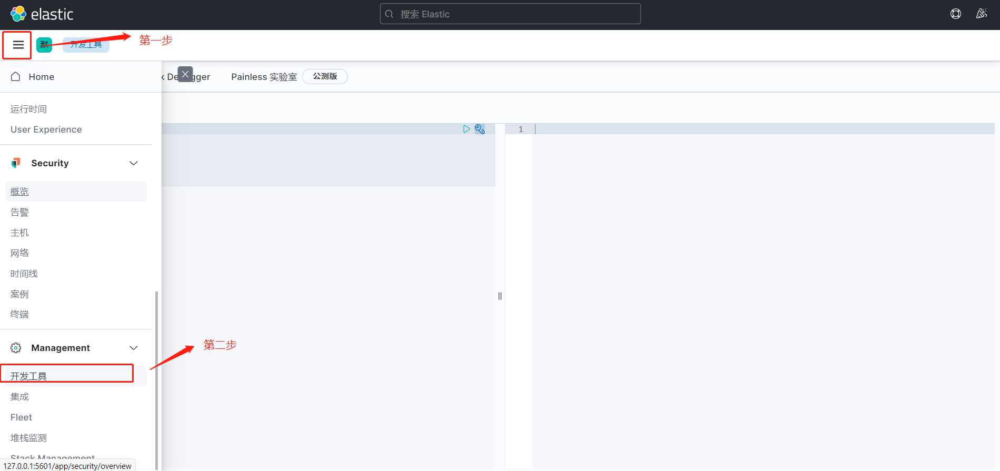

# ElasticSearch

> 这篇文章是基于狂神的ElasticSearch教程而来，B站搜索：[遇见狂神说](https://space.bilibili.com/95256449)

ElasticSearch是一个基于Lucene技术的，使用Restful web接口风格的，使用Java语言编写的分布式多用户的全文搜索引擎技术。

## 聊聊ElasticSearch的前世今生

众所周知，ElasticSearch是基于Lucene，Lucene是一个开放源代码的全文检索引擎工具包，它提供了完整的查询引擎和索引引擎，但并不是完整的一个搜索引擎，但它是搜索引擎的核心部分。并且Lucene技术源于大名鼎鼎的Doug Cutting，一位资深的全文索引/检索专家。（Doug Cutting有一种神奇的能力，那就是可以根据一篇技术论文使一项基于该技术理论的产品落地，真的是非常非常的厉害呀！）和ElasticSearch一样基于Lucene实现的搜索引擎技术还有solr（ElasticSearch的前辈）。solr是老牌的搜索引擎的技术，其社区比较活跃，并且支持的检索格式不仅仅有JSON格式，还有XML等格式，而ElasticSearch仅仅支持JSON格式（现在基本上都是JSON格式）。而且solr不仅仅支持ElasticSearch仅支持的Restful web风格的接口，还支持老式的web Service风格的接口（现在基本使用的都是restful web风格的接口了）。但由于如今的大数据时代，数据更加的庞杂且混乱，而使用solr检索数据并没有ElasticSearch那样的高效，因此在大数据环境下就显得有些捉襟见肘了。并且ElasticSearch还比solr更易上手使用。基于这点，ElasticSearch在一经推出便收获了大量的用户使用，类似于百度，淘宝，京东等大型网站都是使用它作为搜索引擎技术的核心。

## 进一步了解ElasticSearch

### 构成

ElasticSearch是由索引、类别（类别在ElasticSearch7版本中已被废弃，而在ElasticSearch8中将被彻底废除）、文档构成。

对应的其实就是MySQL中的库、表、行数据。理解起来不难。

如果是在ElasticSearch集群中，则还将涉及到ElasticSearch节点和分片的概念。在分布式集群中，每台ElasticSearch服务器都是一个节点，而每个索引都不会单独保存在一个ElasticSearch节点上，这样不安全而且太大了，因此会将一个索引分片并给每一个分片拷贝一个备份分片按照一定的容灾逻辑分别保存在不同的服务器上，使得在一台服务器宕机后不影响该索引的使用！如果根据ElasticSearch默认的5个分片，并且给该集群配置三台ElasticSearch服务器的话，那么，如下图模拟的一种节点分配分片的方式就是可以的：


ElasticSearch中还有一个十分重要的概念，那就是**倒排索引**，又称为反向索引（其实这是Lucene的特性，solr也有），这也是ElasticSearch这么快的原因之一。我们正常的生活中人的思维模式一般都是正向索引，例如通过某篇小说的名字记起该小说中的内容，但要是让你根据小说中的某个章节或者某段话来记起该小说的具体内容时，那将是比较困难的。如果有这样一篇小说，你能根据其中的文字推断出该文章的具体内容，那就可以说是在脑海中建立起了关于该文章的倒排索引了，比如我们都熟悉的一句话——你站在此处别动，待为父去给你买几个橘子。搜索引擎就是基于这样的原理实现的。但是如果所有的文字都建立一遍倒排索引的话，那也将会使用非常多的硬盘空间来存储，而我们日常生活中使用倒排索引其实并不是能够直接回忆起该文章的内容，而是先想到该文章的标题，技术也一样，如果倒排索引时value中存储的只是正向索引时的key值，那将能大大减少存储的硬盘空间，这又称之为倒排索引压缩。此处参考了搜狐上的一篇文章，详情移步[原文](https://www.sohu.com/a/306244095_463994)。

### 应用

毫无疑问，使用ElasticSearch最常用的用途就是用它实现搜索技术。但其实它还有一项重要的技术，那就是分布式日志分析（简称ELK），当然也有人称之为开源实时日志分析技术栈。它分别由三个技术开源组成：分别是Elasticsearch,logstash,kibana，先由logstash进行接收处理和转发日志操作，再由Elasticsearch给日志建立索引，最后使用kibana视图工具处理展示Elasticsearch检索日志页面。例如在分布式系统中，有着几百台服务器，那么如果一台服务器出问题了，运维人员不会一台台远程连接查看，而是通过ELK工具，检索日志出错的信息从而分析问题所在。

## 安装Elasticsearch以及其他附属工具

### 下载ElasticSearch并安装

进入ElasticSearch的[官网](https://www.elastic.co/cn/downloads/elasticsearch)，选择一个版本并下载。此处我选择的是7.14.0版本，是目前的最新版本。如果有能力翻墙，则建议翻墙下载。由于是在windows中进行ElasticSearch的学习，因此，此处下载的是windows版本。如果要在服务器上运行，则建议下载Linux版本。

下载完成后，将压缩包解压到指定的目录，并进入config目录下的elasticsearch.yml文件编辑，添加以下的跨域配置：

```yaml
http.cors.enabled: true
http.cors.allow-origin: "*"
```

这是为了之后的ElasticSearch-head和Kibana能够连接到ElasticSearch所设置的配置。进入bin目录下找到elasticsearch.bat文件，双击执行：


出现这样的页面时就说明已经启动成功了，并且日志信息中还告诉我们ElasticSearch服务器的地址是127.0.0.1:9200，注意上面有一个9300的端口，那是用于节点间通信的。当然在启动完成前日志信息中还会提示jdk的版本推荐使用jdk11，但是使用jdk8也是可以的，并且，在config目录下还有一个jvm.options文件，此处是用于调整运行ElasticSearch项目的jvm的参数的。

启动完成后，访问浏览器访问[127.0.0.1:9200]，会出现如下界面：说明启动成功。


### 下载ElasticSearch-head并安装

ElasticSearch-head是ElasticSearch的web前端工具，用于展示ElasticSearch中的数据信息或者进行相关的查询操作，但是界面不太友好且没有Kibana清晰，因此此处我们仅仅将它作为一个ElasticSearch中数据信息的概览工具。进入GitHub克隆ElasticSearch-head[项目](https://github.com/mobz/elasticsearch-head)，克隆成功后使用vscode打开，运行以下命令后启动ElasticSearch-head前端项目。

```npm
npm install
npm run start
```

启动成功后，我们访问项目的URL路径（默认端口是9100），可以见到以下界面：


由于之前我们配置了ElasticSearch，因此此时可以直接连接到我们启动的ElasticSearch服务（9200）。

### 下载ik分词器并安装

使用英文作为我们的文档语言时是不需要额外进行分词操作的，因为ElasticSearch中已经默认携带了对于英文单词的分词器操作（standard:标准分词器）。但是当我们使用的文档语言是汉字的时候，就需要使用ElasticSearch的插件ik分词器来进行分词了。为什么要给文档做分词处理呢，就是上述的倒排索引的需要。而且ik分词器还支持自定义分词规则以及停顿词过滤等功能。ik分词器对中文分词友好，支持远程词典热更新，有ik_smart（最少分词，此处会参照自定义分词规则） 、ik_max_word（最多分词） 两种分析器。

同理，进入GitHub下载[elasticsearch-analysis-ik项目](https://github.com/medcl/elasticsearch-analysis-ik)项目包，注意不是克隆！下载完成后解压至ElasticSearch的plugins目录，如果我们要自定义分词规则或者使用停顿词过滤，则可以进入**elasticsearch-analysis-ik**目录下的config目录找到**IKAnalyzer.cfg.xml**文件打开就可以配置了。例如，我创建了一个logic.dic的分词规则：


在config目录下创建个人的dic文件，文件中填写你想要当做词语的不分词的词语。然后再在**IKAnalyzer.cfg.xml**文件中配置，此时个人dic文件中的词语就不会被ik分词器分词了。


重启ElasticSearch服务端，看到插件ik分词器已经被加载。


### 下载Kibana并安装

我们在通过初始的Restful风格的接口测试ElasticSearch时，会使用到Kibana客户端操作，因为它显示的内容更加简洁美观清晰。Kibana是ElasticSearch所属公司的另一个开源产品，因此还是去[官网下载](https://www.elastic.co/cn/downloads/kibana)。此处，我下载的是和ElasticSearch同样的7.14.0，注意和ElasticSearch的版本要相匹配。下载后解压到你想要的放置的指定目录。

然后进入Kibana的根目录下的config目录下的kibana.yml文件编辑，将i18n的国际化默认语言配置由en改成zh-CN，这主要是将我们的Kibana启动后的页面汉化，更易于操作。国际化文件所在位置是：


修改完成后，进入bin目录双击启动Kibana.bat文件，你将会看到以下界面：


当然，如果你的启动不成功或者没反应的话，可以尝试在**kibana.yml**中进行以下配置：


```yaml
i18n.locale: "zh-CN"
elasticsearch.hosts: ["http://localhost:9200"]
xpack.reporting.roles.enabled: false
xpack.encryptedSavedObjects.encryptionKey: encryptedSavedObjects12345678909876543210
xpack.security.encryptionKey: encryptionKeysecurity12345678909876543210
xpack.reporting.encryptionKey: encryptionKeyreporting12345678909876543210
xpack.reporting.capture.browser.chromium.disableSandbox: true
```

这是我自己踩得坑，不同的人可能坑不一样。解决问题的具体参照[文章](https://www.cnblogs.com/sanduzxcvbnm/p/12677691.html)。

然后通过启动成功后命令行给出的访问端口(当然，也可以在yml文件中自己配置)，访问Kibana的web页面：


之后，我们就可以愉快的使用ElasticSearch+Kibana进行ElasticSearch 的 Restful风格的Api测试功能了。

## ElasticSearch的RestfulAPI

首先我们进入到Kibana的ElasticSearch的RestfulAPI的开发工具页面：



准备开始测试ElasticSearch的RestfulAPI。

### PUT

PUT API是用于向ElasticSearch中放置索引数据的，我们在此处调用时会指定将type类型的参数设置为"\_doc"，这是ElasticSearch中默认的type类型，当我们使用java语言调用ElasticSearch的Restful API时，可不传type类型就是因为ElasticSearch中默认的type类型就是"\_doc"。

记录不存在就是创建, 否则是全量替换。

```json
PUT /index/type/id  
{
	"属性名" : "value"
	...
}
```

创建操作：


全量替换修改操作：


何为全量修改呢，比如如果PUT已存在文档时其中的一个属性值age没有设置值，则原先文档中的age值会被置空。PUT只是最初的ElasticSearch文档创建的Restful API，它的升级版本是POST API。**注意**，如果想要创建索引以及其中的文档规则，则只能使用PUT API操作。

### POST

POST API同样也是向ElasticSearch中存放文档数据，PUT API有的功能它都有。因此又称之为PUT API升级版本。相同功能演示：


进入ElasticSearch-head前端界面，发现age数据已经在更新时被全量替换了：


除此之外，POST API还可以进行局部更新和自动给id设置uuid操作。

当POST的文档已经存在，但在POST时添加了"/\_update"的命令时，并且使用doc属性包裹要更新的值时，会进行局部更新操作，即只会将我们设置的值进行更新操作，当然，此处操作的前提是将原来创建的数据恢复上再操作：


当我们PUT值时不指定文档ID时，则会默认进行文档的created操作，Kibana系统会自动给我们设置一个uuid作为Id:


### DELETE

DELETE API是用于删除ElasticSearch中数据的API，如果删除的仅仅是文档，那么其实该命令并不会进行物理意义上的删除，而只是逻辑删除，随着不断的索引更多的数据,*Elasticsearch* 将会在后台清理标记为已**删除**的文档。而如果删除的是一个完整的索引，那么则会将该索引下的数据全部物理删除。

### GET

GET API用于查询ElasticSearch中的文档数据。

普通简单查询：


条件查询第一种方式(这种方式较为简单，很多查询，例如term精确查询将很难操作)：


条件查询的第二种方式(这种查询方式非常的强大，通常复杂查询会使用它，结构化查询（DSL）常用)：


### GET复杂查询

一般而言，Get复杂查询指的就是结构化查询（DSL）。

使用"\_source"对查询结果显示的属性进行过滤：


使用sort对指定的属性进行自定义的排序规则查询：


使用"from"，"size"进行分页查询（当然也可以使用/search/{current}/{pagesize}的url方式进行查询）：


使用bool操作进行精确查询(相当于条件连接符)：

must查询(相当于AND)：


should查询(相当于OR)：


使用Filter设置查询的过滤条件（此处可以不加filter直接使用range查询）：


#### match查询和term查询

> 参考文章：[链接](https://www.jianshu.com/p/1ad810427783)
>
> 原作者：双子孤狼

查看分词操作语法：

```api
GET _analyze
{
  "analyzer": "ik_smart",   #分词(此处可称为分析器)器选择  常用的有standard【标准分词器】、两个ik分词器：ik_smart【最小分词，搭配自定义分词规则使用】、ik_max_word【最大分词操作】
  "text":"Look JetBrains"  # 要查看分词操作的数据
}
```

此处需要注意到的一点是，如果使用的是大写的英文单词，但是分词器(几乎所有的分词器)都会将单词分词成小写的英文单词。

首先我们需要了解的是：使用match时会对查询条件使用分词器解析，而使用term时则不会，而是会进行精确匹配查询。什么意思呢？

在说明该问题前，我们需要明白文档的倒排索引是在什么时候创建的。

在创建倒排索引之前，我们需要建立的是存入文档的各个属性值的分词规则，倒排索引的创建其实依照的是文档属性值的分词处理，每多一个新分词其实就是通过算法向倒排索引库中添加了一个新的倒排索引。因此，可以这样理解，其实文档属性值的分词规则就是倒排索引的添加规则。因此，我们需要使用PUT API创建一个具有自定义文档规则的索引，如果不创建索引直接添加文档数据，则会默认将文档属性的type类型默认为"text"类型，而且还会将标准分词器(standard)作为默认的analyzer(分词器)。而且我们需要注意的一点是一旦我们使用的是大写的英文单词建立的倒排索引，那么倒排索引中其实存储的是小写的单词。

例如，我们可以这样创建一个具有自定义文档规则的索引：


此处，我使用的是ik分词器中的**ik_smart**分词器规则，因为使用该规则会使用到之前定义的自定义ik分词规则，而倒排索引其实就是在我们正式向索引中添加文档数据时根据文档属性值的分词结果生成的。

match 查询是执行全文搜索的标准查询，包括模糊匹配选项。使用match时会对查询的条件进行分词处理，并且使用的是默认的**标准分词器(standard)**，标准分词器会将汉字全部划分成单个汉字、将英语按照单词划分、将数字按照整体划分，然后根据划分结果去倒排索引中检索匹配的索引，将匹配到的倒排索引取**并集**就是match查询的结果。

match模糊查询：


Term 查询一般表达的是最小单位查询，也就是说对我们传入的查询关键词会作为一个整体进行查询，是**不会**进行分词处理的，而是直接去倒排索引库中进行完整查询数据的匹配搜索。

term模糊查询：


通过以上的测试，我们明白，其实查询的本质就是去倒排索引库中找查询条件而已，但是match会将查询条件做分词处理（分词会对查询条件处理，可能变成多个查询条件），然后将查询结果取并集；而term则是不会将查询条件做分词处理（写的啥查询条件就是啥，只有一个查询条件）。因此分词器的选择是尤为重要的。回过头来看，当我们使用大写的英文单词向文档中添加数据时，其实实际上ElasticSearch为我们存储的是小写单词的倒排索引，因此当我们使用大写的单词再去充当term查询的查询条件时，查不到是正常的，因为倒排索引中存储的就只是小写单词而已。match之所以能查到，是因为大写单词是经过一次分词处理后，再将分词的结果作为查询条件（此时单词已经变成了小写）所以才能查询到！

#### 高亮查询

高亮查询操作是我们在逛网站时的一个搜索现象，即为我们搜索条件匹配到的倒排索引在搜索列表中以着重色调标明显示。它是帮助搜索者快速看清搜索项是否满足搜索者搜索需求的一种查询方式。注意：fields这边的属性设置要和查询条件保持一致，否则将无法获得highlight数据。


## ElasticSearch整合springboot

在日常的工作使用中，会将ElasticSearch与SpringBoot进行整合。整合也十分的简单：

1、导入maven依赖

```pom
<?xml version="1.0" encoding="UTF-8"?>
<project xmlns="http://maven.apache.org/POM/4.0.0" xmlns:xsi="http://www.w3.org/2001/XMLSchema-instance"
         xsi:schemaLocation="http://maven.apache.org/POM/4.0.0 https://maven.apache.org/xsd/maven-4.0.0.xsd">
    <modelVersion>4.0.0</modelVersion>
    <groupId>com.logic</groupId>
    <artifactId>elasticsearch_springboot</artifactId>
    <version>0.0.1-SNAPSHOT</version>
    <name>elasticsearch_springboot</name>
    <description>Demo project for Spring Boot</description>

    <properties>
        <java.version>1.8</java.version>
        <project.build.sourceEncoding>UTF-8</project.build.sourceEncoding>
        <project.reporting.outputEncoding>UTF-8</project.reporting.outputEncoding>
        <spring-boot.version>2.3.7.RELEASE</spring-boot.version>
    </properties>

    <dependencies>
        <!-- https://mvnrepository.com/artifact/com.alibaba/fastjson -->
        <dependency>
            <groupId>com.alibaba</groupId>
            <artifactId>fastjson</artifactId>
            <version>1.2.75</version>
        </dependency>
        <dependency>
            <groupId>org.springframework.boot</groupId>
            <artifactId>spring-boot-starter-data-elasticsearch</artifactId>
        </dependency>
        <dependency>
            <groupId>org.springframework.boot</groupId>
            <artifactId>spring-boot-starter-web</artifactId>
        </dependency>

        <dependency>
            <groupId>org.springframework.boot</groupId>
            <artifactId>spring-boot-devtools</artifactId>
            <scope>runtime</scope>
            <optional>true</optional>
        </dependency>
        <dependency>
            <groupId>com.taobao.arthas</groupId>
            <artifactId>arthas-spring-boot-starter</artifactId>
            <version>3.4.8</version>
            <scope>runtime</scope>
        </dependency>
        <dependency>
            <groupId>org.springframework.boot</groupId>
            <artifactId>spring-boot-configuration-processor</artifactId>
            <optional>true</optional>
        </dependency>
        <dependency>
            <groupId>org.projectlombok</groupId>
            <artifactId>lombok</artifactId>
            <optional>true</optional>
        </dependency>
        <dependency>
            <groupId>org.springframework.boot</groupId>
            <artifactId>spring-boot-starter-test</artifactId>
            <scope>test</scope>
            <exclusions>
                <exclusion>
                    <groupId>org.junit.vintage</groupId>
                    <artifactId>junit-vintage-engine</artifactId>
                </exclusion>
            </exclusions>
        </dependency>
    </dependencies>

    <dependencyManagement>
        <dependencies>
            <dependency>
                <groupId>org.springframework.boot</groupId>
                <artifactId>spring-boot-dependencies</artifactId>
                <version>${spring-boot.version}</version>
                <type>pom</type>
                <scope>import</scope>
            </dependency>
        </dependencies>
    </dependencyManagement>

    <build>
        <plugins>
            <plugin>
                <groupId>org.apache.maven.plugins</groupId>
                <artifactId>maven-compiler-plugin</artifactId>
                <version>3.8.1</version>
                <configuration>
                    <source>1.8</source>
                    <target>1.8</target>
                    <encoding>UTF-8</encoding>
                </configuration>
            </plugin>
            <plugin>
                <groupId>org.springframework.boot</groupId>
                <artifactId>spring-boot-maven-plugin</artifactId>
                <version>2.3.7.RELEASE</version>
                <configuration>
                    <mainClass>com.logic.ElasticsearchSpringbootApplication</mainClass>
                </configuration>
                <executions>
                    <execution>
                        <id>repackage</id>
                        <goals>
                            <goal>repackage</goal>
                        </goals>
                    </execution>
                </executions>
            </plugin>
        </plugins>
    </build>

</project>
```

需要注意的一点是，此时ElasticSearch client的版本问题，我们要尽量保证客户端和服务器的版本一致，否则可能会出些许问题。此处可以在当前的pom文件的properties标签中通过**<elasticsearch.version>7.14.0</elasticsearch.version>**命令更改ElasticSearch的版本信息，如果更改不生效，则进入**spring-boot-dependencies**的pom依赖文件再次更改即可。

2、编写ElasticSearch的配置类，自己定义连接客户端的方式和数量，此处我使用的是**RestHighLevel**风格，并且连接数量只有一个。

```java
@Configuration
public class ElasticSearchClientConfig {
	@Bean
	public RestHighLevelClient restHighLevelClient() {
		RestHighLevelClient restHighLevelClient = new RestHighLevelClient(RestClient.builder(new HttpHost("localhost", 9200, "http")));
		return restHighLevelClient;
	}
}
```

3、编写一个user的实体类，包含name和age属性，然后进行ElasticSearch客户端的连接测试

```java
@SpringBootTest
class ElasticsearchSpringbootApplicationTests {

	@Autowired
	@Qualifier("restHighLevelClient")
	private RestHighLevelClient client;
	@Test
	void testCreateIndex() throws IOException {
		//创建索引请求
		CreateIndexRequest request = new CreateIndexRequest("logic_springboot");
		//客户端执行请求 indices是index的复数 通过elasticsearch的连接对象请求创建索引后获得响应
		CreateIndexResponse createIndexResponse = client.indices().create(request, RequestOptions.DEFAULT);
		System.out.println(createIndexResponse.index());
	}

	@Test
	void testIsExistIndex() throws IOException {
		//获得索引是否存在请求
		GetIndexRequest request = new GetIndexRequest("logic_springboot");
		boolean exists = client.indices().exists(request, RequestOptions.DEFAULT);
		System.out.println(exists);
	}

	@Test
	void testDelIndex() throws IOException{
		//删除索引请求
		DeleteIndexRequest request = new DeleteIndexRequest("logic_springboot");
		AcknowledgedResponse delete = client.indices().delete(request, RequestOptions.DEFAULT);
		System.out.println(delete.isAcknowledged());
	}

	@Test
	void testAddDocument() throws IOException{
		//增加索引文档 添加文档前记得先创建该索引
		IndexRequest request = new IndexRequest("logic_springboot");
		User user = new User("zc", 23);
		//设置存入文档的ID数据 相当于logic_springboot/_doc/1
		request.id("1");
		request.timeout(TimeValue.timeValueSeconds(1));
		//或者使用以下方式设置过期时间
		request.timeout("1s");
		//将数据以JSON字符串格式放入请求体中
		request.source(JSON.toJSONString(user), XContentType.JSON);
		//客户端发起创建索引文档的请求
		IndexResponse index = client.index(request, RequestOptions.DEFAULT);
		System.out.println(index.toString());
		System.out.println(index.status());
	}

	@Test
	void testIsExistDocument() throws IOException {
		//判断是否存在查询的文档
		GetRequest request = new GetRequest("logic_springboot", "1");
		//不获取source的上下文 使得效率更高
		request.fetchSourceContext(new FetchSourceContext(false));
		//设置不存储属性值
		request.storedFields("_none_");
		System.out.println(client.exists(request, RequestOptions.DEFAULT));
	}

	@Test
	void testGetDocument() throws IOException{
		//获得指定文档的数据信息
		GetRequest request = new GetRequest("logic_springboot", "1");
		GetResponse documentFields = client.get(request, RequestOptions.DEFAULT);
		System.out.println(documentFields.getSourceAsString());
		System.out.println(documentFields);
	}

	@Test
	void testUpdateDocument() throws IOException{
		//更新文档的数据信息
		UpdateRequest request = new UpdateRequest("logic_springboot", "1");
		request.timeout("1s");
		//更新的数据
		User user = new User("testUpdate", 3);
		//设置更新数据
		request.doc(JSON.toJSONString(user), XContentType.JSON);
		UpdateResponse update = client.update(request, RequestOptions.DEFAULT);
		System.out.println(update.status());
		System.out.println(update);
	}

	@Test
	void testDelDocument() throws IOException{
		//删除文档数据信息
		DeleteRequest request = new DeleteRequest("logic_springboot", "1");
		request.timeout("1s");
		DeleteResponse delete = client.delete(request, RequestOptions.DEFAULT);
		System.out.println(delete.status());
	}

	@Test
	void testBulkAddRequest() throws IOException {
		BulkRequest request = new BulkRequest();
		List<User> users = new ArrayList<>();
		users.add(new User("logic01", 1));
		users.add(new User("logic02", 2));
		users.add(new User("logic03", 3));
		users.add(new User("logic04", 4));
		users.add(new User("logic05", 5));
		users.add(new User("logic06", 6));
		request.timeout("5s");
		//批处理请求
		users.forEach(ele->{
			request.add(new IndexRequest("logic_springboot").id(String.valueOf(ele.getAge())).source(JSON.toJSONString(ele), XContentType.JSON));
		});
		BulkResponse bulk = client.bulk(request, RequestOptions.DEFAULT);
		System.out.println(bulk);
		System.out.println(bulk.hasFailures());
	}
	@Test
	void testSearch() throws IOException {
		//高级查询
		SearchRequest request = new SearchRequest("logic_springboot");
		//构建搜索条件 既是相当于结构化查询（DSL）
		SearchSourceBuilder searchSourceBuilder = new SearchSourceBuilder();
		//构建各个子查询的构建器 然后按照结构化查询的JSON结构进行套娃即可
		//通过QueryBuilders来构建查询条件
		TermQueryBuilder termQueryBuilder = QueryBuilders.termQuery("name", "logic01");
		searchSourceBuilder.query(termQueryBuilder);
		//超时时间
		searchSourceBuilder.timeout(new TimeValue(60, TimeUnit.SECONDS));
		request.source(searchSourceBuilder);
		SearchResponse search = client.search(request, RequestOptions.DEFAULT);
		System.out.println(JSON.toJSONString(search.getHits()));
		System.out.println(search.toString());
	}
}
```

## Jsoup+ElasticSearch

Jsoup是一个很好用的java爬虫，使用Jsoup的方式也很简单，导入maven依赖后直接使用即可。

同时此处也需要使用到阿里巴巴的fastjson依赖用于存储ElasticSearch数据时通过JSON转换工具转换成字符串。但是在使用时尤其需要注意一点，那就是在使用fastjson时，不能使用lombok对对象进行可链式化编程的注解，否则可能出现在使用fastjson将对象转成json格式的字符串时出现转换成空JSON字符串的情况发生。

1、导入maven依赖

```pom
<?xml version="1.0" encoding="UTF-8"?>
<project xmlns="http://maven.apache.org/POM/4.0.0" xmlns:xsi="http://www.w3.org/2001/XMLSchema-instance"
         xsi:schemaLocation="http://maven.apache.org/POM/4.0.0 https://maven.apache.org/xsd/maven-4.0.0.xsd">
    <modelVersion>4.0.0</modelVersion>
    <groupId>com.logic</groupId>
    <artifactId>jsoup_es_jd</artifactId>
    <version>0.0.1-SNAPSHOT</version>
    <name>jsoup_es_jd</name>
    <description>Demo project for Spring Boot</description>

    <properties>
        <java.version>1.8</java.version>
        <project.build.sourceEncoding>UTF-8</project.build.sourceEncoding>
        <project.reporting.outputEncoding>UTF-8</project.reporting.outputEncoding>
        <spring-boot.version>2.3.7.RELEASE</spring-boot.version>
    </properties>

    <dependencies>
        <dependency>
            <groupId>org.springframework.boot</groupId>
            <artifactId>spring-boot-starter-thymeleaf</artifactId>
        </dependency>
        <!-- https://mvnrepository.com/artifact/org.jsoup/jsoup -->
        <dependency>
            <groupId>org.jsoup</groupId>
            <artifactId>jsoup</artifactId>
            <version>1.14.2</version>
        </dependency>

        <!-- https://mvnrepository.com/artifact/com.alibaba/fastjson -->
        <dependency>
            <groupId>com.alibaba</groupId>
            <artifactId>fastjson</artifactId>
            <version>1.2.75</version>
        </dependency>
        <dependency>
            <groupId>org.springframework.boot</groupId>
            <artifactId>spring-boot-starter-data-elasticsearch</artifactId>
        </dependency>
        <dependency>
            <groupId>org.springframework.boot</groupId>
            <artifactId>spring-boot-starter-web</artifactId>
        </dependency>

        <dependency>
            <groupId>org.springframework.boot</groupId>
            <artifactId>spring-boot-devtools</artifactId>
            <scope>runtime</scope>
            <optional>true</optional>
        </dependency>
        <dependency>
            <groupId>com.taobao.arthas</groupId>
            <artifactId>arthas-spring-boot-starter</artifactId>
            <version>3.4.8</version>
            <scope>runtime</scope>
        </dependency>
        <dependency>
            <groupId>org.springframework.boot</groupId>
            <artifactId>spring-boot-configuration-processor</artifactId>
            <optional>true</optional>
        </dependency>
        <dependency>
            <groupId>org.projectlombok</groupId>
            <artifactId>lombok</artifactId>
            <optional>true</optional>
        </dependency>
        <dependency>
            <groupId>org.springframework.boot</groupId>
            <artifactId>spring-boot-starter-test</artifactId>
            <scope>test</scope>
            <exclusions>
                <exclusion>
                    <groupId>org.junit.vintage</groupId>
                    <artifactId>junit-vintage-engine</artifactId>
                </exclusion>
            </exclusions>
        </dependency>
    </dependencies>

    <dependencyManagement>
        <dependencies>
            <dependency>
                <groupId>org.springframework.boot</groupId>
                <artifactId>spring-boot-dependencies</artifactId>
                <version>${spring-boot.version}</version>
                <type>pom</type>
                <scope>import</scope>
            </dependency>
        </dependencies>
    </dependencyManagement>

    <build>
        <plugins>
            <plugin>
                <groupId>org.apache.maven.plugins</groupId>
                <artifactId>maven-compiler-plugin</artifactId>
                <version>3.8.1</version>
                <configuration>
                    <source>1.8</source>
                    <target>1.8</target>
                    <encoding>UTF-8</encoding>
                </configuration>
            </plugin>
            <plugin>
                <groupId>org.springframework.boot</groupId>
                <artifactId>spring-boot-maven-plugin</artifactId>
                <version>2.3.7.RELEASE</version>
                <configuration>
                    <mainClass>com.logic.JsoupEsJdApplication</mainClass>
                </configuration>
                <executions>
                    <execution>
                        <id>repackage</id>
                        <goals>
                            <goal>repackage</goal>
                        </goals>
                    </execution>
                </executions>
            </plugin>
        </plugins>
    </build>

</project>
```

2、编写ElasticSearch客户端配置

```java
@Configuration
public class ElasticSearchClientConfig {
	@Bean
	public RestHighLevelClient restHighLevelClient() {
		RestHighLevelClient restHighLevelClient = new RestHighLevelClient(RestClient.builder(new HttpHost("localhost", 9200, "http")));
		return restHighLevelClient;
	}
}
```

3、编写服务端

```java
@Service
public class ElasticSearchServiceImpl implements ElasticSearchService {
	@Autowired
	@Qualifier("restHighLevelClient")
	private RestHighLevelClient client;

	@Override
	public boolean parseJDGoods(String goodName) {
		String url = "https://search.jd.com/Search?keyword=" + goodName + "&enc=utf-8&suggest=1.his.0" +
				".0&wq=&pvid=dcf6be638f044edd9d06abffedf1cd6a";
		Document document = null;
		try {
			document = Jsoup.connect(url)
					.userAgent("Mozilla/5.0 (Windows NT 10.0; Win64; x64) AppleWebKit/537.36 (KHTML, like Gecko) Chrome/92.0.4515.159 Safari/537.36 Edg/92.0.902.78")
					.timeout(5000)  //设置超时时间 设置过短可能爬取不到数据
					.get();
		} catch (IOException e) {
			e.printStackTrace();
		}
		Elements elements = document.select(".gl-i-wrap");
		List<Product> products = new ArrayList<>();
		elements.forEach(element -> {
			Product product = new Product();
			product.setImgUrl(element.select("img").get(0).attr("data-lazy-img"));
			product.setTitle(element.select(".p-name").select("em").select("font").text() + element.select(".p-name").select("em").text());
			product.setPrice(Double.valueOf(element.select(".p-price").select("i").text()));
			products.add(product);
		});
		BulkRequest request = new BulkRequest();
		request.timeout("2m");
		for (int i = 0; i < products.size(); i++) {
			request.add(new IndexRequest("jd_goods").source(JSON.toJSONString(products.get(i)),
					XContentType.JSON));
		}
		BulkResponse bulk = null;
		try {
			bulk = client.bulk(request, RequestOptions.DEFAULT);
		} catch (IOException e) {
			e.printStackTrace();
		}
		return products.isEmpty() && !bulk.hasFailures() ? false : true;
	}

	@Override
	public List<Map<String,Object>> queryAllProducts(String keyword, int pageNo, int pageSize) {
		if (pageNo < 1) {
			pageNo = 1;
		}
		//条件搜索
		SearchRequest request = new SearchRequest("jd_goods");
		SearchSourceBuilder searchSourceBuilder = new SearchSourceBuilder();
		//分页
		searchSourceBuilder.from(pageNo);
		searchSourceBuilder.size(pageSize);
		//精准匹配
		TermQueryBuilder title = QueryBuilders.termQuery("title", keyword);
		searchSourceBuilder.query(title);
		searchSourceBuilder.timeout(new TimeValue(20, TimeUnit.SECONDS));
		//高亮查询
		HighlightBuilder highlightBuilder = new HighlightBuilder();
		highlightBuilder.requireFieldMatch(true);  //如果要多个字段高亮,这项要为false，前提是设置多个属性高亮 为true则表示只有第一个匹配到该文档数据的高亮字符才会高亮
		highlightBuilder.field("title");  //高亮的位置
		highlightBuilder.preTags("<span style='color:red'>");
		highlightBuilder.postTags("</span>");
		searchSourceBuilder.highlighter(highlightBuilder);
		//执行搜索
		request.source(searchSourceBuilder);
		SearchResponse search = null;
		try {
			search = client.search(request, RequestOptions.DEFAULT);
		} catch (IOException e) {
			e.printStackTrace();
		}
		//解析结果
		List<Map<String,Object>> products = new ArrayList<>();
		for (SearchHit hit : search.getHits().getHits()) {
			Map<String, HighlightField> highlightFields = hit.getHighlightFields();
			HighlightField titleHighLight = highlightFields.get("title");
			Map<String, Object> sourceAsMap = hit.getSourceAsMap();
			//解析高亮字段
			if (titleHighLight != null) {
				//由于现在高亮字段还不是字符串格式 需要转换
				Text[] fragments = titleHighLight.getFragments();
				StringBuffer titleBuffer = new StringBuffer();
				for (Text fragment : fragments) {
					titleBuffer.append(fragment);
				}
				sourceAsMap.put("title", titleBuffer);
			}
			products.add(sourceAsMap);
		}
		return products;
	}
}
```

4、编写controller层供前端调用

```java
@RestController
public class ElasticSearchController {
	@Autowired
	private ElasticSearchServiceImpl elasticSearchService;

	/**
	 * 解析需要爬取的京东商城数据
	 * @param goodName 商品名称
	 * @return
	 */
	@RequestMapping("/parse/{goodName}")
	public String parseGood(@PathVariable("goodName") String goodName) {
		if (goodName.isEmpty()) {
			return "请勿传空的解析值！";
		} else {
			boolean b = elasticSearchService.parseJDGoods(goodName);
			return b ? "解析成功！" : "解析失败！";
		}
	}

	/**
	 * 使用ElasticSearch对爬取的商品进行查询
	 * @param keyword 查询关键词
	 * @param pageNo 开始的数据序位 Index
	 * @param pageSize 每页大小
	 * @return
	 */
	@RequestMapping("/search/{keyword}/{pageNo}/{pageSize}")
	public List<Map<String, Object>> parseGood(@PathVariable("keyword") String keyword, @PathVariable("pageNo") int pageNo, @PathVariable(
			"pageSize") int pageSize) {
		return elasticSearchService.queryAllProducts(keyword, pageNo, pageSize);
	}
}
```

5、导入css、js、images等相关静态资源依赖。


6、编写前端html代码

```html
<!DOCTYPE html>
<html xmlns:th="http://www.thymeleaf.org">

<head>
    <meta charset="utf-8"/>
    <title>狂神说Java-ES仿京东实战</title>
    <link rel="stylesheet" th:href="@{/css/style.css}"/>
    <script th:src="@{/js/jquery.min.js}"></script>
</head>

<body class="pg">
<div class="page" id="app">
    <div id="mallPage" class=" mallist tmall- page-not-market ">

        <!-- 头部搜索 -->
        <div id="header" class=" header-list-app">
            <div class="headerLayout">
                <div class="headerCon ">
                    <!-- Logo-->
                    <h1 id="mallLogo">
                        
                    </h1>

                    <div class="header-extra">

                        <!--搜索-->
                        <div id="mallSearch" class="mall-search">
                            <form name="searchTop" class="mallSearch-form clearfix">
                                <fieldset>
                                    <legend>天猫搜索</legend>
                                    <div class="mallSearch-input clearfix">
                                        <div class="s-combobox" id="s-combobox-685">
                                            <div class="s-combobox-input-wrap">
                                                <input v-model="keyword" type="text" autocomplete="off" value="dd"
                                                       id="mq"
                                                       class="s-combobox-input" aria-haspopup="true">
                                            </div>
                                        </div>
                                        <button type="submit" @click.prevent="searchKey" id="searchbtn">搜索</button>
                                    </div>
                                </fieldset>
                            </form>
                            <ul class="relKeyTop">
                                <li><a>狂神说Java</a></li>
                                <li><a>狂神说前端</a></li>
                                <li><a>狂神说Linux</a></li>
                                <li><a>狂神说大数据</a></li>
                                <li><a>狂神聊理财</a></li>
                            </ul>
                        </div>
                    </div>
                </div>
            </div>
        </div>

        <!-- 商品详情页面 -->
        <div id="content">
            <div class="main">
                <!-- 品牌分类 -->
                <form class="navAttrsForm">
                    <div class="attrs j_NavAttrs" style="display:block">
                        <div class="brandAttr j_nav_brand">
                            <div class="j_Brand attr">
                                <div class="attrKey">
                                    品牌
                                </div>
                                <div class="attrValues">
                                    <ul class="av-collapse row-2">
                                        <li><a href="#"> 狂神说 </a></li>
                                        <li><a href="#"> Java </a></li>
                                    </ul>
                                </div>
                            </div>
                        </div>
                    </div>
                </form>

                <!-- 排序规则 -->
                <div class="filter clearfix">
                    <a class="fSort fSort-cur">综合<i class="f-ico-arrow-d"></i></a>
                    <a class="fSort">人气<i class="f-ico-arrow-d"></i></a>
                    <a class="fSort">新品<i class="f-ico-arrow-d"></i></a>
                    <a class="fSort">销量<i class="f-ico-arrow-d"></i></a>
                    <a class="fSort">价格<i class="f-ico-triangle-mt"></i><i class="f-ico-triangle-mb"></i></a>
                </div>

                <!-- 商品详情 -->
                <div class="view grid-nosku">

                    <div class="product" v-for="(item,i) in result">
                        <div class="product-iWrap">
                            <!--商品封面-->
                            <div class="productImg-wrap">
                                <a class="productImg">
                                    
                                </a>
                            </div>
                            <!--价格-->
                            <p class="productPrice">
                                <em><b>¥</b>{{item.price}}</em>
                            </p>
                            <!--标题-->
                            <p class="productTitle">
                                <a v-html="item.title"></a>
                            </p>
                            <!-- 店铺名 -->
                            <div class="productShop">
                                <span>店铺： 狂神说Java </span>
                            </div>
                            <!-- 成交信息 -->
                            <p class="productStatus">
                                <span>月成交<em>999笔</em></span>
                                <span>评价 <a>3</a></span>
                            </p>
                        </div>
                    </div>
                </div>
            </div>
        </div>
    </div>
</div>
<script th:src="@{/js/vue.min.js}"></script>
<script th:src="@{/js/axios.min.js}"></script>
<script>
    new Vue({
        el: "#app",
        data:{
            keyword:'',  //搜索的关键字
            result:[]   //搜索的结果
        },
        methods:{
            searchKey() {
                console.log(this.keyword);
                axios.get("search/"+this.keyword+"/1/10").then(response=>{
                    this.result = response.data;   //绑定数据
                })

            }
        }
    })
</script>

</body>
</html>
```

7、启动springboot项目，进行测试。

先爬取京东商城数据并存入ElasticSearch服务：


再通过写好的前端页面查询ElasticSearch服务中的数据并显示：


