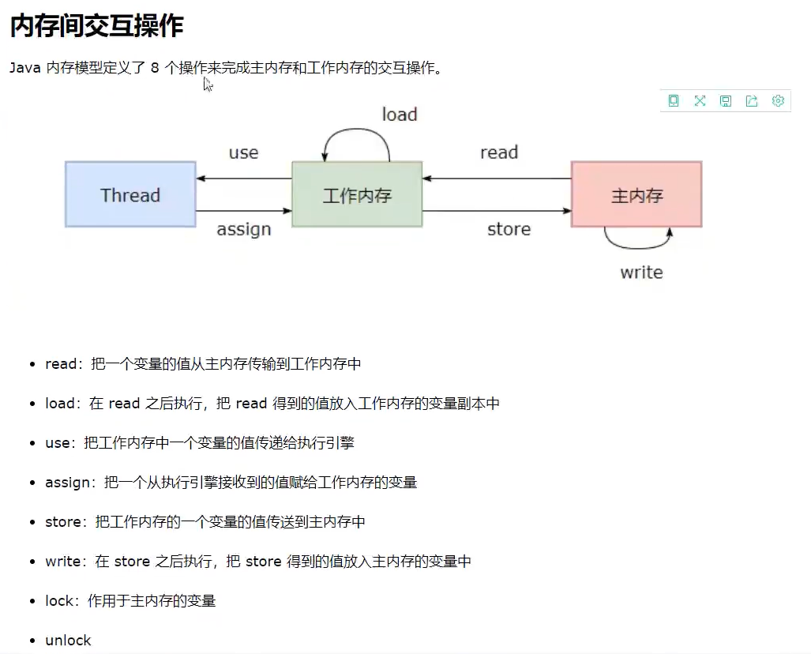

# JVM 

有关JVM的学习来源于狂神以及github 的JVM文档 其中有些理解的不够全面的地方 具体的详细JVM理解请参照<https://doocs.github.io/jvm>

JVM有称为java虚拟机，是java程序运行的环境基础 JVM有着不同的版本 常用的是Java HotSpot(TM)，这是Sun公司旗下的一款用户量最高的JVM虚拟机 除此之外还有Oracle和IBM的Java虚拟机

## 栈内存分析

喝多了吐是栈，吃多了拉是队列(恶心但好记)
每个线程都会创建各自的线程栈，该栈内存中存放的是该线程中的（8大基本数据类型+对象应用+实例的方法），主管该线程程序的运行，栈内存的生命周期和线程同步线程结束 栈内存释放；栈内存释放 线程程序结束对于栈而言 不存在垃圾回收机制 要用直接压栈 用完直接出栈

## 堆内存分析

### 堆的定义
堆是用来存放对象的内存空间，几乎所有的对象都存储在堆中。

### 堆的特点

- 1、线程共享，整个 Java 虚拟机只有一个堆，所有的线程都访问同一个堆。而程序计数器、Java 虚拟机栈、本地方法栈都是一个线程对应一个。
- 2、在虚拟机启动时创建。
- 3、是垃圾回收的主要场所。
- 4、进一步可分为：新生代（Eden 区：From Survior，To Survivor）、老年代。

堆内存由以下几大部分构成
- 1、新生区（新生区又分为伊甸园区和幸存1区和幸存2区[又称from和to区，会交换，这样做主要是为了实行GC复制算法,谁空谁是to]）轻GC回收是将伊甸园区非垃圾数据放入幸存区
- 2、老年区 当一个对象经历了15次GC后还没被回收时会自动进入到老年区（-XX:MaxTenurigThreshold参数的作用就是定义新生代的对象经过几次Minor GC后，如果还能存活，对象就晋升到老年代。参数的默认值是15。具体该参数调大调小，得依据系统的具体运行情况来决定。
比如说，如果系统做15次Minor GC，要花几分钟时间，而一个对象如果都能够存活在新生代几分钟的时间，就可以猜测该对象是那些需要长期存活的核心业务组件，比如用@Service，@Controller等注解修饰的类。这是就应该调小-XX:MaxTenurigThreshold参数，让这些对象提早些进入老年代，避免长时间占用新生代内存空间。
总的来说，要结合系统的运行模型来分析这个参数哪个值比较好，让那些迟早会进入老年代的对象提前进入老年代，避免占用新生代内存，而如果分析出对象需要多经历几次Minor GC才能真正的晋升老年代的话，就可以适当的调大该参数，避免对象过早晋升老年代，比如某些对象可能第16次Minor GC后就会失去引用，变成垃圾，那么该对象如果在默认的15次年龄阈值就晋升老年代，老年代的内存空间就被无效的对象占用了，这样会更早的引起Full GC。），或者当新生区满后，JVM的重GC回收会将新生区非垃圾数据放入老年区
- 3、永久代(1.7以前)/元数据(1.8+) 1.7以前的永久代是存放在堆中的 但是1.8+的版本元数据是放在本地内存中，元数据区取代了永久代。这也是JDK 1.8 同 JDK 1.7 比，最大的差别。因此严格来说元数据区不属于堆内存（非堆），但为了联系1.7版本 从而将它归入堆内存分析中

常用启动命令查看堆内存信息：-Xms256m -Xmx1024m -XX:+PrintGCDetails

## JVM调优

我们需要熟知的参数：
-Xmx: 指定虚拟机堆内存最大值大小 它默认是系统的1/4
-Xms: 指定虚拟机堆内存初始值大小 它默认是系统内存的1/16 受-Xmx设置大小影响

当我们的java程序的运行内存超过指定虚拟机堆内存设置的最大值大小时 会出现`java.lang.OutOfMemoryError: Java heap space`内存溢出错误，它的产生基本上只有三种原因：1、初始设置的最大分配内存不够java程序使用；2、程序死循环或者递归等程序循环错误所导致；3、由于不良代码带来的内存泄漏问题（产生的堆内存数据无法被GC回收并且自己也不可用[丢失地址，但该数据在堆内存中依然保留着]的顽固垃圾数据）逐步累积成的内存溢出操作所导致

前一种原因可以直接通过修改-Xms以及-Xmx的大小来调优JVM 即扩大堆内存大小 但是后两种原因是没法通过扩大堆内存解决的，这是代码逻辑上的错误 因此首先需要定位问题所在 这时候就需要使用到JVM调优工具了 JProfiler非常强大 是一款优秀的JVM调优工具 具体的安装教程参考百度。
 我们可以通过以下命令获得JProfiler的分析文件来更好的定位问题以及JVM调优：
 -Xms256m -Xmx1024m -XX:+HeapDumpOnOutOfMemoryError
 该命令是对内存溢出的情况做抓取 这是按照程序的报错信息来的 我们可以改变OutOfMemoryError的错误信息 从而获得不同的JProfiler的抓取结果 针对不同情况做不同的JVM调优操作。

# GC算法

GC的四大算法：引用计数法（对循环引用束手无策，而且每个变量要分配一个计数器，低效且太low了，JVM基本废弃不用）、复制算法、标记整理(/混合)算法、标记清除算法、分代收集算法。话说这不是五种算法么？其实不是的，分代收集算法其本质是复制算法和标记清除算法的结合算法，年轻代（GC回收频繁，使用复制算法）和老年代（GC回收频率很小，即使存在少量的碎片空间也无所谓，使用标记清除+标记压缩混合算法）实行的不一样的算法结合。具体查看<https://zhuanlan.zhihu.com/p/297965515>

## JMM

JMM是为了保持多个高速缓存下的数据同步性而制定的协议，它是一个抽象的概念

为什么说volitate不能保证线程安全？因为它只是保证了线程间数据的可见性以及程序执行的有序性操作（在执行程序时，为了提高性能，编译器和处理器常常会对指令做重排序。），并没有执行JMM中的lock和unlock这种锁住内存资源不被其他线程访问的规则操作，因此就可能存在同时被多个线程读取到相同数据的情况（可见性只是保证读取时一定是最新的数据，如果是同时读取，即一个线程读取后还没来得及操作就被下一个线程读取，则完全有可能读取到相同的数据，此时两个线程操作的元数据将是相同的，将不存在先后关系问题，即线程是不安全）那volitate存在的意义是什么呢？它对于数据实时性要求较高而不需要更改数据的业务有着天然的适应场景，例如：抢票的库存展示页面（注意，这不是抢票动作，只是一个展示界面）。而且，我们可以通过volitate+CAS算法来实现真正的高性能多并发，相关工具类（java.util.concurrent.atomic.*）。

## CAS算法

当我们想要同步修改某一值的时候，我们不去监控并通知别的程序（加锁）不能修改这一个值，我们只需判断，在我们修改值的期间，该变量是否被其他线程修改过。
1.在共享区获取值的时候，将这一时刻变量值记录下来，称之为oldValue
2.进行我们的操作
3.操作结束，准备写入到主存前，将oldValue与线程共享区的值进行比较，相等，就说明，在我们操作这段期间，别人没有修改过这个值；反之，不等，就证明别人修改过这个值，我们的计算已经是无效的了，就重新进行第一步，直到成功。

算法好处：
这样做，与加锁，有什么区别呢？
1.如果我们这么做的话，那么，所有线程对变量的操作是一直进行的，而加锁，其他的线程对变量的操作是禁止的。
2.并且，我们无需线程调度算法去实现我们的线程的控制，每一项操作，都可以在当前线程中独立的完成。