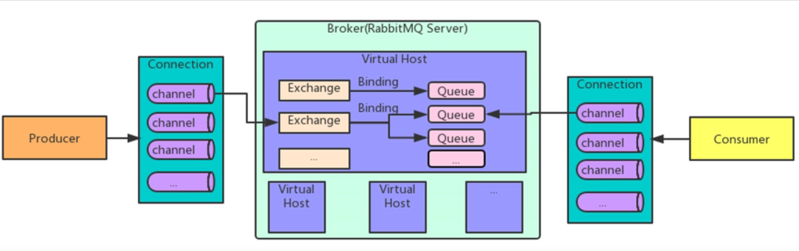
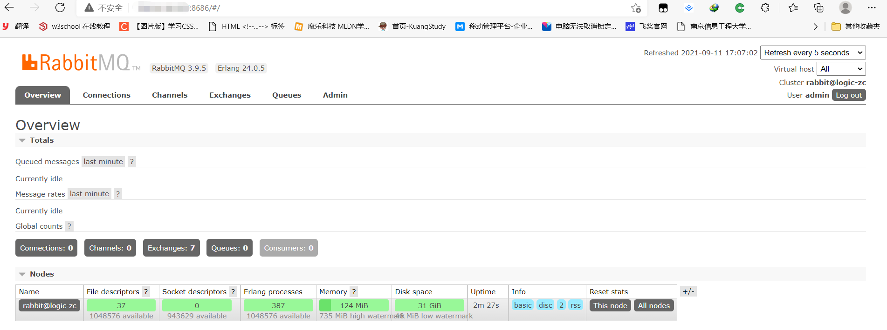
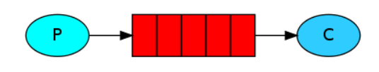

# RabbitMQ

RabbitMQ是一个高性能的消息中间件，常见的消息中间件有使用Java语言编写的ActiveMQ以及功能更加强大，适用语言范围更广的RabbitMQ。两者都毫不例外的涉及到了MQ技术。

## MQ

MQ是message queue的缩写，即消息队列。那么为什么要使用消息队列呢？以及它有哪些优势和劣势呢？

> 优势

随着系统的逐渐增大，系统的功能更加复杂，并且由此发展出了分布式、集群等技术用于迎合复杂的系统功能。但随之而来就出现了以下三大开发问题：

1、当一个分布式系统需要添加或修改子模块系统功能时，父模块的代码会随之改动，父子模块系统耦合性更高，父模块系统的代码修改会异常频繁，不利于代码的维护。

2、当系统的功能更加复杂，各个模块的处理时间会相继的延长，传统的流水式处理作业会导致用户发送一个请求往往需要很长的时间才能获得系统的回复，用户体验很差。

3、每逢节假日时，用户对于系统（例如购物系统）的操作更加频繁，此时平时能够正常处理的计算资源往往无法处理这么庞大的用户请求，会形成一个短暂的请求峰值，若不增设额外机器扩充计算资源，则很可能会发生系统崩溃，机器宕机等情况从而无法使用服务。

因此MQ应运而生，使用消息队列可以有效的解决以上的三个问题：

1、父子模块系统通过MQ进行通信，父模块系统就是生产者，子模块系统就是消费者。当一个分布式系统需要添加或修改子模块系统功能时，无非就是消费者从MQ中取出数据进行消费而已，父模块本身几乎不需要改变，从而实现了**应用解耦**。

2、尽管系统的功能随着生产的需要愈发的复杂，但是生产的信息是恒定的，无非就是处理的过程更加耗时费力。即消费时耗费了绝大多数的时间与资源。因此，将生产的数据直接放入MQ时即视为请求完成，再由消费者从MQ中异步获取数据完成后续的消费操作即可大大减少请求回应时间，提高用户体验，实现了**异步提速**。

3、尽管某段时间会生产峰值请求从而使系统无法一下子处理如此庞大的请求从而导致宕机服务不可用。然而当使用MQ后，处于消费端的模块可以控制每秒内消费的吞吐量，按照消费端模块能处理的最大阈值来不紧不慢地处理请求，从而保证了系统的稳定性，这又称之MQ的**削峰填谷**优势。

> 劣势

1、**系统的可用性提高**，尽管MQ实现了应用解耦，但是应用解耦带来的是系统的依赖更多，在考虑系统解耦时还需要保证系统是完全可用的。例如，如果MQ宕机，则父子模块间将无法通信，系统的整体性遭到破坏，这势必会导致业务受到影响。

2、**系统的复杂性提高**，MQ的加入大大增加了系统的复杂度，以前是系统间父子模块同步调用，现在是为了追求效率而异步调用。尽管速度上变快了，但是同时需要保证消息不能被重复消费，以及需要考虑数据丢失情况处理以及消息传递的顺序性问题。

3、**一致性问题**，在同时具有多个子模块系统时，若A,B模块数据处理完成，而C由于系统故障没有处理完成，那应当考虑如何保证消息数据处理的一致性。

> 总结

既然MQ有优势也有劣势，因此我们应该趋利避害，采用以下的使用标准：

1、在使用MQ时，需要保证生产者不需要从消费者处获得消费反馈。即生产者的代码逻辑不需要判定消费者处的处理结果，而是可以直接当做成功处理，这样就使得MQ异步处理成为了可能。

2、系统允许短暂的不一致性，例如下单操作。如果是类似于无人驾驶等需要实时同步的系统，那是决计不能使用的。

3、使用MQ所带来的优势效果大于MQ产生的系统复杂性问题，如果一个系统很简单，那将完全没必要使用MQ技术。

> 常用的MQ技术

| RabbitMQ                 | ActiveMQ                 | RocketMQ                     | Kafka                      |
| ------------------------ | ------------------------ | ---------------------------- | -------------------------- |
| Rabbit                   | Apache                   | 阿里                         | Apache                     |
| Erlang                   | Java                     | Java                         | Scala&Java                 |
| 单机吞吐量：万级（其次） | 单机吞吐量：万级（最差） | 单机吞吐量：十万级（最好）   | 单机吞吐量：十万级（次之） |
| 微秒级                   | 毫秒级                   | 毫秒级                       | 毫秒级                     |
| 社区活跃，性能好，并发强 | 老牌MQ技术               | 阿里技术，功能完备，扩展性好 | 为大数据准备的技术         |

## 认识RabbitMQ

RabbitMQ是基于AMQP协议，使用Erlang语言于2007年设计的消息队列中间件技术。

RabbitMQ基础架构：



图中概念解释：

Broker:接收和分发消息的应用，RabbitMQ Server就是Message Broker

Virtual Host:出于多租户和安全因素设计的，把AMQP的基本组件划分到一个虚拟的分组中，类似于网络中的namespace概念。与mysql中包含多个数据库的概念类似。而RabbitMQ可以保证每个用户在自己的vhost中创建exchange/queue等。

Connection:publisher/consumer和broker之间的TCP连接。

Channel:如果每次访问RabbitMQ都需要建立一个Connection，那开销会十分大，效率也会很低。Channel是在Connection内部建立的逻辑连接，如果程序支持多线程，则通常每个Thread创建单独的channel进行通讯，AMQP method包含了channel id 帮助客户端和message broker识别channel，所以channel之间是完全隔离的。channel作为轻量级的connection极大的减少了操作系统建立TCP Connection的开销。

Exchange：message到达broker的第一站，根据分发原则，匹配查询表中的routing key，分发消息到queue中去。

Queue：消息最终到这里等待Consumer取走

Binding：Exchange和Queue之间的虚拟连接，binding中可以包含routing key，binding信息被保存到exchange中的查询表中，用于message的分发依据。

> RabbitMQ工作模式

RabbitMQ分别提供了7种工作模式：简单模式、work queue、publish/subscribe发布与订阅模式、routing路由模式、Topics主题模式、RPC远程调用模式（比较特殊）、[发布者确认](https://www.cnblogs.com/lifan12589/p/14304233.html)（新）。

> 小结

1、RabbitMQ是基于AMQP协议使用Erlang语言开发的一款消息队列产品。

2、RabbitMQ提供了6种工作模式

3、AMQP是一种协议，类似于HTTP

4、JMS是API规范接口，类似于JDBC。RabbitMQ官方没有提供实现了JMS的规范接口。

## RabbitMQ的安装与使用

### 普通安装

在没有容器化技术之前，安装RabbitMQ是一件比较繁琐的事情。通常需要经过以下三步：

1、安装RabbitMQ的Erlang语言环境

2、安装RabbitMQ并启动服务

3、安装启动RabbitMQWeb管理界面

由于篇幅较长，详细见[参考链接](https://www.136.la/jingpin/show-124497.html)。

### 容器化安装

在容器化技术成熟以后，一般会从容器仓库拉取RabbitMQ镜像直接进行安装，操作如下：

```shell
docker run -d --hostname logic-zc --name my-rabbitmq -v /usr/rabbitmq/data:/var/lib/rabbitmq -p 8680:5672 -p 8686:15672 -e RABBITMQ_DEFAULT_VHOST=my_vhost  -e RABBITMQ_DEFAULT_USER=admin -e RABBITMQ_DEFAULT_PASS=admin rabbitmq:3-management
```

说明：

-d 后台运行容器；

--name 指定容器名；

-p 指定服务运行的端口（5672：应用访问端口；15672：控制台Web端口号）；

-v 映射目录或文件；

--hostname  主机名（RabbitMQ的一个重要注意事项是它根据所谓的 “节点名称” 存储数据，默认为主机名）；

-e 指定环境变量；（RABBITMQ_DEFAULT_VHOST：默认虚拟机名；RABBITMQ_DEFAULT_USER：默认的用户名；RABBITMQ_DEFAULT_PASS：默认用户名的密码）

使用`docker ps`发现RabbitMQ安装成功。登录检验：



### RabbitMQ常用工作模式

#### 普通模式（"Hello World!"）

图解：




#### 工作队列模式（Work queues）

#### 发布订阅模式（Publish/Subscribe）

#### 路由模式（Routing）

#### 通配符模式（Topics）
