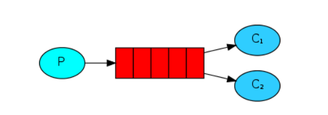

# RabbitMQ

RabbitMQ是一个高性能的消息中间件，常见的消息中间件有使用Java语言编写的ActiveMQ以及功能更加强大，适用语言范围更广的RabbitMQ。两者都毫不例外的涉及到了MQ技术。

## MQ

MQ是message queue的缩写，即消息队列。那么为什么要使用消息队列呢？以及它有哪些优势和劣势呢？

> 优势

随着系统的逐渐增大，系统的功能更加复杂，并且由此发展出了分布式、集群等技术用于迎合复杂的系统功能。但随之而来就出现了以下三大开发问题：

1、当一个分布式系统需要添加或修改子模块系统功能时，父模块的代码会随之改动，父子模块系统耦合性更高，父模块系统的代码修改会异常频繁，不利于代码的维护。

2、当系统的功能更加复杂，各个模块的处理时间会相继的延长，传统的流水式处理作业会导致用户发送一个请求往往需要很长的时间才能获得系统的回复，用户体验很差。

3、每逢节假日时，用户对于系统（例如购物系统）的操作更加频繁，此时平时能够正常处理的计算资源往往无法处理这么庞大的用户请求，会形成一个短暂的请求峰值，若不增设额外机器扩充计算资源，则很可能会发生系统崩溃，机器宕机等情况从而无法使用服务。

因此MQ应运而生，使用消息队列可以有效的解决以上的三个问题：

1、父子模块系统通过MQ进行通信，父模块系统就是生产者，子模块系统就是消费者。当一个分布式系统需要添加或修改子模块系统功能时，无非就是消费者从MQ中取出数据进行消费而已，父模块本身几乎不需要改变，从而实现了**应用解耦**。

2、尽管系统的功能随着生产的需要愈发的复杂，但是生产的信息是恒定的，无非就是处理的过程更加耗时费力。即消费时耗费了绝大多数的时间与资源。因此，将生产的数据直接放入MQ时即视为请求完成，再由消费者从MQ中异步获取数据完成后续的消费操作即可大大减少请求回应时间，提高用户体验，实现了**异步提速**。

3、尽管某段时间会生产峰值请求从而使系统无法一下子处理如此庞大的请求从而导致宕机服务不可用。然而当使用MQ后，处于消费端的模块可以控制每秒内消费的吞吐量，按照消费端模块能处理的最大阈值来不紧不慢地处理请求，从而保证了系统的稳定性，这又称之MQ的**削峰填谷**优势。

> 劣势

1、**系统的可用性提高**，尽管MQ实现了应用解耦，但是应用解耦带来的是系统的依赖更多，在考虑系统解耦时还需要保证系统是完全可用的。例如，如果MQ宕机，则父子模块间将无法通信，系统的整体性遭到破坏，这势必会导致业务受到影响。

2、**系统的复杂性提高**，MQ的加入大大增加了系统的复杂度，以前是系统间父子模块同步调用，现在是为了追求效率而异步调用。尽管速度上变快了，但是同时需要保证消息不能被重复消费，以及需要考虑数据丢失情况处理以及消息传递的顺序性问题。

3、**一致性问题**，在同时具有多个子模块系统时，若A,B模块数据处理完成，而C由于系统故障没有处理完成，那应当考虑如何保证消息数据处理的一致性。

> 总结

既然MQ有优势也有劣势，因此我们应该趋利避害，采用以下的使用标准：

1、在使用MQ时，需要保证生产者不需要从消费者处获得消费反馈。即生产者的代码逻辑不需要判定消费者处的处理结果，而是可以直接当做成功处理，这样就使得MQ异步处理成为了可能。

2、系统允许短暂的不一致性，例如下单操作。如果是类似于无人驾驶等需要实时同步的系统，那是决计不能使用的。

3、使用MQ所带来的优势效果大于MQ产生的系统复杂性问题，如果一个系统很简单，那将完全没必要使用MQ技术。

> 常用的MQ技术

| RabbitMQ                 | ActiveMQ                 | RocketMQ                     | Kafka                      |
| ------------------------ | ------------------------ | ---------------------------- | -------------------------- |
| Rabbit                   | Apache                   | 阿里                         | Apache                     |
| Erlang                   | Java                     | Java                         | Scala&Java                 |
| 单机吞吐量：万级（其次） | 单机吞吐量：万级（最差） | 单机吞吐量：十万级（最好）   | 单机吞吐量：十万级（次之） |
| 微秒级                   | 毫秒级                   | 毫秒级                       | 毫秒级                     |
| 社区活跃，性能好，并发强 | 老牌MQ技术               | 阿里技术，功能完备，扩展性好 | 为大数据准备的技术         |

## 认识RabbitMQ

RabbitMQ是基于AMQP协议，使用Erlang语言于2007年设计的消息队列中间件技术。

RabbitMQ基础架构：


图中概念解释：

Broker:接收和分发消息的应用，RabbitMQ Server就是Message Broker

Virtual Host:出于多租户和安全因素设计的，把AMQP的基本组件划分到一个虚拟的分组中，类似于网络中的namespace概念。与mysql中包含多个数据库的概念类似。而RabbitMQ可以保证每个用户在自己的vhost中创建exchange/queue等。

Connection:publisher/consumer和broker之间的TCP连接。

Channel:如果每次访问RabbitMQ都需要建立一个Connection，那开销会十分大，效率也会很低。Channel是在Connection内部建立的逻辑连接，如果程序支持多线程，则通常每个Thread创建单独的channel进行通讯，AMQP method包含了channel id 帮助客户端和message broker识别channel，所以channel之间是完全隔离的。channel作为轻量级的connection极大的减少了操作系统建立TCP Connection的开销。

Exchange：message到达broker的第一站，根据分发原则，匹配查询表中的routing key，分发消息到queue中去。

Queue：消息最终到这里等待Consumer取走

Binding：Exchange和Queue之间的虚拟连接，binding中可以包含routing key，binding信息被保存到exchange中的查询表中，用于message的分发依据。

> RabbitMQ工作模式

RabbitMQ分别提供了7种工作模式：简单模式、work queue、publish/subscribe发布与订阅模式、routing路由模式、Topics主题模式、RPC远程调用模式（比较特殊）、[发布者确认](https://www.cnblogs.com/lifan12589/p/14304233.html)（新）。

> 小结

1、RabbitMQ是基于AMQP协议使用Erlang语言开发的一款消息队列产品。

2、RabbitMQ提供了6种工作模式

3、AMQP是一种协议，类似于HTTP

4、JMS是API规范接口，类似于JDBC。RabbitMQ官方没有提供实现了JMS的规范接口。

## RabbitMQ的安装与使用

### 普通安装

在没有容器化技术之前，安装RabbitMQ是一件比较繁琐的事情。通常需要经过以下三步：

1、安装RabbitMQ的Erlang语言环境

2、安装RabbitMQ并启动服务

3、安装启动RabbitMQWeb管理界面

由于篇幅较长，详细见[参考链接](https://www.136.la/jingpin/show-124497.html)。

### 容器化安装

在容器化技术成熟以后，一般会从容器仓库拉取RabbitMQ镜像直接进行安装，操作如下：

```shell
docker run -d --hostname logic-zc --name my-rabbitmq -v /usr/rabbitmq/data:/var/lib/rabbitmq -p 8680:5672 -p 8686:15672 -e RABBITMQ_DEFAULT_VHOST=my_vhost  -e RABBITMQ_DEFAULT_USER=admin -e RABBITMQ_DEFAULT_PASS=admin rabbitmq:3-management
```

说明：

-d 后台运行容器；

--name 指定容器名；

-p 指定服务运行的端口（5672：应用访问端口；15672：控制台Web端口号）；

-v 映射目录或文件；

--hostname  主机名（RabbitMQ的一个重要注意事项是它根据所谓的 “节点名称” 存储数据，默认为主机名）；

-e 指定环境变量；（RABBITMQ_DEFAULT_VHOST：默认虚拟机名；RABBITMQ_DEFAULT_USER：默认的用户名；RABBITMQ_DEFAULT_PASS：默认用户名的密码）

使用`docker ps`发现RabbitMQ安装成功。登录检验：


### RabbitMQ常用工作模式

#### 普通模式（"Hello World!"）

图解：


说明，普通模式是RabbitMQ最简单的一种工作模式，它只需要一个生产者、一个消费者以及一个队列即可完成操作，不涉及到RabbitMQ中的交换机配置，将由系统自动配置使用。

操作步骤：

```console
生产者：
1、创建连接工厂
2、设置连接参数
3、创建连接的Connection
4、创建channel
5、创建声明队列queue
6、发送队列消息
7、关闭通道和连接
消费者：
1、创建连接工厂
2、设置连接参数
3、创建连接的Connection
4、创建channel
5、消费队列消息，消费者不需要关闭通道和连接
```

#### 工作队列模式（Work queues）

图解：



说明：工作队列模式和普通模式极其相似，唯一不同的地方在于它可以拥有多个消费者，其主要目的是为了能够分摊消费口的压力，起到分流减压的效果。

操作步骤：

```console
生产者：
1、创建连接工厂
2、设置连接参数
3、创建连接的Connection
4、创建channel
5、批量创建队列queue并发送消息
6、关闭通道和连接
消费者：
1、创建连接工厂
2、设置连接参数
3、创建连接的Connection
4、创建channel
5、消费队列消息，消费者不需要关闭通道和连接
```

#### 发布订阅模式（Publish/Subscribe）

图解：


说明：发布订阅模式和工作队列模式有点相似，不过它主要是为了使不同的消费者能够消费同一条信息所设计的。其原理很简单，就是在生产者生产数据时通过路由将信息发送至多个队列，而后消费者分别从各自的队列中取出数据消费即可。

操作步骤：

```console
生产者：
1、创建连接工厂
2、设置连接参数
3、创建连接的Connection
4、创建channel
5、创建广播交换机 交换机枚举类型：DIRECT("direct"), FANOUT("fanout"), TOPIC("topic"), HEADERS("headers")
6、创建队列queue
7、绑定队列到指定的交换机 普通发布订阅模式routingKey默认设置为""
8、生产者发送消息
9、关闭连接
消费者：
1、创建连接工厂
2、设置连接参数
3、创建连接的Connection
4、创建channel
5、消费队列消息，消费者不需要关闭通道和连接
```

#### 路由模式（Routing）

图解：


说明：路由模式是在基础的发布订阅模式的基础上发展而来。主要是为了区分不同的订阅者从而决定是否将该发布信息同步至该订阅者队列中。例如，如果在日志系统中，如果是error级别的信息则将记录至数据库，而info及以上级别的信息直接打印至控制台输出即可。

操作步骤：

```console
生产者：
1、创建连接工厂
2、设置连接参数
3、创建连接的Connection
4、创建channel
5、创建广播交换机 交换机枚举类型：DIRECT("direct"), FANOUT("fanout"), TOPIC("topic"), HEADERS("headers")
6、创建队列queue
7、绑定队列到指定的交换机 Routing模式的routingKey需要指定设置
8、生产者分别发送不同routingKey标识的消息
9、关闭连接
消费者：
1、创建连接工厂
2、设置连接参数
3、创建连接的Connection
4、创建channel
5、消费队列消息，消费者不需要关闭通道和连接
```

#### 通配符模式（Topics）

图解：


说明：通配符模式是基于路由模式的基础上发展而来的，其主要是为了通配routingKey的值，从而使得路由更加的灵活。其中通配符*表示占位一个单词，通配符\#表示占位任意个字符。

操作步骤：

```console
生产者：
1、创建连接工厂
2、设置连接参数
3、创建连接的Connection
4、创建channel
5、创建广播交换机 交换机枚举类型：DIRECT("direct"), FANOUT("fanout"), TOPIC("topic"), HEADERS("headers")
6、创建队列queue
7、绑定队列到指定的交换机 Topics模式的routingKey需要使用通配符进行泛配置
8、生产者分别发送不同routingKey标识的消息
9、关闭连接
消费者：
1、创建连接工厂
2、设置连接参数
3、创建连接的Connection
4、创建channel
5、消费队列消息，消费者不需要关闭通道和连接
```

## RabbitMQ整合

### spring整合RabbitMQ

> 参考[链接](https://www.jianshu.com/p/39f74092fb7e)

1、创建maven工程，工程结构为一个主项目中包含两个模块

2、主项目pom文件配置maven依赖

```pom
<?xml version="1.0" encoding="UTF-8"?>
<project xmlns="http://maven.apache.org/POM/4.0.0"
         xmlns:xsi="http://www.w3.org/2001/XMLSchema-instance"
         xsi:schemaLocation="http://maven.apache.org/POM/4.0.0 http://maven.apache.org/xsd/maven-4.0.0.xsd">
    <modelVersion>4.0.0</modelVersion>

    <groupId>org.example</groupId>
    <artifactId>spring-rabbitmq</artifactId>
    <packaging>pom</packaging>
    <version>1.0-SNAPSHOT</version>
    <modules>
        <module>spring-producer</module>
        <module>spring-consumer</module>
    </modules>

    <dependencies>
        <dependency>
            <groupId>org.springframework</groupId>
            <artifactId>spring-context</artifactId>
            <version>5.2.5.RELEASE</version>
        </dependency>
        <dependency>
            <groupId>org.springframework.amqp</groupId>
            <artifactId>spring-rabbit</artifactId>
            <version>2.1.8.RELEASE</version>
        </dependency>
        <dependency>
            <groupId>junit</groupId>
            <artifactId>junit</artifactId>
            <version>4.12</version>
        </dependency>
        <dependency>
            <groupId>org.springframework</groupId>
            <artifactId>spring-test</artifactId>
            <version>5.2.5.RELEASE</version>
        </dependency>
    </dependencies>

    <build>
        <plugins>
            <plugin>
                <groupId>org.apache.maven.plugins</groupId>
                <artifactId>maven-compiler-plugin</artifactId>
                <version>3.8.1</version>
                <configuration>
                    <source>1.8</source>
                    <target>1.8</target>
                    <encoding>UTF-8</encoding>
                </configuration>
            </plugin>
        </plugins>
    </build>

</project>
```

3、在生产者模块和消费者模块中配置rabbitmq的配置文件类

```properties
rabbitmq.host=120.26.162.227
rabbitmq.port=8680
rabbitmq.username=admin
rabbitmq.password=admin
rabbitmq.virtual-host=my_vhost
```

4、生产者模块中配置springcontext的xml文件

```xml
<?xml version="1.0" encoding="UTF-8" ?>
<beans xmlns="http://www.springframework.org/schema/beans"
       xmlns:xsi="http://www.w3.org/2001/XMLSchema-instance"
       xmlns:context="http://www.springframework.org/schema/context"
       xmlns:rabbit="http://www.springframework.org/schema/rabbit"
       xsi:schemaLocation="http://www.springframework.org/schema/beans
               http://www.springframework.org/schema/beans/spring-beans.xsd
               http://www.springframework.org/schema/context
               http://www.springframework.org/schema/context/spring-context.xsd
               http://www.springframework.org/schema/rabbit
               http://www.springframework.org/schema/rabbit/spring-rabbit.xsd">
    <!--加载配置文件-->
    <context:property-placeholder location="rabbitmq.properties"/>
    <!--定义rabbitmq，connectionFactory-->
    <rabbit:connection-factory id="connectionFactory"
                               host="${rabbitmq.host}"
                               port="${rabbitmq.port}"
                               username="${rabbitmq.username}"
                               password="${rabbitmq.password}"
                               virtual-host="${rabbitmq.virtual-host}"/>
    <!--定义管理交换机队列-->
    <rabbit:admin connection-factory="connectionFactory"/>
    <!--定义持久化队列，不存在则自动创建，如果不存在交换机，则绑定到默认交换机direct,名字为"",路由键为队列名称 -->
    <rabbit:queue id="spring_queue" name="spring_queue" auto-declare="true"/>
    <!-- ~~~~~~~~~~~~~~~~~~~~~~~~~~~~广播；所有队列都能收到消息~~~~~~~~~~~~~~-->
    <!--定义广播交换机中的持久化策略，如果不存在，就自动创建-->
    <rabbit:queue id="spring_fanout_queue_01" name="spring_fanout_queue_01" auto-declare="true"/>
    <rabbit:queue id="spring_fanout_queue_02" name="spring_fanout_queue_02" auto-declare="true"/>
    <!--定义广播类型交换机；并绑定上述两个队列-->
    <rabbit:fanout-exchange id="spring_fanout_exchange" name="spring_fanout_exchange" auto-declare="true">
        <rabbit:bindings>
            <rabbit:binding queue="spring_fanout_queue_01"/>
            <rabbit:binding queue="spring_fanout_queue_02"/>
        </rabbit:bindings>
    </rabbit:fanout-exchange>
    <!-- ~~~~~~~~~~~~~~~~~~~~~~~~~~~~通配符；*匹配一个单词，#匹配多个单词 ~~~~~~~~~~~~~~~~~~~~~~~~~~~~ -->
    <rabbit:queue id="spring_topic_queue_star" name="spring_topic_queue_star" auto-declare="true"/>
    <rabbit:queue id="spring_topic_queue_hall" name="spring_topic_queue_hall" auto-declare="true"/>
    <rabbit:queue id="spring_topic_queue_hall02" name="spring_topic_queue_hall02" auto-declare="true"/>
    <rabbit:topic-exchange id="spring_topics_change" name="spring_topics_change" auto-declare="true">
        <rabbit:bindings>
            <rabbit:binding pattern="item.*" queue="spring_topic_queue_star"/>
            <rabbit:binding pattern="item.#" queue="spring_topic_queue_hall"/>
            <rabbit:binding pattern="book.#" queue="spring_topic_queue_hall02"/>
        </rabbit:bindings>
    </rabbit:topic-exchange>
    <!--定义rabbitTemplate对象操作可以在代码中方便发送消息-->
    <rabbit:template id="rabbitTemplate" connection-factory="connectionFactory"/>
</beans>
```

5、消费者的springcontext的xml文件

```xml
<?xml version="1.0" encoding="UTF-8" ?>
<beans xmlns="http://www.springframework.org/schema/beans"
       xmlns:xsi="http://www.w3.org/2001/XMLSchema-instance"
       xmlns:context="http://www.springframework.org/schema/context"
       xmlns:rabbit="http://www.springframework.org/schema/rabbit"
       xsi:schemaLocation="http://www.springframework.org/schema/beans
               http://www.springframework.org/schema/beans/spring-beans.xsd
               http://www.springframework.org/schema/context
               http://www.springframework.org/schema/context/spring-context.xsd
               http://www.springframework.org/schema/rabbit
               http://www.springframework.org/schema/rabbit/spring-rabbit.xsd">
    <!--加载配置文件-->
    <context:property-placeholder location="rabbitmq.properties"/>
    <!--定义rabbitmq，connectionFactory-->
    <rabbit:connection-factory id="connectionFactory"
                               host="${rabbitmq.host}"
                               port="${rabbitmq.port}"
                               username="${rabbitmq.username}"
                               password="${rabbitmq.password}"
                               virtual-host="${rabbitmq.virtual-host}"/>
    <!--定义rabbitTemplate对象操作可以在代码中方便发送消息-->
    <rabbit:template id="rabbitTemplate" connection-factory="connectionFactory"/>
    <!--将listener纳入Spring容器-->
    <context:component-scan base-package="com.logic"/>
    <rabbit:listener-container connection-factory="connectionFactory" auto-declare="true">
        <rabbit:listener ref="springQueueListener" queue-names="spring_queue"/>
        <rabbit:listener ref="springFanoutQueueListener01" queue-names="spring_fanout_queue_01"/>
        <rabbit:listener ref="springFanoutQueueListener02" queue-names="spring_fanout_queue_02"/>
        <rabbit:listener ref="springTopicsQueueListener01" queue-names="spring_topic_queue_star"/>
        <rabbit:listener ref="springTopicsQueueListener02" queue-names="spring_topic_queue_hall"/>
        <rabbit:listener ref="springTopicsQueueListener03" queue-names="spring_topic_queue_hall02"/>
    </rabbit:listener-container>
</beans>
```

6、生产者发送消息至rabbitmq

```java
package com.logic;

import org.junit.Test;
import org.junit.runner.RunWith;
import org.springframework.amqp.rabbit.core.RabbitTemplate;
import org.springframework.beans.factory.annotation.Autowired;
import org.springframework.test.context.ContextConfiguration;
import org.springframework.test.context.junit4.SpringJUnit4ClassRunner;

@RunWith(SpringJUnit4ClassRunner.class)
@ContextConfiguration(locations = "classpath:spring-rabbitmq-producer.xml")
public class ProducerTest {
	@Autowired
	private RabbitTemplate rabbitTemplate;

	@Test
	public void test00(){
		System.out.println(rabbitTemplate);
	}

	/**
	 * 普通消息传送
	 */
	@Test
	public  void  test01(){
		rabbitTemplate.convertAndSend("spring_queue","hello spring rabbit".getBytes());
	}
	/**
	 * 发送fanout消息
	 */
	@Test
	public  void  test02(){
		rabbitTemplate.convertAndSend("spring_fanout_exchange","","hello spring rabbit[fanout]");
	}
	/**
	 * 发送topic消息
	 */
	@Test
	public  void test03(){
		rabbitTemplate.convertAndSend("spring_topics_change","item.delete.id","hello spring rabbit[topic]");
	}
}
```

7、消费者接收消息，此处类的编写是根据rabbitmq的listener-container(xml文件)来的，此处仅列举一个示例

```java
package com.logic.ConsumerListener;

import org.springframework.amqp.core.Message;
import org.springframework.amqp.core.MessageListener;
import org.springframework.stereotype.Component;

@Component
public class SpringQueueListener implements MessageListener {

	@Override
	public void onMessage(Message message) {
		System.out.println("spring-queue" + new String(message.getBody()));
	}
}
```

8、启动消费者模块，然后通过发送者模块发送消息观察消费者模块的控制台输出。

### springboot整合RabbitMQ

> 参考[链接](https://www.cnblogs.com/lusaisai/p/13019822.html)

1、创建maven工程，工程结构为一个主项目中包含两个模块

2、向主项目的pom文件中添加maven依赖

```pom
<?xml version="1.0" encoding="UTF-8"?>
<project xmlns="http://maven.apache.org/POM/4.0.0"
         xmlns:xsi="http://www.w3.org/2001/XMLSchema-instance"
         xsi:schemaLocation="http://maven.apache.org/POM/4.0.0 http://maven.apache.org/xsd/maven-4.0.0.xsd">
    <modelVersion>4.0.0</modelVersion>

    <groupId>org.example</groupId>
    <artifactId>springboot-rabbitmq</artifactId>
    <packaging>pom</packaging>
    <version>1.0-SNAPSHOT</version>
    <modules>
        <module>springboot-Producer</module>
        <module>springboot-Consumer</module>
    </modules>

    <parent>
        <groupId>org.springframework.boot</groupId>
        <artifactId>spring-boot-starter-parent</artifactId>
        <version>2.1.4.RELEASE</version>
    </parent>

    <dependencies>
        <!-- 使用springmvc来进行测试 -->
        <dependency>
            <groupId>org.springframework.boot</groupId>
            <artifactId>spring-boot-starter-web</artifactId>
        </dependency>
        <!--amqp的起步依赖-->
        <dependency>
            <groupId>org.springframework.boot</groupId>
            <artifactId>spring-boot-starter-amqp</artifactId>
        </dependency>
        <!--单元测试类-->
        <dependency>
            <groupId>org.springframework.boot</groupId>
            <artifactId>spring-boot-starter-test</artifactId>
        </dependency>
    </dependencies>

</project>
```

3、配置生产模块和消费模块各自的springboot启动类和yaml配置文件

生产模块：

```java
@SpringBootApplication
public class ProducerApplication {
	public static void main(String[] args) {
		SpringApplication.run(ProducerApplication.class, args);
	}
}
```

```yaml
#tomcat端口
server:
  port: 8888
#Rabbitmq的配置
spring:
  rabbitmq:
    host: 120.26.162.227
    port: 8680
    virtual-host: my_vhost
    username: admin
    password: admin
```

消费模块：

```java
@SpringBootApplication
public class ConsumerApplication {
	public static void main(String[] args) {
		SpringApplication.run(ConsumerApplication.class, args);
	}
}
```

```yaml
#端口,注意端口不要冲突
server:
  port: 9999
#Rabbitmq的配置
spring:
  rabbitmq:
    host: 120.26.162.227
    port: 8680
    virtual-host: my_vhost
    username: admin
    password: admin
```

4、生产模块配置RabbitMQ的springboot配置并编写相应的发送信息接口

配置：

```java
/**
 * RabbitMQ配置类
 */
@Configuration
public class RabbitMQConfig {
	//交换机名称
	public static final String ITEM_TOPIC_EXCHANGE = "item_topic_exchange";
	//队列名称
	public static final String ITEM_QUEUE = "item_queue";

	//声明交换机
	@Bean
	public Exchange topicExchange(){
		return ExchangeBuilder.topicExchange(ITEM_TOPIC_EXCHANGE).durable(true).build();
	}

	//声明队列
	@Bean
	public Queue itemQueue(){
		return QueueBuilder.durable(ITEM_QUEUE).build();
	}

	//绑定队列和交换机
	@Bean
	public Binding itemQueueExchange(@Qualifier("itemQueue") Queue queue,
	                                 @Qualifier("topicExchange") Exchange exchange){
		return BindingBuilder.bind(queue).to(exchange).with("item.#").noargs();
	}

}
```

controller接口：

```java
@RestController
public class SendMsgController {
	//注入RabbitMQ的模板
	@Autowired
	private RabbitTemplate rabbitTemplate;

	/**
	 * 测试
	 */
	@GetMapping("/sendmsg")
	public String sendMsg(@RequestParam String msg, @RequestParam String key){
		/**
		 * 发送消息
		 * 参数一：交换机名称
		 * 参数二：路由key: item.springboot-rabbitmq,符合路由item.#规则即可
		 * 参数三：发送的消息
		 */
		rabbitTemplate.convertAndSend(RabbitMQConfig.ITEM_TOPIC_EXCHANGE ,key ,msg);
		//返回消息
		return "发送消息成功！";
	}
}
```

5、调用发送接口，使activemq中间件创建springboot配置中的队列，从而使得后续的消费模块能够监听该队列

```http
http://localhost:8888/sendmsg?msg=springboot-rabbitmq-producer&key=item.springboot-rabbitmq
```

6、消息监听处理类MyListener监听RabbitMQ队列

```java
@Component
public class ConsumerListener {
   @RabbitListener(queues = "item_queue")
   public void msg(String msg){
      System.out.println("消费者消费消息了："+msg);
      //TODO 这里可以做异步的工作
   }
}
```

## RabbitMQ的高级特性

### 生产端消息的可靠性投递

rabbitmq的消息投递路径是：

producer-->rabbitmq broker-->exchange-->queue-->consumer

#### confirm:

如果在该过程中的`producer-->rabbitmq broker-->exchange`步骤消息丢失，例如发送到不存在的交换机导致消息丢失，则可以使用生产端的confirm确认方式来确保消息的可靠投递。该过程会返回一个confirmCallback。

步骤：

```console
1、确认confirm确认方式被开启：yaml文件中publisher-confirms参数设置为true
2、在rabbitTemplate中定义confirmCallback的回调参数
```

#### return:

如果在该过程中的`exchange-->queue`步骤消息丢失，则一般情况下rabbitmq采用的方式是丢弃不处理，当然，可以通过代码的编写开启处理。例如路由写错了就会发生交换机传递消息到队列时发生消息丢失。若投递失败则会返回一个returnCallback。

步骤：

```console
1、确认return确认方式被开启：yaml文件中publisher-returns参数设置为true
2、在rabbitTemplate中定义returnCallback的回调参数
3、设置开启交换机处理失败消息的模式，否则默认将丢弃不处理
```

### 消费端消息的可靠性接收

同样在rabbitmq的消息投递路径中，如果发生了`queue-->consumer`步骤的消息丢失，则需要在消费端使用Consumer Ack的方式确保消息的可靠传递。

#### Consumer Ack

Ack指的是acknowledge，确认。表示消费端接收消息后的确认方式。

它有三种方式：

1、自动确认：acknowledge="none"（默认）

2、手动确认：acknowledge="manual"（比较方便，使用较多）

3、根据异常情况进行确认：acknowledge="auto"（比较麻烦，使用较少）

步骤：

```console
1、在yaml文件中设置spring.rabbitmq.listener.simple.acknowledge-mode属性为"manual"手动接收
2、如果是spring整合，则消费端需要实现ChannelAwareMessageListener接口；如果是springboot，则需要在被@RabbitListener注解标识的方法上使用Message和Channel作为接参的参数类型
3、使用try{}catch{}包裹消费业务代码，模拟业务出错观察Ack操作。channel.basicAck(msg.getMessageProperties().getDeliveryTag(), true);表示手动确认签收
channel.basicNack(msg.getMessageProperties().getDeliveryTag(), true, false);表示拒绝签收 第三个参数requeue设置为false表示出错将不再返回队列
```

### 消费端限流

RabbitMQ同样有着**削峰填谷**的的特点，因此为了防止业务程序遭受大量请求的冲击，因此可以使用消费端限流的方式限制消费端处理请求的个数，从而达到**削峰填谷**的目的。

步骤：

```console
1、进行消费端限流操作需要保证消费端使用的是手动确认的Consumer Ack方式，这样就能根据确认的结果来确定是否可以再处理新的请求。
2、在yaml文件中设置spring.rabbitmq.listener.simple.prefetch属性为较小的一个数字，表示限流的处理请求数。
3、在生产端生产多条消费信息（数量大于prefetch属性设置的值）
4、在消费端手动确认时将确认代码注释掉，然后运行项目从队列中获取消费信息消费发现只会有prefetch属性设置的数量进入了消费端处理，而由于没有手动确认操作，所以队列中的其他消息将无法被消费。
```

### 生产端过期时间(TTL)设置

同样可以为队列中长期得不到处理的消息设置过期时间，设置过期时间有很多用处，常用于死信队列以及延迟队列中，后续会涉及到。设置过期时间的方式有两种，分别是设置队列的过期时间以及设置单个消息的过期时间。如果两种方式都使用的话，则消息的过期时间以两者之间TTL较小的那个数值为准。

#### 队列过期时间

如果使用的是队列的过期时间设置，则队列中的所有消息都有相同的过期时间。

操作方式：如果是使用的spring集成，则在队列的bean配置中直接设置x-message-ttl参数即可，注意同时需要设置参数的类型是integer类型；如果是使用的springboot集成，则直接在Configuration配置文件中配置queue的bean实体时，使用Map配置queue的参数即可。

#### 单个消息过期时间

若是对消息进行单独设置，则每条消息TTL可以不同。

操作方式：创建一个MessagePostProcessor对象，在该对象中配置单个消息的过期时间，然后在使用rabbitmq的convertAndSend方法时将该对象作为参数传入即可。

### 死信队列

图解：


说明：所谓死信队列就是某个队列中的消息没有被消费就将被丢弃，此时使用另一个交换机(死信交换机)把这些即将丢弃的信息再存储至新的队列以供后续操作，这个新的队列就称之为死信队列。

死信队列中的消息来源有三种方式：

1、上一个队列已满，多余的消费信息将进入配置好的死信队列

2、消息在消费端被手动拒绝并丢弃，被丢弃的消息将进入配置好的死信队列

3、上一个队列中的消息已经过期，过期的消息将进入配置好的死信队列

步骤：

```console
1、声名配置正常的交换机以及队列
2、声名配置死信的交换机以及队列
3、在正常的队列中配置死信交换机以及死信队列对应的routingKey,以及过期时间和队列最大长度的配置
4、向正常队列中同时发送多条数据，观察正常队列和死信队列的消费信息变化
```

### 延迟队列

### 日志与监控

## 消息追踪

## RabbitMQ应用问题

### 消息补偿

### 幂等性保障

## RabbitMQ集群搭建
