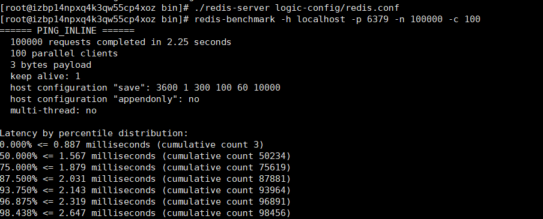

# Redis

Redis是一款十分流行的key-value键值对存储的NOSQL数据库，同类别的还有memeCache，但是与memeCache不同是，Redis更推荐使用的是单线程，且效率十分之高，能够达到每秒10万数据量的QPS（每秒查询率），处理流量的能力十分之高！当然，NoSQL也不仅仅局限于类key-value值的数据库，还有专门用于存储文档信息的MogoDB，MogoDB也十分流行，它被称之为最像关系型数据库的非关系型数据库，里面存储的是一种Bson的类JSON二进制数据。以及图形数据库，专门用于存储类似于社交关系一类的网状关系数据库（使用的算法基本上是最短路径寻址以及N度关系查找等），存储的是关系（关系看起来就像图形一样），而不是真正意义上的图形。

大数据时代的3V和3高：3V:海量，多样，实时；3高：高并发，高性能，高可拓。

架构师的设计理念，没有什么是加一层解决不了的，如果还是不行，那就两层！！

## Redis安装

### Windows上的安装

Windows的Redis版本官方是不支持的，一直交予微软维护和开发，而现在微软也基本上不维护了。因此官方更推荐使用的是Linux环境下的Redis。当然，我们也可以使用Windows版本的Redis来满足基于windows系统的软件开发！

windows版本redis十分简单，在官网下载redis的windows版本后，直接解压即可使用。其中的redis-server是redis的服务版本，而redis-cli是redis的客户机版本。而且还为我们提供了redis-check-aof(redis持久化检查)以及redis-benchmark(radish压力测试)工具。

当然，如果我们在windows系统中为redis设置了服务的话，也可以通过net start redis和net stop redis 命令来分别启动和关闭redis。

### Linux上的安装

Linux版本的Redis是官方最为推荐的稳定版本。安装步骤如下：

1、官网下载最新版本的Linux版本的redis。

2、将redis的压缩文件上传至Linux服务器并解压。

3、进入解压目录，运行`make`命令编译linux版本的redis源码，从而获得redis的安装文件以及配置文件redis.conf。

4、在该目录下使用`make install`命令运行redis安装文件。

5、此时会在/usr/local/bin目录下生成redis的运行文件。

6、将redis.conf文件复制至radis的运行文件目录，然后使用vim编辑器将redis.conf中的daemonize设置为yes，表示将redis以守护线程的方式运行，类似于java中服务，运行在操作系统的后台。

7、使用`./redis-server [配置文件所在位置]`命令运行Redis。

8、使用`./redis-cli -h localhost -p 6379`命令运行redis客户端，当显示为`localhost:6379>`的输入场景就表示客户端运行成功，可以进行基本的redis操作了。

9、当我们输入shutdown则表示关闭redis服务。此时就会杀掉redis进程，客户端也会显示`not connected> `的提示。

## Redis性能测试

使用redis-benchmark工具来完成redis的性能测试。

该图表明：模拟使用的是100台客户机访问10万条数据，完成时间是2.25秒，每条模拟请求携带的数据大小是 3 bytes,不使用多线程的方式以单线程运行，之后得数据就是详细的性能压测数据了，精确到毫秒级！

## Redis的基础知识

### 基本命令

前提：进入redis客户端并连上redis服务器。

`set key value`向redis中存值！

`get key`根据key值获取value值

`del key`根据key值去除数据库中存在的key-value记录

`select dbname`切换redis数据库 打开配置文件 可以发现默认是16个

`key *`查看数据库所有的key值

`flushdb`清空当前数据库

`flushall`清空所有数据库

### 为啥使用6379作为端口号

因为明星效应导致的，有一个明星叫做merz，对应以前的老式按键手机上的6379按键。

### 为什么redis使用单线程还这么快

对于开发有两大误区:

1、高性能的服务器一定是多线程的

2、多线程一定比单线程的效率高

其实不然，尽管在处理和访问速度上CPU>内存>硬盘是不争的事实，但是CPU在运行多线程时是会切换上下文的，这个时间大概在1000-1500纳秒之间，尽管非常短，但如果切换频繁将极大的削减cpu的执行效率。

了解到以上内容，再来分析原因：

1、纯内存操作，redis是将所有的数据全部放在内存中的，是一个完全的内存系统，内存系统避免了大量访问磁盘数据的操作，redis将数据储存在内存里面，读写数据的时候都不会受到硬盘 I/O 速度的限制，所以速度快；

2、单线程操作，避免了不必要的上下文切换和竞争条件，不用去考虑各种锁的问题，不存在加锁释放锁操作，没有因为可能出现死锁而导致的性能消耗；

3、采用了非阻塞I/O多路复用机制，采用多路 I/O 复用技术可以让单个线程高效的处理多个连接请求（尽量减少网络 IO 的时间消耗），多路I/O复用模型是利用 select、poll、epoll 可以同时监察多个流的 I/O 事件的能力，在空闲的时候，会把当前线程阻塞掉，当有一个或多个流有 I/O 事件时，就从阻塞态中唤醒，于是程序就会轮询一遍所有的流（epoll 是只轮询那些真正发出了事件的流），并且只依次顺序的处理就绪的流，这种做法就避免了大量的无用操作，从而提高效率。

