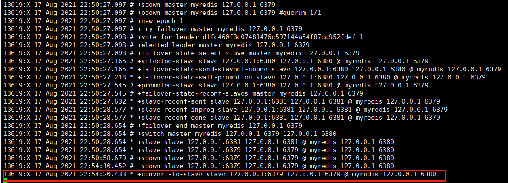

# Redis

Redis是一款十分流行的key-value键值对存储的NOSQL数据库，同类别的还有memeCache，但是与memeCache不同是，执行Redis命令的核心模块使用的是单线程，且效率十分之高，能够达到每秒10万数据量的QPS（每秒查询率），处理流量的能力十分之高！由于Redis的性能瓶颈在于内存和网络，而且网络的I/O操作占用了cpu的大部分时间，因此在redis6中将网络读写模块设计成了多线程，核心模块依然使用的是单线程，从而使得redis的QPS又翻了一倍之多。当然，NoSQL也不仅仅局限于类key-value值的数据库，还有专门用于存储文档信息的MogoDB，MogoDB也十分流行，它被称之为最像关系型数据库的非关系型数据库，里面存储的是一种Bson的类JSON二进制数据。以及图形数据库，专门用于存储类似于社交关系一类的网状关系数据库（使用的算法基本上是最短路径寻址以及N度关系查找等），存储的是关系（关系看起来就像图形一样），而不是真正意义上的图形。

大数据时代的3V和3高：3V:海量，多样，实时；3高：高并发，高性能，高可拓。

架构师的设计理念，没有什么是加一层解决不了的，如果还是不行，那就两层！！

## Redis安装

### Windows上的安装

Windows的Redis版本官方是不支持的，一直交予微软维护和开发，而现在微软也基本上不维护了。因此官方更推荐使用的是Linux环境下的Redis。当然，我们也可以使用Windows版本的Redis来满足基于windows系统的软件开发！

windows版本redis十分简单，在官网下载redis的windows版本后，直接解压即可使用。其中的redis-server是redis的服务版本，而redis-cli是redis的客户机版本。而且还为我们提供了redis-check-aof(redis持久化检查)以及redis-benchmark(radish压力测试)工具。

当然，如果我们在windows系统中为redis设置了服务的话，也可以通过net start redis和net stop redis 命令来分别启动和关闭redis。

### Linux上的安装

Linux版本的Redis是官方最为推荐的稳定版本。安装步骤如下：

1、官网下载最新版本的Linux版本的redis。

2、将redis的压缩文件上传至Linux服务器并解压。

3、进入解压目录，运行`make`命令编译linux版本的redis源码，从而获得redis的安装文件以及配置文件redis.conf。

4、在该目录下使用`make install`命令运行redis安装文件。

5、此时会在/usr/local/bin目录下生成redis的运行文件。

6、将redis.conf文件复制至radis的运行文件目录，然后使用vim编辑器将redis.conf中的daemonize设置为yes，表示将redis以守护线程的方式运行，类似于java中服务，运行在操作系统的后台。

7、使用`./redis-server [配置文件所在位置]`命令运行Redis。

8、使用`./redis-cli -h localhost -p 6379`命令运行redis客户端，当显示为`localhost:6379>`的输入场景就表示客户端运行成功，可以进行基本的redis操作了。

9、当我们输入shutdown则表示关闭redis服务。此时就会杀掉redis进程，客户端也会显示`not connected> `的提示。

## Redis性能测试

使用redis-benchmark工具来完成redis的性能测试。


该图表明：模拟使用的是100台客户机访问10万条数据，完成时间是2.25秒，每条模拟请求携带的数据大小是 3 bytes,不使用多线程的方式以单线程运行，之后得数据就是详细的性能压测数据了，精确到毫秒级！

## Redis的基础知识

### 基本命令

前提：进入redis客户端并连上redis服务器。

`set key value`向redis中存值！

`get key`根据key值获取value值

`del key`根据key值去除数据库中存在的key-value记录

`select dbname`切换redis数据库 打开配置文件 可以发现默认是16个

`key *`查看数据库所有的key值

`flushdb`清空当前数据库

`flushall`清空所有数据库

### 为啥使用6379作为端口号

因为明星效应导致的，有一个明星叫做merz，对应以前的老式按键手机上的6379按键。

### 为什么redis使用单线程还这么快

对于开发有两大误区:

1、高性能的服务器一定是多线程的

2、多线程一定比单线程的效率高

其实不然，尽管在处理和访问速度上CPU>内存>硬盘是不争的事实，但是CPU在运行多线程时是会切换上下文的，这个时间大概在1000-1500纳秒之间，尽管非常短，但如果切换频繁将极大的削减cpu的执行效率。

了解到以上内容，再来分析原因：

1、纯内存操作，redis是将所有的数据全部放在内存中的，是一个完全的内存系统，内存系统避免了大量访问磁盘数据的操作，redis将数据储存在内存里面，读写数据的时候都不会受到硬盘 I/O 速度的限制，所以速度快；

2、单线程操作，避免了不必要的上下文切换和竞争条件，不用去考虑各种锁的问题，不存在加锁释放锁操作，没有因为可能出现死锁而导致的性能消耗；

3、采用了非阻塞I/O多路复用机制，采用多路 I/O 复用技术可以让单个线程高效的处理多个连接请求（尽量减少网络 IO 的时间消耗），多路I/O复用模型是利用 select、poll、epoll 可以同时监察多个流的 I/O 事件的能力，在空闲的时候，会把当前线程阻塞掉，当有一个或多个流有 I/O 事件时，就从阻塞态中唤醒，于是程序就会轮询一遍所有的流（epoll 是只轮询那些真正发出了事件的流），并且只依次顺序的处理就绪的流，这种做法就避免了大量的无用操作，从而提高效率。

需要格外注意的一点是自redis6开始，redis的网络模块采用了多线程的方式，因为redis的瓶颈主要是内存和网络，而网络有是CPU耗费时间最长的部分，因此网络模块采用多线程极大的提高了redis的QPS，但是redis的核心模块依旧是使用的单线程运作。

## JAVA集成Redis

1、Java集成redis有着两种方案，一种是使用redis官方提供的Jedis来集成到Java中使用，但是Jedis在多线程环境下非线程安全,除非使用连接池,为每个redis实例增加物理连接。
2、使用spring提供的RedisTemplate来集成使用。RedisTemplate是对JedisApi的高度封装，新版本使用的是Lettuce,是基于Netty(NIO)技术实现的，性能更高，同时比Jedis多了自动管理连接池的特性。RedisTemplate相对于Jedis来说可以方便地更换Redis的Java客户端，多线程下线程安全，且方便与其他Spring框架进行搭配使用如：SpringCache。

## Redis的配置文件

Redis中包含一个重要的配置文件redis.conf,windows系统中是redis.windows-service.conf。使用该配置文件，我们可以很轻松的定制化配置我们想要的redis功能，例如配置密码，配置AOF持久化，配置rdb镜像的保存时间，配置redis的内存管理策略以及配置redis的主从复制等等操作，其配置文档中都说明的十分清楚，可以按需配置。

## Redis持久化

实现Redis持久化有两种方式：RDB(Redis Database)和AOF(Append Only File)。

RDB是指在主进程运行的过程中会fork一个子线程，专门用于保存被触发保存时的镜像文件（默认是dump.rdb，如果已有dump.rdb文件，则会替换）。由于每次保存的都是Redis中完整的数据，因此如果在主线程下保存的话会占用很多的资源，但fork一个子线程就很好地避免了该问题。而且在重新启动Redis时会将数据快速加载到redis中。触发保存可以有三种方式：1、redis rdb保存策略配置；2、使用flush操作（flushDB或者flushAll，flush操作会清除dump.rdb中的持久化数据）;3、正常的shutdown redis-server。
redis使用rdb来持久化数据可能会导致异常情况下的数据大量丢失。因此一般而言只适合用于备份。

AOF持久化默认是关闭的，它也是在主进程运行的过程中fork一个子线程，不同的是该子线程追加保存到aof文件中的是一条条redis数据添加修改的命令。而且它的策略一般都是每秒追加执行一次，这样能够保证即使是在最恶劣的情况下，也只会丢失最多2秒不到的数据量。但是带来的缺点是大量的I/O操作极大的损失了性能。而且由于aof中保存的是一条条redis进行添加修改的命令，因此其持久化的AOF文件比之rdb文件大很多，往往需要分多个文件进行AOF的持久化操作；且由于从持久化文件中恢复redis数据时相当于重新执行了一遍redis数据，因此，其恢复速度是十分慢的。当然，由于这样的机制，它往往比rdb持久化文件存储的数据更加的完整。因此在同时启用RDB和AOF持久化操作时，默认会使用AOF来启动恢复redis数据，因为其数据往往更加完整。当AOF文件被恶意篡改失效后，我们可以使用`redis-check-aof --fix 文件`来检查并修复AOF持久化文件。其修复的原理很简单，即是将redis无法执行的命令删除（shrink file[让文件缩水]）。

### 扩展

1、RDB持久化方式能顾在指定的时间间隔内对你的数据进行快照存储

2、AOF持久化操作记录每次对服务器写的操作，当服务器重启时会重新执行这些命令来恢复原始的数据。AOF命令以redis协议追加保存每次写的操作到文件末尾，Redis还能对AOF文件进行后台重写，使得AOF文件的体积不至于过大（默认64M）

3、只把Redis作为缓存使用，即你只希望你的数据只在服务器运行时存在，则不需要使用任何持久化操作

4、同时开启两种持久化方式

- 在这种情况下，当redis重启的时候会优先载入AOF文件来恢复原始的数据，因为通常情况下AOF文件中保存的数据要比RDB文件中保存的数据更加完整。
- RDB的数据不实时，同时使用两者时服务器重启也只会找AOF文件，那要不要只使用AOF文件呢？建议不要，因为RDB更加适合用于备份数据库（AOF在不断变化不好备份），而且RDB可以用于快速重启，而且不会有AOF潜在的bug，留着RDB作为一个以防万一的手段。

5、性能建议

- 因为RDB文件只用作后备用途，建议只在Slave上持久化RDB文件，而且只要15分钟备份一次即可，只保留save 900 1这条规则。
- 如果Enable AOF，好处是在最恶劣的情况下也只会去丢失最多两秒的数据量，启动脚本较简单，启动脚本较为简单，只load自己的AOF文件就可以了。代价一是带来了持续的I/O，二是 AOF rewrite的最后将rewrite过程中产生的新数据写到新文件造成的阻塞几乎是不可避免的。因此，只要硬盘许可，应该尽量减少AOF rewrite的频率，AOF重写的基础大小默认值64M太小了，可以设置到5G以上，默认超过原AOF文件大小的100%大小才重写可以改到适当的数值。
- 如果不Enable AOF，仅靠Master-Slave Replcation实现高可用性也是可以的，能够省掉一大笔I/O开销，也减少了rewrite时带来的系统波动。代价是如果Master/Slave同时宕掉，则很可能会丢失十几分钟的数据，启动脚本时也需要比较两个Master/Slave中的RDB文件，从而选择载入最新的那个，微博就是使用的这种架构。

### Redis发布订阅

redis的发布订阅机制实际上是一种生产者和消费者模式，发送者向消息通道A发布消息，订阅A频道的订阅者监听通道A并接收消息，订阅者通过关闭监听通道取消订阅，一旦消息被发送，如果没有订阅者接收，消息就会消失。

应用场景：即时聊天，群聊，消息推送等。

实现原理：每个redis服务进程都维护一个表示服务器状态的标识，结构的pubsub_channel属性是一个字典，字典的键是通道名称，字典的值是一个链表，链表保存了所有订阅此频道的客户端，客户端调用订阅命令时，就会将客户端和频道关联，并将关联频道的消息推送到频道键所对应的所有客户端。

#### 基本命令：

订阅一个或者多个频道：subscribe channel [channel]

取消订阅一个或者多个频道：unsubscribe channel [channel]

向指定频道中发布消息：publish channel msg

订阅所有给定模式的频道：psubscribe pattern [pattern]

取消订阅所有给定模式的频道：punsubscribe pattern [pattern]

#### 演示：


## Redis集群

在实际的开发生产中，仅仅一台redis服务器是很可能会发生问题的，一旦出现事故，那将导致redis服务不可用，从而影响客户体验。这在真实的开发中是绝对不可取的。因此我们可以通过部署Redis集群来避免此类问题的发生。但随之而来的又是另一个问题，那就是如果我们部署了由多个redis组成的集群，那么该如何保证这些redis之间的数据同步呢？此时就需要配置集群实现redis的主从复制，达到一主多从（多主多从场景必须涉及到哨兵模式），读写分离的效果。

### 主从复制

通过将配置文件复制成3份，并分别命名成redis79.conf,redis80.conf,redis81.conf，表示将会以6379,6380,6381三个端口分别启动redis-server的服务。将配置文件中的内容分别修改成具有端口号标识的信息后，分别启动。然后分别进入各自的客户端。进入后使用`PING`命令检查是否连接成功。检查连接成功后，使用`info replication`命令查看当前redis客户端连接的redis服务器的信息。此时发现，三个redis服务器显示它们的角色(role)都是**主机**角色，并且连接的**从机**数量（connected_slaves）都是0。说明此时的三个redis服务器处于平等地位，它们之间的数据无法实现共享。


此时，如果想要将这三个redis服务器配置成主从复制模式，则只需要保留一台主机，然后再其他服务器上配置从机属性。我选择的是将6379作为主从复制的主机，然后将6380和6381作为从机进行配置。配置有两种方式：1、一种是直接在配置文件中配置成固定的主机，配置的命令为`replicaof [ipAddress] [port]`，老版本命令是`slaveof [ipAddress] [port] \n slave-read-only yes`,并且如果主机配置了密码的话，则还需要配置密码校验`masterauth <master-password>`才能连接。2、二是进入redis的客户端直接使用`replicaof [ipAddress] [port]`命令配置即可，这种方式是临时生效的，当关闭redis服务器后将失效，相比较配置文件配置此种方式更加的灵活。此处我采用的是第二种配置方式，使用`replicaof 127.0.0.1 6379`命令将6380和6381配置成了6379的从机。

从机配置成功后，在6379客户端使用`info replication`命令可以很清楚的发现此时的**从机**连接数已经变成了2，并且每个**从机**的详细信息也可以清楚的看到。同时在**从机**的客户端使用`info replication`命令也能很清楚的发现该redis服务器已经变为**从机**了。


此时，我们再通过redis的set和get基本命令来测试主从复制。我们发现主机上允许存取操作，而从机只允许进行读操作，并没有写操作的权限。而且主机上写的数据会同步到从机上。同步数据分为两种方式：1、全量复制，从机连接主机时会发送一个sync的请求，因此主机会为每一个刚连接的从机启用一个子进程专门用于将主机上的数据复制同步至该连接的从机 ；2、增量复制，主机在进行写入操作时会将数据追加复制同步至各个从机。

#### 主从复制测试

1、将主机宕机，我们观察到从机角色仍然是从机，也就是还是只能进行读操作，并且此时该redis集群已经没有了写功能；但是一旦当主机恢复，此时主机又重新接管了写功能，redis集群的功能又重新恢复正常。但是在主机宕机期间是没法操作redis的写入功能的。

2、将某一个从机宕机，我们发现redis集群的读写功能都正常运行，然而当我们再次启用该从机时，如果我们使用的是直接命令行的方式设置的主机，那将无法同步在该从机宕机期间主机的写入数据。因为可以发现，此时该所谓的从机又重新变为了主句的角色。这就是直接命令行设置时的临时生效的体现。因此此时我们需要重新将该redis服务器重新设置为主机的从机，这时主机会先使用全量同步操作来同步从机数据，再使用增量同步来同步后续的主机写入操作。最终实现该宕机的从机同步主机数据的操作。

### 主从复制的链式实现

所谓链式实现，就是主机下只有一台从机A ，但是从机A下还有一台从机B的套娃行为。注意：尽管从机A下有从机B，但是从机A并没有写入权限。这样的架构从机A和从机B也可以同步主机的数据，实现redis的主从复制功能。

### 宕机后手动配置主机

我们知道，在主从复制模式下，一旦主机宕机，那么在主机宕机期间的所有redis写操作将是被拒绝操作的。而且很遗憾，前面的两种主从复制的架构在redis未使用哨兵模式之前，都没有自动处理宕机后的操作功能。

此时，就需要手动配置宕机后的主机，用于保证在主机宕机期间可以人为更改一台从机为主机从而保证redis的写入功能得以正常运行。此时，第二种链式实现的主从复制能够减少更多的从机重新配置主机的操作。用一个成语来说，那就是“谋朝篡位”，只不过是人为手动的。在使用链式实现的主从复制中，一旦主机宕机，我们可以在该主机的从机（链式实现，一个主机下只有一个从机）的客户端下使用`replicaof no one`命令将该从机设置为没有主机，此时该从机就会默认成为主机，而且它底下还挂载了一个从机实现了读写分离。此时如果使用配置文件配置主从复制并且使用了第一种主从复制的架构的话，那么手动配置主机将变得极为麻烦。而且在这种情况下就算原来的主机恢复了正常，那也只是个普通的redis服务器，如果想配置成主机或者从机则需要额外配置。

### 哨兵模式自动选举主机

哨兵模式是一种特殊模式，Redis中提供了哨兵命令，哨兵是一个独立的进程，它会独立运行。其原理是**哨兵通过发送命令等待Redis服务器响应，从而监控运行的多个Redis实例**。

哨兵的作用：

1、通过发送命令，让Redis服务器返回其运行状态从而监控，包括主服务器和从服务器。

2、当哨兵检测到master宕机，会在slave从机中进行自动选举操作，选举完成后，通过发布订阅模式通知其他的从机服务器，修改配置文件，让他们将主机切换成选举出的slave，并将该slave的主机置空。

一个哨兵进程对Redis服务器进行监控，可能会出现问题，所以我们使用多个哨兵进行监控。各个哨兵之间还会进行监控，这样就形成了多个哨兵模式。


故障切换的过程：

假设主服务器宕机，哨兵1先检测到了这个结果，系统不会马上进行failover(故障转移)过程，因为此时仅仅是哨兵1直观认为主服务器不可用，这个现象叫做主观下线。当后面的哨兵也检测到主服务器不可用，并且数量达到一定的数量值时，那么哨兵会进行一次投票，投票的结果由一个哨兵发起，进行failover操作。切换成功后，就会通过发布订阅模式，让各个哨兵把自己监控的从服务器切换成主机，这个过程称之为客观下线。

> 测试

1、配置哨兵配置文件sentinel.conf

```conf
# sentinel monitor #被监控的名称 host port 1
sentinel monitor myredis 127.0.0.1 6379 1
```

该行配置的含义是：该哨兵会去监控一个名为myredis的主redis实例，这个主redis的实例的ip地址为本机的127.0.0.1，端口号是6379，而将这个主实例判断为失效至少需要一个Sentinel进程的同意，只要同意的Sentinel进程数量不达标，自动的failover就不会被执行。

2、启动哨兵

```shel
#./redis-sentinel [哨兵的配置文件路径]
./redis-sentinel logic-config/sentinel.conf
```

我们可以通过哨兵的启动图发现它的监视主机信息以及该主机下的从机信息。


3、关闭6379主机，等待查看哨兵的运行状态：我们发现激活了哨兵的failover模式，并且将主机切换成了6380从机。


4、重新启动原来的6379主机，查看哨兵的运行状态：我们发现尽管原来的6379主机恢复正常了，但由于现在redis集群中已经存在6380主机了，因此哨兵直接将原来的6379主机直接转换成了6380主机的从机。



5、此时我们再将6380主机shutdown，我们发现哨兵并没有实行failover操作并对剩下的从机进行选举，这是因为该哨兵只监控着6379redis服务器的变化，至于其他的服务器，并不在该哨兵的监控范围之内。因此，如果为了稳定着想，最经典的redis集群架构应该是三主三从三哨兵的架构，哨兵之间互相监控的同时还兼顾着各自主服务器的监控。

#### 优缺点：

优点：

1、哨兵集群，基于主从复制模式，所有的主从配置的优点，他都有。

2、主从可以切换，故障可以转移，系统的可用性就会更好。

3、哨兵模式就是主从模式的升级，但由手动处理宕机到自动处理宕机，更加强大健壮。

缺点:

1、redis是不好在线扩容的，集群容量一旦到达上限，在线扩容就十分的麻烦！

2、实行哨兵模式的配置比较麻烦，里面有着很多的选择。

#### 哨兵模式的全部配置

```conf
# Example sentinel.conf
 
# 哨兵sentinel实例运行的端口 默认26379
port 26379
 
# 哨兵sentinel的工作目录
dir /tmp
 
# 哨兵sentinel监控的redis主节点的 ip port 
# master-name  可以自己命名的主节点名字 只能由字母A-z、数字0-9 、这三个字符".-_"组成。
# quorum 当这些quorum个数sentinel哨兵认为master主节点失联 那么这时 客观上认为主节点失联了
# sentinel monitor <master-name> <ip> <redis-port> <quorum>
  sentinel monitor mymaster 127.0.0.1 6379 2
 
# 当在Redis实例中开启了requirepass foobared 授权密码 这样所有连接Redis实例的客户端都要提供密码
# 设置哨兵sentinel 连接主从的密码 注意必须为主从设置一样的验证密码
# sentinel auth-pass <master-name> <password>
sentinel auth-pass mymaster MySUPER--secret-0123passw0rd
 
 
# 指定多少毫秒之后 主节点没有应答哨兵sentinel 此时 哨兵主观上认为主节点下线 默认30秒
# sentinel down-after-milliseconds <master-name> <milliseconds>
sentinel down-after-milliseconds mymaster 30000
 
# 这个配置项指定了在发生failover主备切换时最多可以有多少个slave同时对新的master进行 同步，
这个数字越小，完成failover所需的时间就越长，
但是如果这个数字越大，就意味着越 多的slave因为replication而不可用。
可以通过将这个值设为 1 来保证每次只有一个slave 处于不能处理命令请求的状态。
# sentinel parallel-syncs <master-name> <numslaves>
sentinel parallel-syncs mymaster 1
 
 
 
# 故障转移的超时时间 failover-timeout 可以用在以下这些方面： 
#1. 同一个sentinel对同一个master两次failover之间的间隔时间。
#2. 当一个slave从一个错误的master那里同步数据开始计算时间。直到slave被纠正为向正确的master那里同步数据时。
#3.当想要取消一个正在进行的failover所需要的时间。  
#4.当进行failover时，配置所有slaves指向新的master所需的最大时间。不过，即使过了这个超时，slaves依然会被正确配置为指向master，但是就不按parallel-syncs所配置的规则来了
# 默认三分钟
# sentinel failover-timeout <master-name> <milliseconds>
sentinel failover-timeout mymaster 180000
 
# SCRIPTS EXECUTION
 
#配置当某一事件发生时所需要执行的脚本，可以通过脚本来通知管理员，例如当系统运行不正常时发邮件通知相关人员。
#对于脚本的运行结果有以下规则：
#若脚本执行后返回1，那么该脚本稍后将会被再次执行，重复次数目前默认为10
#若脚本执行后返回2，或者比2更高的一个返回值，脚本将不会重复执行。
#如果脚本在执行过程中由于收到系统中断信号被终止了，则同返回值为1时的行为相同。
#一个脚本的最大执行时间为60s，如果超过这个时间，脚本将会被一个SIGKILL信号终止，之后重新执行。
 
#通知型脚本:当sentinel有任何警告级别的事件发生时（比如说redis实例的主观失效和客观失效等等），将会去调用这个脚本，
这时这个脚本应该通过邮件，SMS等方式去通知系统管理员关于系统不正常运行的信息。调用该脚本时，将传给脚本两个参数，
一个是事件的类型，
一个是事件的描述。
如果sentinel.conf配置文件中配置了这个脚本路径，那么必须保证这个脚本存在于这个路径，并且是可执行的，否则sentinel无法正常启动成功。
#通知脚本
# sentinel notification-script <master-name> <script-path>
  sentinel notification-script mymaster /var/redis/notify.sh
 
# 客户端重新配置主节点参数脚本
# 当一个master由于failover而发生改变时，这个脚本将会被调用，通知相关的客户端关于master地址已经发生改变的信息。
# 以下参数将会在调用脚本时传给脚本:
# <master-name> <role> <state> <from-ip> <from-port> <to-ip> <to-port>
# 目前<state>总是“failover”,
# <role>是“leader”或者“observer”中的一个。 
# 参数 from-ip, from-port, to-ip, to-port是用来和旧的master和新的master(即旧的slave)通信的
# 这个脚本应该是通用的，能被多次调用，不是针对性的。
# sentinel client-reconfig-script <master-name> <script-path>
 sentinel client-reconfig-script mymaster /var/redis/reconfig.sh
```

## Redis的缓存穿透与雪崩（面试高频、工作常用！）

### 缓存穿透（查不到）

缓存查不到 数据库也查不到，此时相同的请求就会一直越过缓存来查询数据库，如果是大量恶意请求导致的缓存穿透则可能导致数据库宕机。解决策略：布隆过滤器拦截非法请求、缓存空对象，数据库中也查询不到就向redis中缓存一个空对象。缓存空对象的方式会占用redis大量的内存空间，并且尽管设置了过期时间，但当数据库中新增该对象信息后还是会造成数据有段时间不同步的问题。

### 缓存击穿（量太大，缓存过期）

可以查到，但是针对该缓存的量级太大，一旦缓存过期，压力就全部到了数据库层，很可能导致数据库的直接宕机。例如微博热搜，很多人同时访问那个新闻热点，导致访问都朝着一个接口去了，此时一旦redis key值过期，那么瞬间所有的查询压力将指向数据库。

处理策略：

1、设置热点数据永不过期，但是redis的内存空间是有限的，这样很可能会导致redis的内存快速用完。

2、加互斥锁。使用分布式锁，保证对于每个key同时只有一个线程去查询后端数据库层，其他没有获得分布式锁权限的线程，只需要等待即可，注意，每次入锁查询还是需要先查一遍redis缓存。这种方式将高并发的压力转移到了分布式锁，因此对分布式锁的考验很大。

### 缓存雪崩（缓存集体失效导致的微服务连锁效应）

指的是在某一段时间内，缓存集中过期失效，redis宕机。例如redis所在写字楼断电以及双十一时热点商品的缓存集体过期，这样就会把所有访问数据的压力施加到数据库，极可能导致数据库的宕机从而形成连锁的服务雪崩效应。

解决方案：

1、redis高可用，确保异地多活

2、限流降级，为了某些热点服务的正常运行，将分布式微服务降级，只能访问某些指定的热点服务，如双十一无法退换货。

3、数据预热，在正式的部署前，先将可能访问的数据先预先访问一遍，这样大量可能被访问的数据就会被预先加载到缓存中。同时在即将发生大并发访问前手动触发加载缓存不同的key，设置不同的过期时间，使得缓存失效的时间点尽量的均匀分布。
