# MyBatisPlus概述

[MyBatis-Plus (opens new window)](https://github.com/baomidou/mybatis-plus)（简称 MP）是一个 [MyBatis (opens new window)](https://www.mybatis.org/mybatis-3/)的增强工具，在 MyBatis 的基础上只做增强不做改变，为简化开发、提高效率而生。使用MybatisPlus仍然可以使用原生的mybatis，最最重要的是，它可以帮助我们自动生成后台的MVC代码，不考虑实用性和功能性，仅仅就自动构建生成最基本的entity类，mapper类、service类以及controller类而言，从而让开发者有一个完整的项目架构，就已经是非常厉害的了。而这点就适用于任何的项目了，无非就是先生成后复制，CV工程师嘛。当然，并不是说明MyBatisPlus自动生成的代码就只有这点作用。恰恰相反，它对于单表的操作是非常简单且灵活的，只是在处理多表联结的复杂查询时使用原生MyBatis的XML功能书写会更好。它是MyBatis的增强工具，同样你也可以将它理解为一个轻量级的jpa，原生的jpa实在是太重了，它甚至不想让开发摸到SQL，但是MyBatisPlus不一样，它还能和mybatis一样自主定制SQL。具体的官方文档请参照MyBatisPlus[官网](https://mp.baomidou.com/)。

说明：本文出自狂神说！秦疆老师的java课程很好，具体请参照bilibili[遇见狂神说](https://space.bilibili.com/95256449?spm_id_from=333.788.b_765f7570696e666f.1)！

> 特性

- **无侵入**：只做增强不做改变，引入它不会对现有工程产生影响，如丝般顺滑
- **损耗小**：启动即会自动注入基本 CURD，性能基本无损耗，直接面向对象操作
- **强大的 CRUD 操作**：内置通用 Mapper、通用 Service，仅仅通过少量配置即可实现单表大部分 CRUD 操作，更有强大的条件构造器，满足各类使用需求
- **支持 Lambda 形式调用**：通过 Lambda 表达式，方便的编写各类查询条件，无需再担心字段写错
- **支持主键自动生成**：支持多达 4 种主键策略（内含分布式唯一 ID 生成器 - Sequence），可自由配置，完美解决主键问题
- **支持 ActiveRecord 模式**：支持 ActiveRecord 形式调用，实体类只需继承 Model 类即可进行强大的 CRUD 操作
- **支持自定义全局通用操作**：支持全局通用方法注入（ Write once, use anywhere ）
- **内置代码生成器**：采用代码或者 Maven 插件可快速生成 Mapper 、 Model 、 Service 、 Controller 层代码，支持模板引擎，更有超多自定义配置等您来使用
- **内置分页插件**：基于 MyBatis 物理分页，开发者无需关心具体操作，配置好插件之后，写分页等同于普通 List 查询
- **分页插件支持多种数据库**：支持 MySQL、MariaDB、Oracle、DB2、H2、HSQL、SQLite、Postgre、SQLServer 等多种数据库
- **内置性能分析插件**：可输出 SQL 语句以及其执行时间，建议开发测试时启用该功能，能快速揪出慢查询
- **内置全局拦截插件**：提供全表 delete 、 update 操作智能分析阻断，也可自定义拦截规则，预防误操作

## 快速入门

地址：https://mp.baomidou.com/guide/quick-start.html#初始化工程

使用第三方组件：
1、导入对应的依赖
2、研究依赖如何配置
3、代码如何编写
4、提高扩展技术能力！

> 步骤

1、创建数据库 ==mybatis_plus==

2、创建user表

```mysql
DROP TABLE IF EXISTS user;
CREATE TABLE user
(
id BIGINT(20) NOT NULL COMMENT '主键ID',
name VARCHAR(30) NULL DEFAULT NULL COMMENT '姓名',
age INT(11) NULL DEFAULT NULL COMMENT '年龄',
email VARCHAR(50) NULL DEFAULT NULL COMMENT '邮箱',
PRIMARY KEY (id)
);
INSERT INTO user (id, name, age, email) VALUES
(1, 'Jone', 18, 'test1@baomidou.com'),
(2, 'Jack', 20, 'test2@baomidou.com'),
(3, 'Tom', 28, 'test3@baomidou.com'),
(4, 'Sandy', 21, 'test4@baomidou.com'),
(5, 'Billie', 24, 'test5@baomidou.com');
-- 真实开发中，version（乐观锁）、deleted（逻辑删除）、gmt_create、gmt_modified
```

3、编写项目，初始化项目！使用SpringBoot初始化！

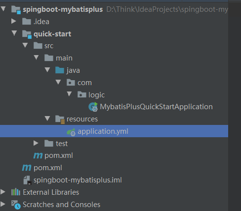

4、导入依赖

```xml
<!-- https://mvnrepository.com/artifact/org.projectlombok/lombok -->
<dependency>
    <groupId>org.projectlombok</groupId>
    <artifactId>lombok</artifactId>
    <version>1.18.20</version>
    <scope>provided</scope>
</dependency>
<!-- https://mvnrepository.com/artifact/mysql/mysql-connector-java -->
<dependency>
    <groupId>mysql</groupId>
    <artifactId>mysql-connector-java</artifactId>
    <version>8.0.22</version>
</dependency>
<!-- https://mvnrepository.com/artifact/com.baomidou/mybatis-plus-boot-starter -->
<dependency>
    <groupId>com.baomidou</groupId>
    <artifactId>mybatis-plus-boot-starter</artifactId>
    <version>3.4.2</version>
</dependency>
<dependency>
    <groupId>org.springframework.boot</groupId>
    <artifactId>spring-boot-starter-test</artifactId>
    <scope>test</scope>
    <exclusions>
        <exclusion>
            <groupId>org.junit.vintage</groupId>
            <artifactId>junit-vintage-engine</artifactId>
        </exclusion>
    </exclusions>
</dependency>
```

说明：我们使用 mybatis-plus 可以节省我们大量的代码，尽量不要同时导入 mybatis 和 mybatis-plus！版本的差异！

5、连接数据库！这一步和 mybatis 相同！

```yml
# mysql 5 驱动不同 com.mysql.jdbc.Driver
# mysql 8 驱动不同com.mysql.cj.jdbc.Driver、需要增加时区的配置 serverTimezone=GMT%2B8
spring:
  datasource:
    username: root
    password: 123456
    url: jdbc:mysql://localhost:3306/mybatis_plus?useSSL=false&useUnicode=true&characterEncoding=utf-8&serverTimezone=GMT%2B8
    driver-class-name: com.mysql.cj.jdbc.Driver
```

6、传统方式pojo-dao（连接mybatis，配置mapper.xml文件）-service-controller，并且还需要在yml配置文件中配置实体的别名包，以及mapper.xml文件的映射目录！

使用了mybatis-plus 之后：

- pojo

```java
@Data
@AllArgsConstructor
@NoArgsConstructor
public class User {
	private Long id;
	private String name;
	private Integer age;
	private String email;
}
```

- mapper接口

- 注意点，我们需要在主启动类上去扫描我们的mapper包下的所有接口==@MapperScan("com.kuang.mapper")==或者是在每个mapper类上直接使用@Mapper注解标明这是一个Mapper配置类。

- 测试类中测试

```java
@SpringBootTest
class MybatisPlusApplicationTests {
	// 继承了BaseMapper，所有的方法都来自己父类
	// 我们也可以编写自己的扩展方法！
	@Autowired
	private UserMapper userMapper;
	@Test
	void contextLoads() {
		List<User> users = userMapper.selectList(null);
		users.forEach(System.out::println);
	}
}
```

- 结果

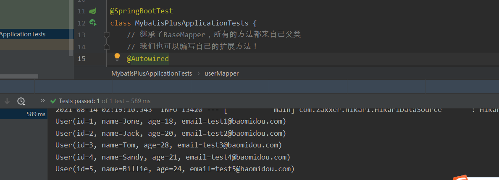

> 思考问题？

1、SQL谁帮我们写的 ? MyBatis-Plus 都写好了
2、方法哪里来的？ MyBatis-Plus 都写好了

## 配置日志

我们所有的sql现在是不可见的，我们希望知道它是怎么执行的，所以我们必须要看日志！

```yml
# 配置mybatis-plus输出日志 可以观察到自动生成的SQL
mybatis-plus:
  configuration:
    log-impl: org.apache.ibatis.logging.stdout.StdOutImpl
```

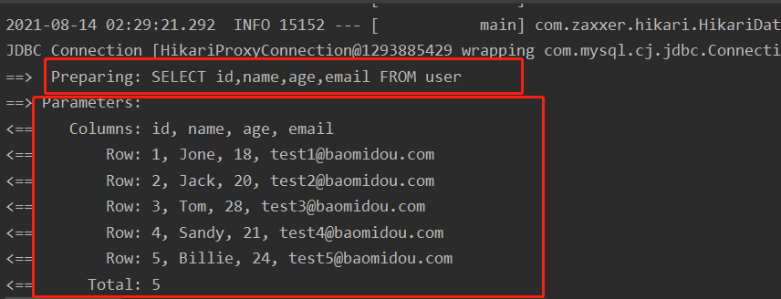

## CRUD扩展

### 插入操作

> Insert 插入

```java
@Test
void testInsert() {
	User user = new User();
	user.setName("狂神说Java");
	user.setAge(3);
	user.setEmail("24736743@qq.com");
	int result = userMapper.insert(user); // 帮我们自动生成id
	System.out.println(result); // 受影响的行数
	System.out.println(user); // 发现，id会自动回填
}
```

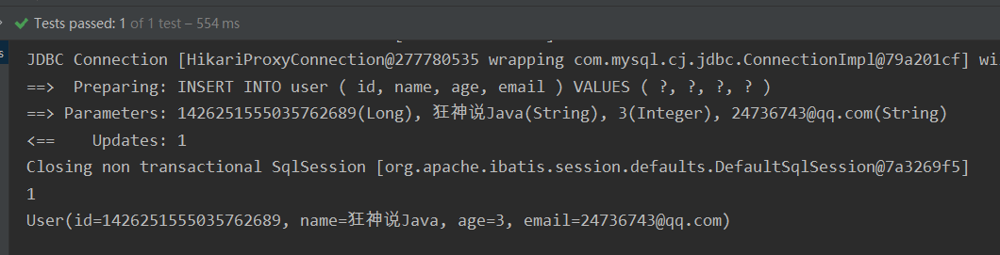

> 数据库插入的id的默认值为：全局的唯一id

### 主键生成策略

> v3.3.0之前默认 ID_WORKER 全局唯一id，后由于雪花算法生成ID重复，所以现版本默认改为ASSIGN_ID(UUID生成，去除“-”)

分布式系统唯一id生成：https://www.cnblogs.com/haoxinyue/p/5208136.html

#### 雪花算法：

snowflake是Twitter开源的分布式ID生成算法，结果是一个long型的ID。其核心思想是：使用41bit作为
毫秒数，10bit作为机器的ID（5个bit是数据中心，5个bit的机器ID），12bit作为毫秒内的流水号（意味
着每个节点在每毫秒可以产生 4096 个 ID），最后还有一个符号位，永远是0。可以保证几乎全球唯
一！(现已经被证实不可靠)

> 主键自增

我们需要配置主键自增：

1、实体类字段上 ==@TableId(type = IdType.AUTO)==

2、数据库字段一定要是自增！

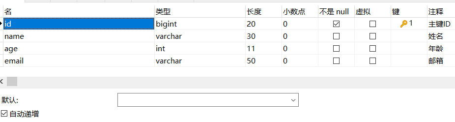

3、再次测试插入即可！

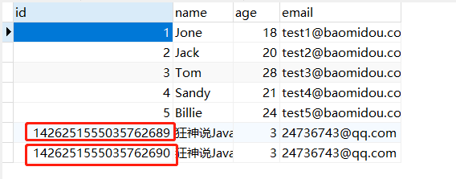

> 其与的源码解释

```java
public enum IdType {
    /**
     * 数据库ID自增
     * <p>该类型请确保数据库设置了 ID自增 否则无效</p>
     */
    AUTO(0),
    /**
     * 该类型为未设置主键类型(注解里等于跟随全局,全局里约等于 INPUT)
     */
    NONE(1),
    /**
     * 用户输入ID
     * <p>该类型可以通过自己注册自动填充插件进行填充</p>
     */
    INPUT(2),

    /* 以下3种类型、只有当插入对象ID 为空，才自动填充。 */
    /**
     * 分配ID (主键类型为number或string）,
     * 默认实现类 {@link com.baomidou.mybatisplus.core.incrementer.DefaultIdentifierGenerator}(雪花算法)
     *
     * @since 3.3.0
     */
    ASSIGN_ID(3),
    /**
     * 分配UUID (主键类型为 string)
     * 默认实现类 {@link com.baomidou.mybatisplus.core.incrementer.DefaultIdentifierGenerator}(UUID.replace("-",""))
     */
    ASSIGN_UUID(4),
    /**
     * @deprecated 3.3.0 please use {@link #ASSIGN_ID}
     */
    @Deprecated
    ID_WORKER(3),
    /**
     * @deprecated 3.3.0 please use {@link #ASSIGN_ID}
     */
    @Deprecated
    ID_WORKER_STR(3),
    /**
     * @deprecated 3.3.0 please use {@link #ASSIGN_UUID}
     */
    @Deprecated
    UUID(4);

    private final int key;

    IdType(int key) {
        this.key = key;
    }
}
```

> 测试手动输入主键

```java
@Test
void testInputInsert() {
	User user = new User();
	user.setId(6L);
	user.setName("狂神说Java");
	user.setAge(3);
	user.setEmail("24736743@qq.com");
	int result = userMapper.insert(user); // 帮我们自动生成id
	System.out.println(result); // 受影响的行数
	System.out.println(user); // 发现，id会自动回填
}
```

测试结果：

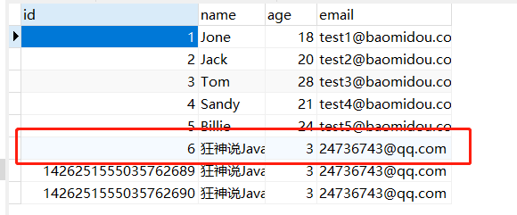

### 更新操作

```java
@Test
void testUpdate() {
	User user = new User();
	// 通过条件自动拼接动态sql
	user.setId(6L);
	user.setName("关注公众号：狂神说");
	user.setAge(18);
	// 注意：updateById 但是参数是一个 对象
	int i = userMapper.updateById(user);
	System.out.println(i);
}
```

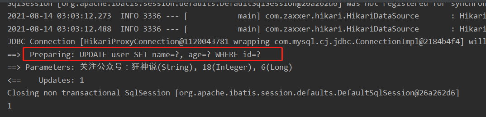

所有的sql都是MybatisPlus自动帮你动态配置的！

### 自动填充

创建时间、修改时间！这些个操作一遍都是自动化完成的，我们不希望手动更新！

阿里巴巴开发手册：所有的数据库表：gmt_create、gmt_modified几乎所有的表都要配置上！而且需
要自动化！

> 方式一：数据库级别（工作中不允许你修改数据库）

1、在表中新增字段 create_time, update_time

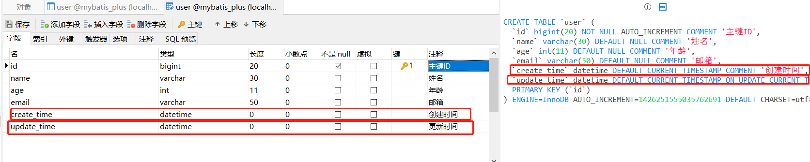

2、再次测试插入方法，我们需要先把实体类同步！

```java
private Date createTime;
private Date updateTime;
```

3、再次更新查看结果即可

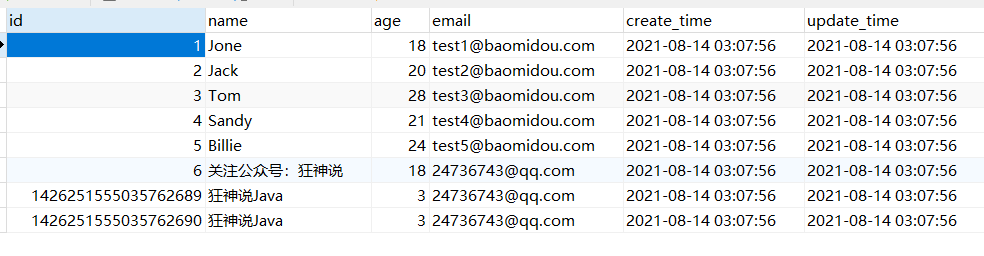

> 方式二：代码级别

1、删除数据库的默认值、更新操作！

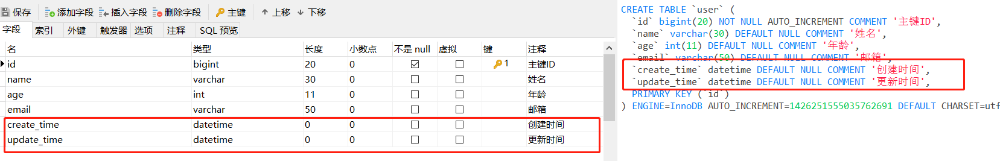

2、实体类字段属性上需要增加注解

```java
// 字段添加填充内容
@TableField(fill = FieldFill.INSERT)
private Date createTime;
@TableField(fill = FieldFill.INSERT_UPDATE)
private Date updateTime;
```

3、编写处理器来处理这个注解即可！

```java
@Slf4j
@Component // 一定不要忘记把处理器加到IOC容器中！
public class MyMetaObjectHandler implements MetaObjectHandler {
	// 插入时的填充策略
	@Override
	public void insertFill(MetaObject metaObject) {
		log.info("start insert fill.....");
		// setFieldValByName(String fieldName, Object fieldVal, MetaObject
		this.setFieldValByName("createTime",new Date(),metaObject);
		this.setFieldValByName("updateTime",new Date(),metaObject);
	}

	// 更新时的填充策略
	@Override
	public void updateFill(MetaObject metaObject) {
		log.info("start update fill.....");
		this.setFieldValByName("updateTime",new Date(),metaObject);
	}
}
```

4、测试插入

5、测试更新、观察时间即可！

### 乐观锁

在面试过程中，我们经常会被问到乐观锁，悲观锁！这个其实非常简单！

>乐观锁 : 故名思意十分乐观，它总是认为不会出现问题，无论干什么不去上锁！如果出现了问题，再次更新值测试
>悲观锁：故名思意十分悲观，它总是认为总是出现问题，无论干什么都会上锁！再去操作！

我们这里主要讲解 乐观锁机制！

乐观锁实现方式：

- 取出记录时，获取当前 version
- 更新时，带上这个version
- 执行更新时， set version = newVersion where version = oldVersion
- 如果version不对，就更新失败，执行的行数为0就说明更新失败

```sql
乐观锁：1、先查询，获得版本号 version = 1
-- A 线程
update user set name = "kuangshen", version = version + 1
where id = 2 and version = 1
-- B 线程抢先完成，这个时候 version = 2，会导致 A 修改失败！
update user set name = "kuangshen", version = version + 1
where id = 2 and version = 1
```

> 测试一下MP的乐观锁插件

1、给数据库中增加version字段！

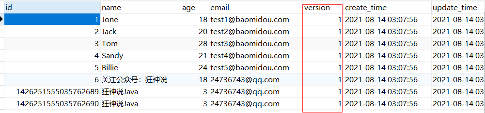

2、我们实体类加对应的字段

```java
@Version //乐观锁Version注解
private Integer version;
```

3、注册组件

```java
@Configuration  //设置为spring中的配置类
@EnableTransactionManagement //添加事务控制
@MapperScan("com.logic.mapper")  //必须要设置 否则MybatisPlus将无法执行
public class MybatisPlusConfig {
	// 注册乐观锁插件 旧版的OptimisticLockerInterceptor类已经被废弃
	@Bean
	public MybatisPlusInterceptor mybatisPlusInterceptor() {
		MybatisPlusInterceptor interceptor = new MybatisPlusInterceptor();
		//配置乐观锁
		interceptor.addInnerInterceptor(new OptimisticLockerInnerInterceptor());
		return interceptor;
	}
}
```

4、测试一下！

```java
// 测试乐观锁成功
@Test
void testOptimisticLocker() {
	// 1、查询用户信息
	User user = userMapper.selectById(1L);
	// 2、修改用户信息
	user.setName("kuangshen");
	user.setEmail("24736743@qq.com");
	int exNum = userMapper.updateById(user);
	System.out.println("影响行数:" + exNum);
}
```

```java
@Test
void testOptimisticLocker2() throws InterruptedException {
	new Thread(() -> {
		User user = userMapper.selectById(1L);
		user.setName("kuangshen111");
		user.setEmail("24736743@qq.com");
		try {
			//模拟被线程二插队的情况
			TimeUnit.SECONDS.sleep(1);
		} catch (InterruptedException e) {
			e.printStackTrace();
		}
		int exNum = userMapper.updateById(user);
		//由于乐观锁的存在，因此会更新失败，若想更新成功 则需要返回重试(自旋锁)
		System.out.println("T1影响行数:" + exNum);
	},"T1").start();
	new Thread(() -> {
		User user = userMapper.selectById(1L);
		user.setName("kuangshen222");
		user.setEmail("24736743@qq.com");
		int exNum = userMapper.updateById(user);
		System.out.println("T2影响行数:" + exNum);
	},"T2").start();
	//此处需要额外注意，因为SpringBoot Test 中主线程退出，是不会管用户线程是否结束了任务的 所以要保证用户线程跑完才让主线程结束
	TimeUnit.SECONDS.sleep(2);
}
```

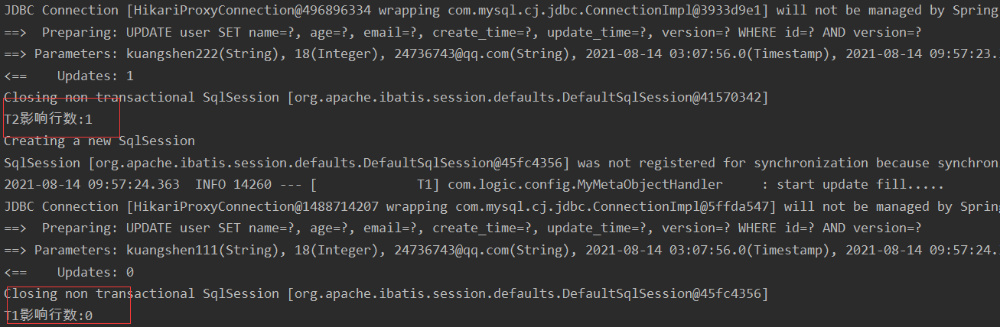

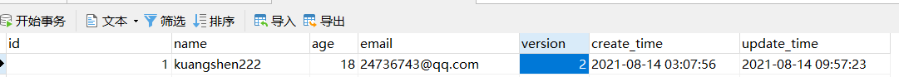

### 查询操作

```java
//测试查询
@Test
public void testSelectById(){
	User user = userMapper.selectById(1L);
	System.out.println(user);
}
// 测试批量查询！
@Test
public void testSelectByBatchId() {
	List<User> users = userMapper.selectBatchIds(Arrays.asList(1, 
	users.forEach(System.out::println);
}
// 按条件查询之一使用map操作
@Test
public void testSelectByBatchIds(){
	HashMap<String, Object> map = new HashMap<>();
	// 自定义要查询
	map.put("name","狂神说Java");
	map.put("age",3);
	List<User> users = userMapper.selectByMap(map);
	users.forEach(System.out::println);
}
```

### 分页查询

分页在网站使用的十分之多！

#### 实现方式

1、原始的 limit 进行分页

2、pageHelper 第三方插件

3、MP 其实也内置了分页插件！

> 如何使用！

1、配置拦截器组件即可

```java
//配置分页插件 老版的PaginationInterceptor 已经被废弃，现在统一使用interceptor.addInnerInterceptor()的方式添加插件
interceptor.addInnerInterceptor(new PaginationInnerInterceptor(DbType.H2));
```

2、直接使用Page对象即可！

```java
//测试分页
@Test
public void testPage(){
	/**
	 * 参数一：当前页
	 *参数二：页面大小
	 *使用了分页插件之后，所有的分页操作也变得简单的！
	 */
	Page<User> page = new Page<>(2,5);
	userMapper.selectPage(page,null);
	page.getRecords().forEach(System.out::println);
	System.out.println(page.getTotal());
}
```

### 删除操作

```java
// 测试删除
@Test
void testDeleteById() {
	userMapper.deleteById(1426251555035762689L);
}
// 通过id批量删除
@Test
void testDeleteBatchByIds() {
	userMapper.deleteBatchIds(Arrays.asList(1426251555035762689L, 1426251555035762690L));
}
// 通过map条件删除
@Test
void testMapDelete() {
	HashMap<String, Object> map = new HashMap<>();
	map.put("name","关注公众号：狂神说");
	userMapper.deleteByMap(map);
}
```

### 逻辑删除

>物理删除 ：从数据库中直接移除
>逻辑删除 ：再数据库中没有被移除，而是通过一个变量来让他失效！ deleted = 0 => deleted = 1

1、在数据表中增加一个 delete 字段

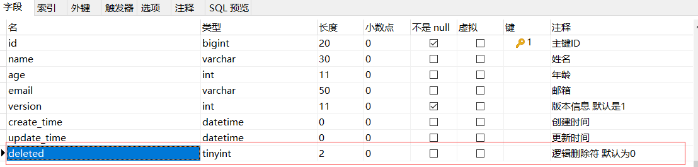

2、实体类中增加属性

```java
@TableLogic //逻辑删除
private Integer deleted;
```

3、配置application.yml

```yaml
mybatis-plus:
  global-config:
    db-config:
      logic-delete-field: flag  # 全局逻辑删除的实体字段名(since 3.3.0,配置后可以忽略不配置步骤2)
      logic-delete-value: 1 # 逻辑已删除值(默认为 1)
      logic-not-delete-value: 0 # 逻辑未删除值(默认为 0)
```

4、测试一下删除！

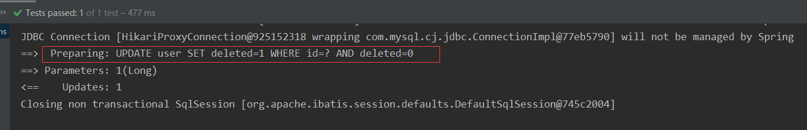

此时执行的是更新语句而不是删除语句！记录依旧在数据库，但是值确已经变化了！

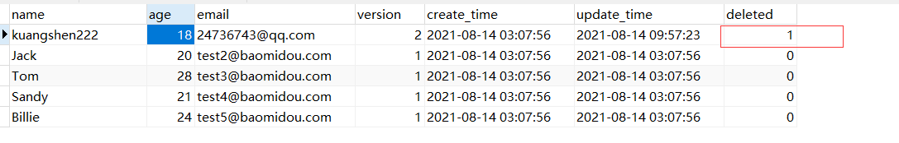

```java
//逻辑删除后的结果测试查询
@Test
void logicDeleteAndTestQueryResult() {
   User user = userMapper.selectById(1L);
   System.out.println(user);
}
```

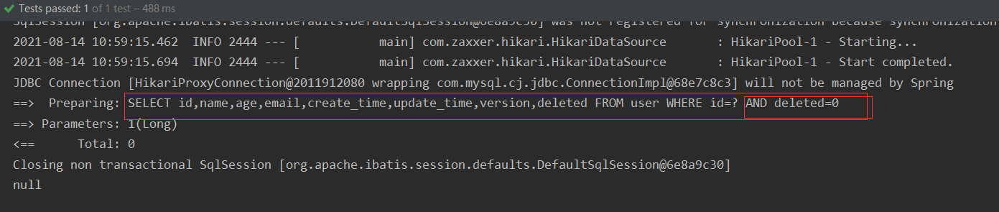

精通掌握以上的所有CRUD操作及其扩展操作，会大大提高工作和写项目的效率！

### 性能分析插件

我们在平时的开发中，会遇到一些慢sql。测试！ 例如第三方插件druid。

作用：性能分析拦截器，用于输出每条 SQL 语句及其执行时间。

3.2.0之前的MybatisPlus也有此功能。如果超过这个时间就停止运行！但3.2.0版本已经被MP正式移除了，官方推荐使用第三方的性能分析插件来`执行 SQL 分析打印` 功能。关于druid的详细使用，具体请参照[博文](https://www.cnblogs.com/prefectjava/p/9397999.html)。

1、导入依赖

```xml
<dependency>
    <groupId>org.springframework.boot</groupId>
    <artifactId>spring-boot-starter-web</artifactId>
</dependency>
<dependency>
    <groupId>com.alibaba</groupId>
    <artifactId>druid-spring-boot-starter</artifactId>
    <version>1.2.6</version>
</dependency>
```

2、在application.yml中配置druid参数，当然也可以使用@Configuration注解手动配置druid配置类

```yaml
spring:
  datasource:
    username: root
    password: 123456
    url: jdbc:mysql://localhost:3306/mybatis_plus?useSSL=false&useUnicode=true&characterEncoding=utf-8&serverTimezone=GMT%2B8
    driver-class-name: com.mysql.cj.jdbc.Driver
    type: com.alibaba.druid.pool.DruidDataSource
    druid:
      # 下面为连接池的补充设置，应用到上面所有数据源中
      # 初始化大小，最小，最大
      initial-size: 5
      min-idle: 5
      max-active: 20
      # 配置获取连接等待超时的时间
      max-wait: 60000
      # 配置间隔多久才进行一次检测，检测需要关闭的空闲连接，单位是毫秒
      time-between-eviction-runs-millis: 60000
      # 配置一个连接在池中最小生存的时间，单位是毫秒
      min-evictable-idle-time-millis: 300000
      validation-query: SELECT 1 FROM DUAL
      test-while-idle: true
      test-on-borrow: false
      test-on-return: false
      # 打开PSCache，并且指定每个连接上PSCache的大小
      pool-prepared-statements: true
      max-pool-prepared-statement-per-connection-size: 20
      # 配置监控统计拦截的 Filter，去掉后监控界面 SQL 无法统计，wall 用于防火墙  日志 log4j
      filters: stat,wall,slf4j  #导入了slf4j 不需要再配置log4j的配置文件了
      use-global-data-source-stat: true
      # 通过connectProperties属性来打开mergeSql功能；慢SQL记录
      connect-properties: druid.stat.mergeSql=true;druid.stat.slowSqlMillis=5000
      #可以直接在配置文件中进行配置而不需要使用@Configuration注解类再通过@Bean将配置类导入
      web-stat-filter:
        enabled: true
        url-pattern: "/*"
        exclusions: "*.js,*.gif,*.jpg,*.bmp,*.png,*.css,*.ico,/druid/*"
      stat-view-servlet:
        url-pattern: "/druid/*"
        allow: 0.0.0.0
        reset-enable: true
        login-username: root
        login-password: 123456
        enabled: true
```

编写测试Controller进行测试：

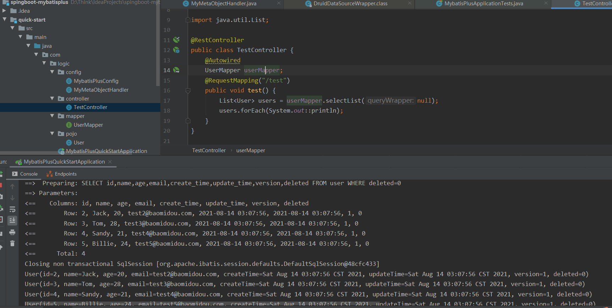

登录druid即可直接查看SQL分析：

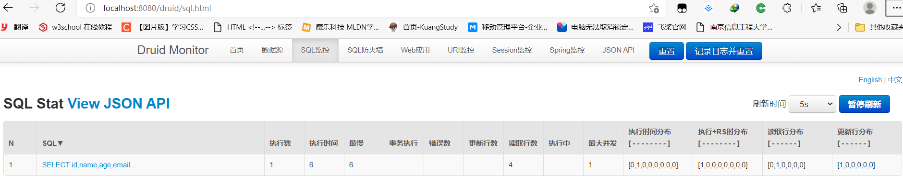

### 条件构造器

十分重要：Wrapper，我们写一些较为复杂的sql就可以使用它来替代！如果非常复杂，则推荐使用Mybatis原生的XML文件进行编写。不忘初心，方得始终！

```java
@Test
void allEqWrapper() {
   QueryWrapper queryWrapper = new QueryWrapper();
   HashMap<String, Object> map = new HashMap<>();
   map.put("name", "Jack");
   map.put("age", "20");
   queryWrapper.allEq(map);
   System.out.println(userMapper.selectList(queryWrapper));
}
@Test
void geWrapper() {
   QueryWrapper queryWrapper = new QueryWrapper();
   queryWrapper.ge("age", 20);
   System.out.println(userMapper.selectList(queryWrapper));
}
@Test
void groupByWrapper() {
   QueryWrapper queryWrapper = new QueryWrapper();
   queryWrapper.groupBy("version");
   System.out.println(userMapper.selectMaps(queryWrapper));
}
```

> 如果是想要使用多表联合复杂查询，则需要配置MybatisPlus的别名目录以及mapper.xml文件所在路径。

1、配置maven资源过滤器

对于IDEA系列的IDE而言，其maven打包是会忽略掉java目录中的静态资源文件的，因此，如果不想将文件xml文件放置在resource目录下的话，则需要在maven中配置资源过滤器防止maven打包时忽略java目录中的静态资源：

```xml
<build>
  <resources>
      <resource>
          <!-- xml放在java目录下-->
          <directory>src/main/java</directory>
          <includes>
              <include>**/*.xml</include>
          </includes>
      </resource>
      <!--指定资源的位置（xml放在resources下，可以不用指定）-->
      <resource>
          <directory>src/main/resources</directory>
      </resource>
  </resources>
</build>
```

2、配置application配置文件

```yaml
mybatis-plus:	
	type-aliases-package: com.logic.pojo
	mapper-locations: classpath:/com/logic/mapper/*.xml
```

3、mapper接口类添加自定义接口方法

```java
// 在对应的Mapper上面继承基本的类 BaseMapper
@Repository // 代表持久层
@Mapper
public interface UserMapper extends BaseMapper<User> {
   // 所有的CRUD操作都已经编写完成了
   // 你不需要像以前的配置一大堆文件了！
   User queryUserByMyOperate(int id);
}
```

4、同级目录下创建userMapper.xml

```xml
<?xml version="1.0" encoding="UTF-8" ?>
<!DOCTYPE mapper
        PUBLIC "-//mybatis.org//DTD Mapper 3.0//EN"
        "http://mybatis.org/dtd/mybatis-3-mapper.dtd">
<mapper namespace="com.logic.mapper.UserMapper">

    <!--<insert id="insertEmployee" parameterType="com.logic.pojo.Employee">-->
    <!--    insert into z_employee(name,sex,email,birth,departId) values (#{name},#{sex},#{email},#{birth},#{department.id})-->
    <!--</insert>-->
   <select id="queryUserByMyOperate" resultType="com.logic.pojo.User" parameterType="int">
      SELECT * FROM `user` WHERE id = #{id}
   </select>
</mapper>
```

5、编写测试类测试

```java
//测试自己编写的mybatis查询
@Test
void testMyself() {
   System.out.println(userMapper.queryUserByMyOperate(1));
}
```

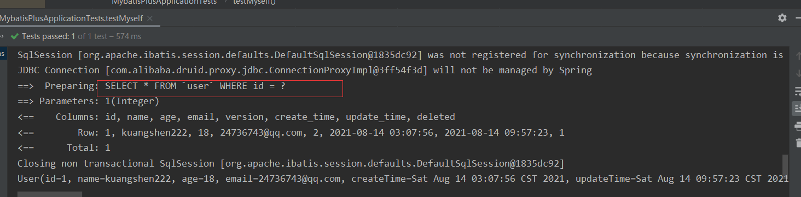

观察到MybatisPlus使用的是我们自定义的查询语句。

### 代码自动生成器

通过 AutoGenerator 可以快速生成 Entity、Mapper、Mapper XML、Service、Controller 等各个模块的代码，极大的提升了开发效率。

1、导入依赖，MyBatis-Plus 从 `3.0.3` 之后移除了代码生成器与模板引擎的默认依赖，需要手动添加相关依赖：

```xml
<dependency>
    <groupId>com.baomidou</groupId>
    <artifactId>mybatis-plus-generator</artifactId>
    <version>3.4.1</version>
</dependency>
<!--Velocity（默认）-->
<dependency>
    <groupId>org.apache.velocity</groupId>
    <artifactId>velocity-engine-core</artifactId>
    <version>latest-velocity-version</version>
</dependency>
<!--Freemarker：-->
<dependency>
    <groupId>org.freemarker</groupId>
    <artifactId>freemarker</artifactId>
    <version>latest-freemarker-version</version>
</dependency>
<!--Beetl：-->
<dependency>
    <groupId>com.ibeetl</groupId>
    <artifactId>beetl</artifactId>
    <version>latest-beetl-version</version>
</dependency>
```

注意！如果您选择了非默认引擎，需要在 AutoGenerator 中 设置模板引擎。

```java
AutoGenerator generator = new AutoGenerator();

// set freemarker engine
generator.setTemplateEngine(new FreemarkerTemplateEngine());

// set beetl engine
generator.setTemplateEngine(new BeetlTemplateEngine());

// set custom engine (reference class is your custom engine class)
generator.setTemplateEngine(new CustomTemplateEngine());

// other config
...
```

2、编写自动生成代码测试：

```java
package com.logic;

import com.baomidou.mybatisplus.generator.config.GlobalConfig;
import com.baomidou.mybatisplus.core.exceptions.MybatisPlusException;
import com.baomidou.mybatisplus.core.metadata.TableInfo;
import com.baomidou.mybatisplus.core.toolkit.StringPool;
import com.baomidou.mybatisplus.core.toolkit.StringUtils;
import com.baomidou.mybatisplus.generator.AutoGenerator;
import com.baomidou.mybatisplus.generator.InjectionConfig;
import com.baomidou.mybatisplus.generator.config.*;
import com.baomidou.mybatisplus.generator.config.rules.NamingStrategy;
import com.baomidou.mybatisplus.generator.engine.FreemarkerTemplateEngine;

import java.util.ArrayList;
import java.util.List;
import java.util.Scanner;

// 演示例子，执行 main 方法控制台输入模块表名回车自动生成对应项目目录中
public class CodeGenerator {

   /**
    * <p>
    * 读取控制台内容
    * </p>
    */
   public static String scanner(String tip) {
      Scanner scanner = new Scanner(System.in);
      StringBuilder help = new StringBuilder();
      help.append("请输入" + tip + "：");
      System.out.println(help.toString());
      if (scanner.hasNext()) {
         String ipt = scanner.next();
         if (StringUtils.isNotBlank(ipt)) {
            return ipt;
         }
      }
      throw new MybatisPlusException("请输入正确的" + tip + "！");
   }

   public static void main(String[] args) {
      // 代码生成器
      AutoGenerator mpg = new AutoGenerator();

      // 全局配置
      GlobalConfig gc = new GlobalConfig();
      String projectPath = System.getProperty("user.dir");
      gc.setOutputDir(projectPath + "/src/main/java");
      gc.setAuthor("logic");
      gc.setOpen(false);
      gc.setFileOverride(false); // 是否覆盖
      // gc.setSwagger2(true); 实体属性 Swagger2 注解
      mpg.setGlobalConfig(gc);

      // 数据源配置
      DataSourceConfig dsc = new DataSourceConfig();
      dsc.setUrl("jdbc:mysql://localhost:3306/mybatis_plus?useSSL=false&useUnicode=true&characterEncoding=utf-8&serverTimezone=GMT%2B8");
      // dsc.setSchemaName("public");
      dsc.setDriverName("com.mysql.jdbc.Driver");
      dsc.setUsername("root");
      dsc.setPassword("123456");
      mpg.setDataSource(dsc);

      // 包配置
      PackageConfig pc = new PackageConfig();
      pc.setModuleName(scanner("模块名"));
      pc.setParent("com.logic");
      mpg.setPackageInfo(pc);

      // 自定义配置
      InjectionConfig cfg = new InjectionConfig() {
         @Override
         public void initMap() {
            // to do nothing
         }
      };

      // 如果模板引擎是 freemarker
      String templatePath = "/templates/mapper.xml.ftl";
      // 如果模板引擎是 velocity
      // String templatePath = "/templates/mapper.xml.vm";

      // 自定义输出配置
      List<FileOutConfig> focList = new ArrayList<>();
      // 自定义配置会被优先输出
      focList.add(new FileOutConfig(templatePath) {
         @Override
         public String outputFile(com.baomidou.mybatisplus.generator.config.po.TableInfo tableInfo) {
            // 自定义输出文件名 ， 如果你 Entity 设置了前后缀、此处注意 xml 的名称会跟着发生变化！！
            return projectPath + "/src/main/resources/mapper/" + pc.getModuleName()
                  + "/" + tableInfo.getEntityName() + "Mapper" + StringPool.DOT_XML;
         }
      });
        /*
        cfg.setFileCreate(new IFileCreate() {
            @Override
            public boolean isCreate(ConfigBuilder configBuilder, FileType fileType, String filePath) {
                // 判断自定义文件夹是否需要创建
                checkDir("调用默认方法创建的目录，自定义目录用");
                if (fileType == FileType.MAPPER) {
                    // 已经生成 mapper 文件判断存在，不想重新生成返回 false
                    return !new File(filePath).exists();
                }
                // 允许生成模板文件
                return true;
            }
        });
        */
      cfg.setFileOutConfigList(focList);
      mpg.setCfg(cfg);

      // 配置模板
      TemplateConfig templateConfig = new TemplateConfig();

      // 配置自定义输出模板
      //指定自定义模板路径，注意不要带上.ftl/.vm, 会根据使用的模板引擎自动识别
      // templateConfig.setEntity("templates/entity2.java");
      // templateConfig.setService();
      // templateConfig.setController();

      templateConfig.setXml(null);
      mpg.setTemplate(templateConfig);

      // 策略配置
      StrategyConfig strategy = new StrategyConfig();
      strategy.setNaming(NamingStrategy.underline_to_camel);
      strategy.setColumnNaming(NamingStrategy.underline_to_camel);
      // strategy.setSuperEntityClass("你自己的父类实体,没有就不用设置!");
      strategy.setEntityLombokModel(true);
      strategy.setRestControllerStyle(true);
      // 公共父类
      // strategy.setSuperControllerClass("你自己的父类控制器,没有就不用设置!");
      // 写于父类中的公共字段
      strategy.setSuperEntityColumns("id");
      strategy.setInclude(scanner("表名，多个英文逗号分割").split(","));
      strategy.setControllerMappingHyphenStyle(true);
      strategy.setTablePrefix(pc.getModuleName() + "_");
      mpg.setStrategy(strategy);
      mpg.setTemplateEngine(new FreemarkerTemplateEngine());
      mpg.execute();
   }

}
```

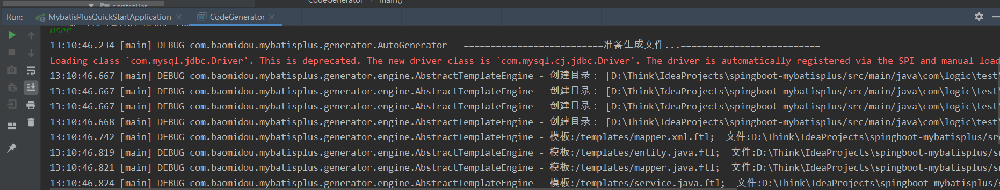
