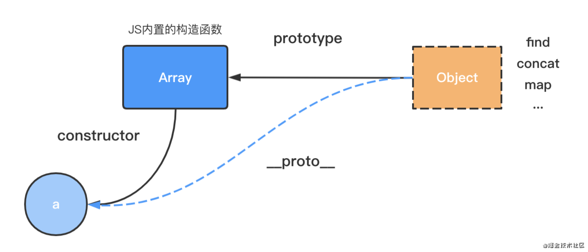
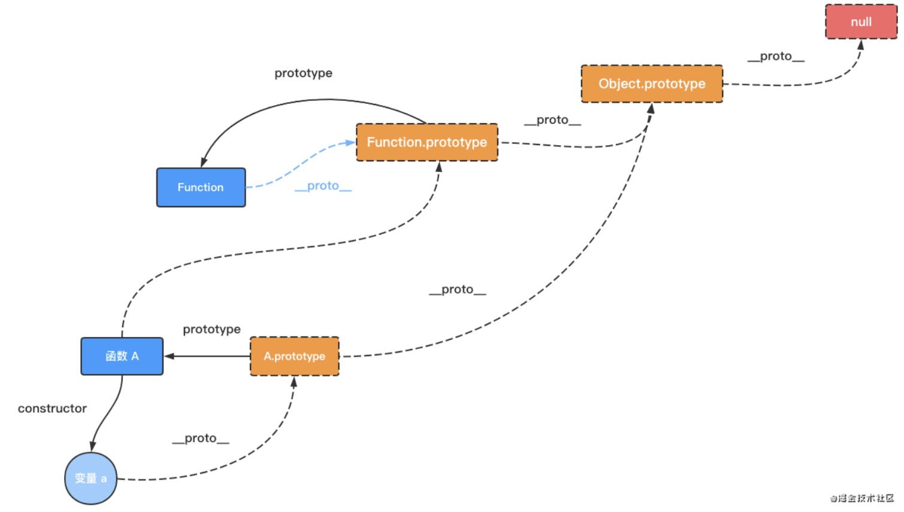

# JS需要掌握的几大核心知识

## 闭包

何为闭包？所谓闭包，简单来说就是：变量赋值和方法赋值是不一样的，变量赋值是直接将某个值赋值给某个变量；而方法赋值是指将某方法的定义赋值给**指定的变量**，同时将该方法被创建时的局部上下文变量的值打包成一个**外带的背包**一样的形式同时传递给该**指定的变量**，除了该方法的赋值链上的变量，其他任何变量都不能访问到闭包中变量的值。例子：

```js
let c = 6
const addX = (x, y) => n => {
  if (x - y > 0) {
    x += 1;
    y += 1;
    return x + y + n;
  } else {
    x -= 1;
    y -= 1;
    return x + y - n;
  }
}
const addThree = addX(3, 4)
let d = addThree(c)
let f = addThree(c)
console.log('example partial application', d, f);
```

关于闭包的详细的讲解请参见：<https://juejin.cn/post/6844903858636849159>

## 原型链



何为原型链？所谓原型链，就是指：__proto__和prototype其实是一个意思，构造函数的作用，就是将自身的原型（prototype），赋值给实例的__proto__;所有类的最终超类是Object,Object的原型就是null(规定)。

一个变量的__proto__，永远是指向其构造函数的原型(prototype)，其终点为null；并且这种通过 prototype 一直寻找的过程，也即是原型链。



关于原型链的详细的讲解请参见：<https://juejin.cn/post/6960866669052821517>
