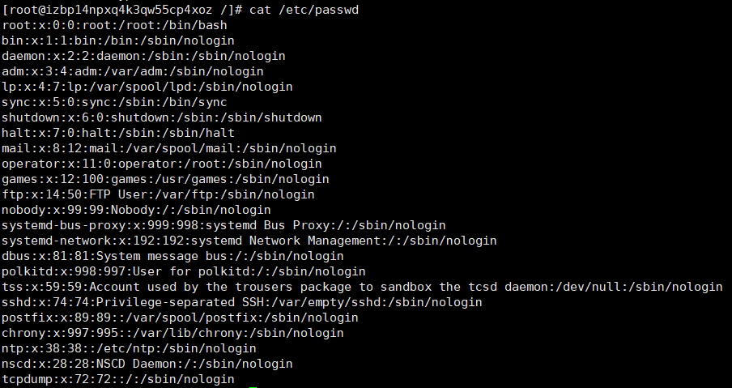
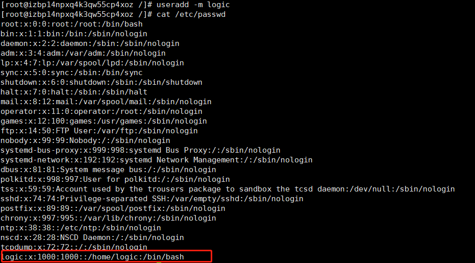
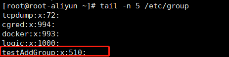
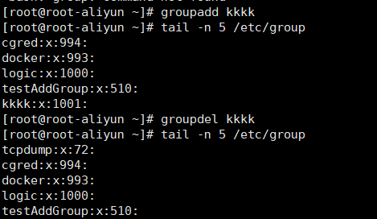
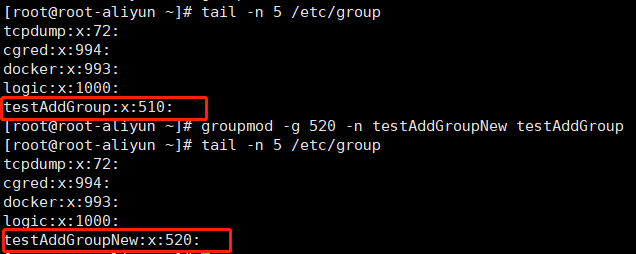
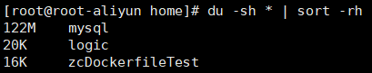
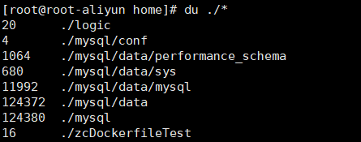
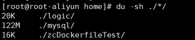
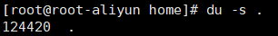
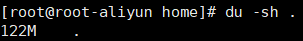

# Linux的常用命令行

## chown

用来变更文件或目录的拥有者或所属群组，只有文件主(属主)和超级用户才可以便用该命令。
语法：```chown(选项)(参数)```
实例：
1、将目录/usr/meng及其下面的所有文件、子目录的文件主改成 liu：```chown -R liu /usr/meng```

## chgrp

用来变更文件或目录的所属群组,该命令用来改变指定文件所属的用户组。其中，组名可以是用户组的id，也可以是用户组的组名。文件名可以 是由空格分开的要改变属组的文件列表，也可以是由通配符描述的文件集合。如果用户不是该文件的文件主或超级用户(root)，则不能改变该文件的组。

语法：```chgrp [选项][组群][文件|目录]```
实例：
1、将/usr/meng及其子目录下的所有文件的用户组改为mengxin：```chgrp -R mengxin /usr/meng```
2、更改文件ah的组群所有者为 newuser：```[root@rhel ~]# chgrp newuser ah```

## chmod

用来变更文件或目录的权限,更改方式：
1、通过符号组合的方式更改目标文件或目录的权限。组合三次 rwx,分别表示属主的权限，属组的权限以及其他用户的权限。
2、通过八进制数的方式更改目标文件或目录的权限。r:4,w:2,x:1,使用组合数字形式分别表示属主的权限，属组的权限以及其他用户的权限。例如777表示所有用户都赋予最高权限。
3、通过参考文件的权限来更改目标文件或目录的权限。

例子：

```linux
# 添加组用户的写权限。
chmod g+w ./test.log
# 删除其他用户的所有权限。
chmod o= ./test.log
# 使得所有用户都没有写权限。
chmod a-w ./test.log
# 当前用户具有所有权限，组用户有读写权限，其他用户只有读权限。
chmod u=rwx, g=rw, o=r ./test.log
# 等价的八进制数表示：
chmod 754 ./test.log
# 将目录以及目录下的文件都设置为所有用户拥有读写权限。
# 注意，使用'-R'选项一定要保留当前用户的执行和读取权限，否则会报错！
chmod -R a=rw ./testdir/
# 根据其他文件的权限设置文件权限。
chmod --reference=./1.log  ./test.log
```

## 查看文件

touch:创建文件
cat:查看一个文件的完整内容 顺序查看
tac:查看一个文件的完整内容 倒序查看
nl: 查看一个文件的完整内容 顺序查看并标明行号
more:查看文件的部分内容 使用enter向下换行 使用space向下翻页 只能向下翻页
less:more的升级版，仍然是查看文件的部分内容，使用enter健或“↓”向下换行，使用“↑”向上换行，使用PgUp和PgDn向上和向下翻页。查看文件过程中使用``:f``查看行位置以及当前文件位置（百分比显示），使用```/[搜索字段]```会将匹配的字符顺序标明，并定位到第一个匹配的字符所在位置;使用```?[搜索字段]```会将匹配的字符逆序标明，并定位到最后一个匹配的字符所在位置;使用"n"按照匹配方向正向定位下一个字符所在位置，使用"N"按照匹配方向逆向定位下一个字符所在位置。使用```q```退出查看。
head:显示文件的开头部分。```head -n 10 ifup-ib```查看ifup-ib文件的前10行数据
tail:显示文件的结尾部分。```tail -n 10 ifup-ib```查看ifup-ib文件的结尾10行数据

## ln

用来为文件创建链接，链接类型分为硬链接和符号链接(软链接)两种，默认的链接类型是硬链接。如果要创建符号链接必须使用"-s"选项。符号链接文件不是一个独立的文件，它的许多属性依赖于源文件，所以给符号链接文件设置存取权限是没有意义的。硬链接的“源文件”参数只能是文件，不能是目录。硬链接本质上是为硬盘中的真正存储的文件多挂载了一个节点，因此删除硬链接的源文件，本质上是减少了硬盘中存储文件的一个节点，并不会真正删除文件；而软链接本质上存储的是关于某个节点的指向，因此当软链接指向的源文件（节点）被删除后，软链接自然也就没用了。
硬链接实例：将目录/usr/mengqc/mub1下的文件m2.c链接到目录/usr/liu下的文件a2.c：

```linux
cd /usr/mengqc
ln /mub1/m2.c /usr/liu/a2.c
```

软链接实例：在目录/usr/liu下建立一个符号链接文件abc，使它指向目录/usr/mengqc/mub1：
```ln -s /usr/mengqc/mub1 /usr/liu/abc``` 执行该命令后，/usr/mengqc/mub1代表的路径将存放在名为/usr/liu/abc的文件中。

## echo

输出指定的字符串或者变量
语法：echo(选项)(参数)
-e：激活转义字符。
使用-e选项时，若字符串中出现以下字符，则特别加以处理，而不会将它当成一般文字输出：

\a 发出警告声；
\b 删除前一个字符；
\c 不产生进一步输出 (\c 后面的字符不会输出)；
\f 换行但光标仍旧停留在原来的位置；
\n 换行且光标移至行首；
\r 光标移至行首，但不换行；
\t 插入tab；
\v 与\f相同；
\\ 插入\字符；
\nnn 插入 nnn（八进制）所代表的ASCII字符；

echo默认直接输出到控制台，也可以输出到文件中 例如：将“hello world”字符串输出到f1文件中：```echo "hello world" >>f1```

## vim

强大的linux编辑器

[数字]<space> 光标移动指定的位数
[数字]<enter> 光标移动指定的行数
r 替换游标所在处一个字符
R 替换游标所在处一行字符
/<word> 查找 n 下一个 N上一个
<数字>x 在光标处向后连续删除指定个数的字符
:!表示强制执行 放在命令的最后保证改命令强制执行
:q不保存退出
:w无论有没有改动，都执行一次保存动作
:x有改动则保存后退出，无则直接退出，因此，使用:wq保存退出不如直接使用:x
:w [fileName] 将内容另存新档
:r [fileName] 读取另一个档案的数据 并将改数据放入游标指向的下一行
:n1,n2 w [fileName] 将n1,n2的内容存储成[fileName]这个档案
:! [command] 暂时离开vim到指令模式下执行[command]命令并显示执行结果，例如:! echo "hello"就是暂时离开vim并输出“hello”，之后你再按任意键就会重新返回vim
:set nu 显示行号 设置之后会在每一行的开头显示行号
:set nonu 不显示行号 设置之后原本的显示行号设置失效 取消行号设置

## useradd

创建的新的系统用户,useradd可用来建立用户帐号。帐号建好之后，再用```passwd [用户名]```设定指定帐号的密码，用户登入后可以直接通过```passwd```命令修改账户的密码，```passwd –d [用户名]```清空一个用户的口令密码，不设置账户密码或密码被清空将无法登入该账户；而可用userdel删除帐号。使用useradd指令所建立的帐号，实际上是保存在/etc/passwd文本文件中。
root账户使用```cat /etc/passwd```查看所有账户信息：
每一个用户一条记录，7个字段分别为：用户名，密码（隐藏显示x），用户ID，用户主组ID，用户描述，用户主目录，用户默认shell：

当然：真实的密码是不会存储在/etc/passwd文件中的，而是会存储在/etc/shadow中，只不过密码也是密文，无法得知真正的密码，除非通过shadow文件破解密码。
语法:useradd(选项)(参数)
选项：
-c<备注>：加上备注文字。备注文字会保存在passwd的备注栏位中；
-d<登入目录>：指定用户登入时的启始目录；
-D：变更预设值；
-e<有效期限>：指定帐号的有效期限；
-f<缓冲天数>：指定在密码过期后多少天即关闭该帐号；
-g<群组>：指定用户所属的群组；
-G<群组>：指定用户所属的附加群组；
-m：自动建立用户的登入目录；
-M：不要自动建立用户的登入目录；
-n：取消建立以用户名称为名的群组；
-r：建立系统帐号；
-s<shell>：指定用户登入后所使用的shell；
-u<uid>：指定用户id。
实例：
新建一个logic账户，并自动建立用户的登入目录：```useradd -m logic```

新建jack用户加入sales主组以及company,employees两个附加组：
```useradd –g sales jack –G company,employees    //-g：加入主要组、-G：加入次要组```
建立一个新用户账户，并设置ID：```useradd caojh -u 544```需要说明的是，设定ID值时尽量要大于500，以免冲突。因为Linux安装后会建立一些特殊用户，一般0到499之间的值留给bin、mail这样的系统账号。

## userdel

用于删除给定的用户以及与用户相关的文件,若不加选项，则仅删除用户帐号，而不删除相关文件。
语法:userdel(选项)(参数)
选项:
-f：强制删除用户，即使用户当前已登录；
-r：删除用户的同时，删除与用户相关的所有文件。
实例:
userdel命令很简单，比如我们现在有个用户linuxde，其家目录位于/var目录中，现在我们来删除这个用户：

```linux
userdel linuxde       # 删除用户linuxde，但不删除其家目录及文件；
userdel -r linuxde    # 删除用户linuxde，其家目录及文件一并删除；
```
请不要轻易用-r选项；他会删除用户的同时删除用户所有的文件和目录，切记如果用户目录下有重要的文件，在删除前请备份。其实也有最简单的办法，但这种办法有点不安全，也就是直接在/etc/passwd中删除您想要删除用户的记录；但最好不要这样做，/etc/passwd是极为重要的文件，可能您一不小心会操作失误。删除账户后在/etc/passwd下就不会有该账户信息了。

## usermod

用于修改用户的基本信息,usermod 命令不允许你改变正在线上的使用者帐号名称。当 usermod 命令用来改变user id，必须确认这名user没在电脑上执行任何程序。你需手动更改使用者的 crontab 档。也需手动更改使用者的 at 工作档。采用 NIS server 须在server上更动相关的NIS设定。

语法：usermod(选项)(参数)
选项:
-c<备注>：修改用户帐号的备注文字；
-d<登入目录>：修改用户登入时的目录，只是修改/etc/passwd中用户的家目录配置信息，不会自动创建新的家目录，通常和-m一起使用；
-m<移动用户家目录>:移动用户家目录到新的位置，不能单独使用，一般与-d一起使用。
-e<有效期限>：修改帐号的有效期限；
-f<缓冲天数>：修改在密码过期后多少天即关闭该帐号；
-g<群组>：修改用户所属的群组；
-G<群组>；修改用户所属的附加群组；
-l<帐号名称>：修改用户帐号名称；
-L：锁定用户密码，使密码无效；
-s<shell>：修改用户登入后所使用的shell；
-u<uid>：修改用户ID；
-U:解除密码锁定。

实例:
将 newuser2 添加到组 staff 中：```usermod -G staff newuser2```
修改newuser的用户名为newuser1：```usermod -l newuser1 newuser```
锁定账号newuser1：```usermod -L newuser1``` 被锁定的账户将无法登入
解除对newuser1的锁定：```usermod -U newuser1```
修改logic用户登入目录：```usermod -d /home/modUserDir logic```此时最好先保证/home/modUserDir目录存在，否则账户将无法正常登入。

## 切换用户

语法：su [username]
root用户切换logic普通用户：```su logic``` 使用```exit```或```logout```或使用快捷键```ctrl+d```退回原来的账户（root）
普通用户切换root用户：```sudo su``` 当然前提是该普通用户已经在/etc/sudoers文件中给用户添加了权限 否则该普通用户将没有权限切换成root用户
登入成功后，命令行最后一个字符是"$"表示当前登录账户为普通用户，如果是"#"，则表示当前登录账户为超级用户，即root用户

## hostname

用于显示和设置系统的主机名称。
```hostname```命令展示当前主机的主机名
```hostname [newname]```命令修改当前主机的主机名为newname,远程连接重连即可生效；但系统并不会永久保存新的主机名，重启之后还是原来的主机名。如果需要永久修改主机名，需要修改 /etc/hosts 和 /etc/sysconfig/network 的相关内容并进行重启；也可以使用 hostnamectl 命令进行永久修改（hostnamectl命令不用重启）。

## groupadd

组的相关概念介绍：

- 1、主组：
    也叫初始组，是用户登录系统时的组，规则如下：
    创建新用户时，若未明确指定该用户所属的主组，会默认创建一个与用户名相同的组，作为该用户的主组
    用户创建文件时，文件的所属权限组就是当前用户的主组
    使用useradd命令时用-g参数可以指定主组，则不会默认创建同名的主组
    用户有且只能所属一个主组
    用户的主组不能被删除
    用户不能直接被移出主组，但可以更换主组
    用户被删除时它的主组若没有其他所属用户，则会自动删除该主组

- 2、附加组
    登录后可切换的其他组，规则如下：
    使用useradd命令时用-G参数可以指定附加组
    用户可以所属零个或多个附加组
    用户的附加组和主组可相同
    附加组可以直接被删除而无需关心是否所属于用户
    附加组可以新增和移除任意个所属用户
    用户被删除时所属附属组不会受影响

**groupadd命令**用于创建一个新的工作组，新工作组的信息将被添加到系统文件中。
语法：groupadd(选项)(参数)
选项：
-g：指定新建工作组的id；默认ID从500开始 小于500是系统维护的账户所属的主组ID
-r：创建系统工作组，系统工作组的组ID小于500；
-K：覆盖配置文件“/ect/login.defs”；
-o：允许添加组ID号不唯一的工作组。
参数：
组名：指定新建工作组的组名。
实例：建立一个新组，并设置组ID加入系统：```groupadd -g 510 testAddGroup```
此时在/etc/passwd文件中产生一个组ID（GID）是510名称是testAddGroup的组：
每一个组一条记录，四个字段分别为：名，密码，组ID，组内用户列表（仅显示将该组作为附加组的用户）


## groupdel

用于删除指定的工作组 本命令要修改的系统文件包括/ect/group和/ect/gshadow。若该群组中仍包括某些用户，则必须先删除这些用户后，方能删除群组。
语法：groupdel(参数)
实例：

```linux
groupadd kkkk  //创建kkkk工作组
groupdel kkkk  //删除这个工作组
```



## groupmod

更改群组识别码或名称，需要更改群组的识别码或名称时，可用groupmod指令来完成这项工作。
语法：groupmod(选项)(参数)
选项：
-g<群组识别码>：设置欲使用的群组识别码；
-o：重复使用群组识别码；
-n<新群组名称>：设置欲使用的群组名称。
实例：更改testAddGroup组的组Id为520和组名为testAddGroupNew：
```groupmod -g 520 -n testAddGroupNew testAddGroup```


## df

df命令 用于显示磁盘分区上的可使用的磁盘空间。默认显示单位为KB。可以利用该命令来获取硬盘被占用了多少空间，目前还剩下多少空间等信息。
语法:df(选项)(参数)
选项:
-a或--all：包含全部的文件系统；
--block-size=<区块大小>：以指定的区块大小来显示区块数目；
-h或--human-readable：以可读性较高的方式来显示信息；
-H或--si：与-h参数相同，但在计算时是以1000 Bytes为换算单位而非1024 Bytes；
-i或--inodes：显示inode的信息；
-k或--kilobytes：指定区块大小为1024字节；
-l或--local：仅显示本地端的文件系统；
-m或--megabytes：指定区块大小为1048576字节；
--no-sync：在取得磁盘使用信息前，不要执行sync指令，此为预设值；
-P或--portability：使用POSIX的输出格式；
--sync：在取得磁盘使用信息前，先执行sync指令；
-t<文件系统类型>或--type=<文件系统类型>：仅显示指定文件系统类型的磁盘信息；
-T或--print-type：显示文件系统的类型；
-x<文件系统类型>或--exclude-type=<文件系统类型>：不要显示指定文件系统类型的磁盘信息；
--help：显示帮助；
--version：显示版本信息。
参数:
文件：指定文件系统上的文件。
实例:
查看系统磁盘设备，默认是KB为单位：

```linux
[root@LinServ-1 ~]# df
文件系统               1K-块        已用     可用 已用% 挂载点
/dev/sda2            146294492  28244432 110498708  21% /
/dev/sda1              1019208     62360    904240   7% /boot
tmpfs                  1032204         0   1032204   0% /dev/shm
/dev/sdb1            2884284108 218826068 2518944764   8% /data1
```

使用-h选项以KB以上的单位来显示，可读性高：

```linux
[root@LinServ-1 ~]# df -h
文件系统              容量  已用 可用 已用% 挂载点
/dev/sda2             140G   27G  106G  21% /
/dev/sda1             996M   61M  884M   7% /boot
tmpfs                1009M     0 1009M   0% /dev/shm
/dev/sdb1             2.7T  209G  2.4T   8% /data1
```

查看全部文件系统：

```linux
[root@LinServ-1 ~]# df -a
文件系统               1K-块        已用     可用 已用% 挂载点
/dev/sda2            146294492  28244432 110498708  21% /
proc                         0         0         0   -  /proc
sysfs                        0         0         0   -  /sys
devpts                       0         0         0   -  /dev/pts
/dev/sda1              1019208     62360    904240   7% /boot
tmpfs                  1032204         0   1032204   0% /dev/shm
/dev/sdb1            2884284108 218826068 2518944764   8% /data1
none                         0         0         0   -  /proc/sys/fs/binfmt_misc
```

显示 public 目录中的可用空间量，如以下输出中所示：

```linux
df public
# Filesystem     1K-blocks     Used Available Use% Mounted on
# /dev/loop0      18761008 15246924   2554392  86% /d Avail
```

## du

du命令 也是查看使用空间的，但是与df命令不同的是Linux du命令是对文件和目录磁盘使用的空间的查看，还是和df命令有一些区别的。
语法:du [选项][文件]
选项:
-a, --all                              显示目录中个别文件的大小。
-B, --block-size=大小                  使用指定字节数的块
-b, --bytes                            显示目录或文件大小时，以byte为单位。
-c, --total                            除了显示个别目录或文件的大小外，同时也显示所有目录或文件的总和。
-D, --dereference-args                 显示指定符号链接的源文件大小。
-H, --si                               与-h参数相同，但是K，M，G是以1000为换算单位。
-h, --human-readable                   以K，M，G为单位，提高信息的可读性。
-k, --kilobytes                        以KB(1024bytes)为单位输出。
-l, --count-links                      重复计算硬件链接的文件。
-m, --megabytes                        以MB为单位输出。
-L<符号链接>, --dereference<符号链接>  显示选项中所指定符号链接的源文件大小。
-P, --no-dereference                   不跟随任何符号链接(默认)
-0, --null                             将每个空行视作0 字节而非换行符
-S, --separate-dirs                    显示个别目录的大小时，并不含其子目录的大小。
-s, --summarize                        仅显示总计，只列出最后加总的值。
-x, --one-file-xystem                  以一开始处理时的文件系统为准，若遇上其它不同的文件系统目录则略过。
-X<文件>, --exclude-from=<文件>        在<文件>指定目录或文件。
--apparent-size                        显示表面用量，而并非是磁盘用量；虽然表面用量通常会小一些，但有时它会因为稀疏文件间的"洞"、内部碎片、非直接引用的块等原因而变大。
--files0-from=F                        计算文件F中以NUL结尾的文件名对应占用的磁盘空间如果F的值是"-"，则从标准输入读入文件名
--exclude=<目录或文件>                 略过指定的目录或文件。
--max-depth=N                          显示目录总计(与--all 一起使用计算文件)当N为指定数值时计算深度为N，等于0时等同--summarize
--si                                   类似-h，但在计算时使用1000 为基底而非1024
--time                                 显示目录或该目录子目录下所有文件的最后修改时间
--time=WORD                            显示WORD时间，而非修改时间：atime，access，use，ctime 或status
--time-style=样式                      按照指定样式显示时间(样式解释规则同"date"命令)：full-iso，long-iso，iso，+FORMAT
--help                                 显示此帮助信息并退出
--version                              显示版本信息并退出

实例:
文件从大到小排序:

只显示当前目录下子目录的大小:

查看指定目录下文件所占的空间:

只显示总和的大小:

显示总和的大小且易读:


## mount

mount命令 Linux mount命令是经常会使用到的命令，它用于挂载Linux系统外的文件。
语法：
mount [-hV]
mount -a [-fFnrsvw] [-t vfstype]
mount [-fnrsvw] [-o options [,...]] device | dir
mount [-fnrsvw] [-t vfstype] [-o options] device dir
选项：
-V：显示程序版本
-h：显示辅助讯息
-v：显示较讯息，通常和 -f 用来除错。
-a：将 /etc/fstab 中定义的所有档案系统挂上。
-F：这个命令通常和 -a 一起使用，它会为每一个 mount 的动作产生一个行程负责执行。在系统需要挂上大量 NFS 档案系统时可以加快挂上的动作。
-f：通常用在除错的用途。它会使 mount 并不执行实际挂上的动作，而是模拟整个挂上的过程。通常会和 -v 一起使用。
-n：一般而言，mount 在挂上后会在 /etc/mtab 中写入一笔资料。但在系统中没有可写入档案系统存在的情况下可以用这个选项取消这个动作。
-s-r：等于 -o ro
-w：等于 -o rw
-L：将含有特定标签的硬盘分割挂上。
-U：将档案分割序号为 的档案系统挂下。-L 和 -U 必须在/proc/partition 这种档案存在时才有意义。
-t：指定档案系统的型态，通常不必指定。mount 会自动选择正确的型态。
-o async：打开非同步模式，所有的档案读写动作都会用非同步模式执行。
-o sync：在同步模式下执行。
-o atime、-o noatime：当 atime 打开时，系统会在每次读取档案时更新档案的『上一次调用时间』。当我们使用 flash 档案系统时可能会选项把这个选项关闭以减少写入的次数。
-o auto、-o noauto：打开/关闭自动挂上模式。
-o defaults:使用预设的选项 rw, suid, dev, exec, auto, nouser, and async.
-o dev、-o nodev-o exec、-o noexec允许执行档被执行。
-o suid、-o nosuid：
允许执行档在 root 权限下执行。
-o user、-o nouser：使用者可以执行 mount/umount 的动作。
-o remount：将一个已经挂下的档案系统重新用不同的方式挂上。例如原先是唯读的系统，现在用可读写的模式重新挂上。
-o ro：用只读模式挂上。
-o rw：用可读写模式挂上。
-o loop=：使用 loop 模式用来将一个档案当成硬盘分割挂上系统。

实例:
将 /dev/hda1 挂在 /mnt 之下：
```#mount /dev/hda1 /mnt```
将 /dev/hda1 用只读模式挂在 /mnt 之下：
```#mount -o ro /dev/hda1 /mnt```
将 /tmp/image.iso 这个光碟的 image 档使用 loop 模式挂在 /mnt/cdrom 之下。用这种方法可以将一般网络上可以找到的 Linux 光 碟 ISO 档在不烧录成光碟的情况下检视其内容:
```#mount -o loop /tmp/image.iso /mnt/cdrom```