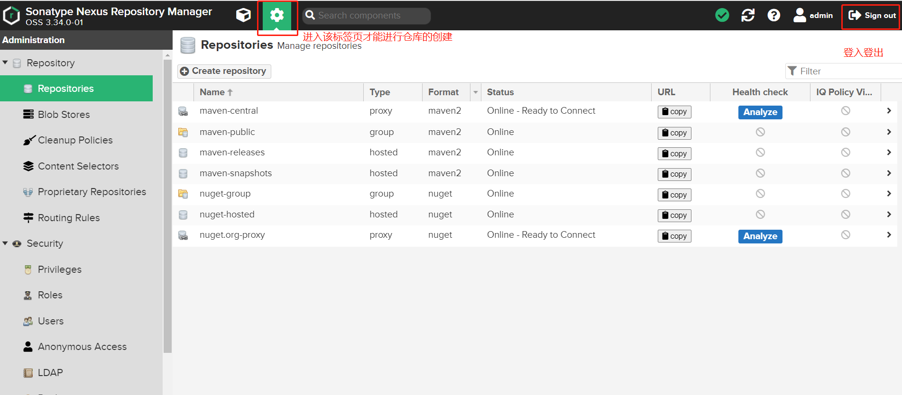

# Nexus

## 一、定义

nexus的全称是Nexus Repository Manager，是Sonatype公司的一个产品。它是一个强大的仓库管理器，极大地简化了内部仓库的维护和外部仓库的访问。我们主要用它来搭建公司内部的maven私服。但是它的功能不仅仅是创建maven私有仓库这么简单，还可以作为nuget、docker、npm、bower、pypi、rubygems、git lfs、yum、go、apt等的私有仓库，功能非常强大。

## 二、部署私服的优点

从项目实际开发来看：

1、一些无法从外部仓库下载的构件，例如内部的项目还能部署到私服上，以便供其他依赖项目使用。

2、为了节省带宽和时间，在局域网内架设一个私有的仓库服务器，用其代理所有外部的远程仓库。当本地Maven项目需要下载构件时，先去私服请求，如果私服没有，则再去远程仓库请求，从远程仓库下载构件后，把构件缓存在私服上。这样，及时暂时没有Internet链接，由于私服已经缓存了大量构件，整个项目还是可以正常使用的。同时，也降低了中央仓库的负荷。

优点归纳：

1.节省外网带宽：大量对中央仓库的重复请求会消耗带宽，利用私服代理外部仓库，可以避免重复的公网下载降低带宽的压力。

2.加速maven的构建：maven通过内网从私服拉取所需构件（私服存在此构件的情况下），获取构件的速度大大加快，从而加快打包构件的速度。

3.部署第三方构件：开发人员自己封装的一些jar包（工具类），可以部署到私服，以便内部开发人员的maven项目使用。

4.提高稳定性：当公网网络不稳定的时候，如果使用远程仓库，maven的构建也会变得不稳定。如果在私服存在所需的构件，即使没有公网，maven的构件也会顺利进行。

5.降低中央仓库的负荷：使用私服，避免了从中央仓库的重复下载，可以减轻中央仓库的负荷。

## 三、如何使用docker来进行Nexus的maven私有仓库的部署与使用

### 安装：

其实Nexus的部署一开始会使用npm包管理工具进行部署，但是这样的部署方式需要配置较多的参数，没有docker来的直接简单，因此，此处直接使用docker进行Nexus的maven私有仓库的部署。

1、在需要部署的linux机器上配置yum阿里源加速，下载并安装docker（可以的话可以配置docker阿里源加速，不过此处速度已经够了）

2、建立数据储存文件夹，用于docker容器数据挂载

```shell
##建立数据存放文件夹，用于docker中nexus的数据与本地物理机映射
mkdir -p /usr/local/nexus3/nexus-data
##更改权限
chmod 777 /usr/local/nexus3/nexus-data
```

3、安装最新版本的nexus并运行容器，记得打开防火墙端口以及安全组策略，否则将无法进行访问

```shell
docker run -d -p 8081:8081 --name docker-nexus3 -v /usr/local/nexus3/nexus-data:/nexus-data sonatype/nexus3
```

4、安装完成，使用linux的ip地址和指定的端口号进行访问。登录后才能创建仓库，进行后面的使用操作。注意密码的所在位置在docker容器的数据卷挂载处也可以看到。




