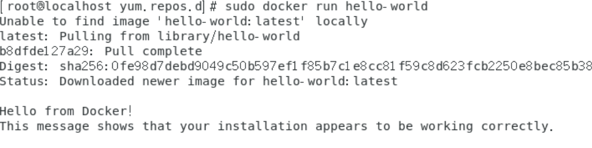
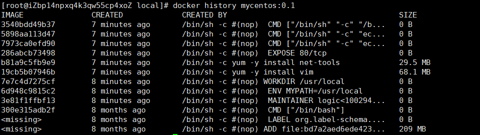
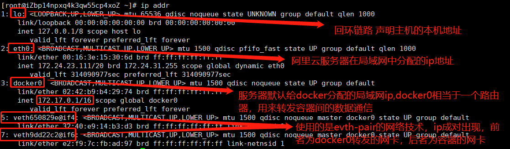
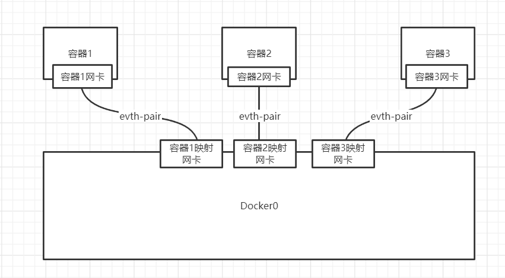
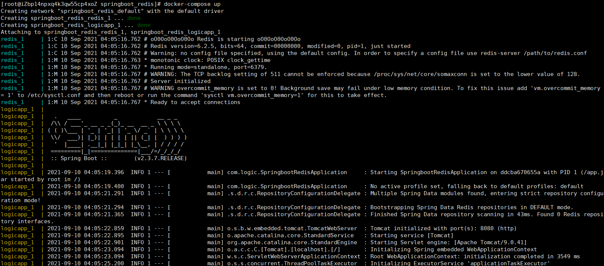
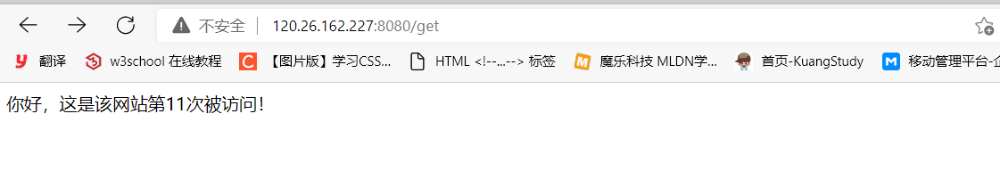
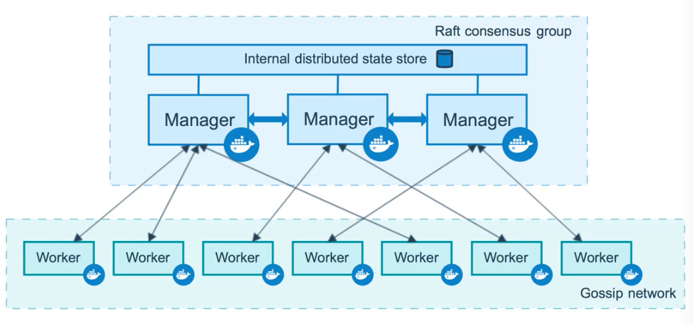

# docker

Docker 是一个开源的应用容器引擎，让开发者可以打包他们的应用以及依赖包到一个可移植的镜像中，然后发布到任何流行的 Linux或Windows 机器上，也可以实现虚拟化，而且比起虚拟机，它极其轻量小巧。容器是完全使用沙箱机制，相互之间不会有任何接口。

## 安装docker

我们一般会使用yum(Shell前端软件包管理器)安装docker。yum十分流行，现在很多项目都会使用yum来安装和管理linux上的软件应用。联网的情况下 我们一般使用```yum install -y yum源```命令安装应用。

- 1、旧版本的Docker被称为docker或docker-engine。如果安装了这些，则卸载它们以及相关的依赖关系。

    ```linux
     sudo yum remove docker \
                    docker-client \
                    docker-client-latest \
                    docker-common \
                    docker-latest \
                    docker-latest-logrotate \
                    docker-logrotate \
                    docker-engine
    ```

- 2、设置 Docker 的仓库并从中安装，以方便安装和升级任务，安装yum-utils包（提供yum-config-manager实用程序）从而设置稳定的仓库。

```linux
sudo yum install -y yum-utils
sudo yum-config-manager --add-repo https://download.docker.com/linux/centos/docker-ce.repo
```

这样就把docker官网的指定的yum仓库docker-ce.repo配置好了，但是docker-ce.repo是墙外的仓库，除非科学上网，否则几乎是无法进行访问的。因此按照官方所言，yum源嘛，稳定快速才是王道嘛，所以我选择阿里源作为我的主仓库哈哈。

### 如何配置阿里的yum源呢？

我们进入```/etc/yum.repos.d```文件夹，发现所谓的yum源，其实本质上就是一个个的repo文件。因此所谓的添加yum源就是添加repo文件。但是通过```yum repolist all```命令(罗列出所有的仓库信息)，我们发现并不是所有的被添加到该目录下的repo文件都会生效。而且启用的多个yum源进行同一应用拉取时还有相关策略，为了简单起见，因此我们干脆把CentOS-Base源替换为阿里源不就完事了！</br>
  1、备份原有的 yum 源文件，防止丢失</br>
  ```mv /etc/yum.repos.d/CentOS-Base.repo /etc/yum.repos.d/CentOS-Base.repo.backup```</br>
  2、下载阿里 yum 源配置文件（CentOS7 先安装wget），并将其存储为CentOS-Base源！</br>
  ```wget -O /etc/yum.repos.d/CentOS-Base.repo http://mirrors.aliyun.com/repo/Centos-7.repo```</br>
  3、yum清除原yum源的所有缓存后，再重新创建包含阿里源的缓存。缓存作用：将服务器上的软件包信息本地缓存,以提高搜索以及安装软件的速度。</br>

  ```linux
yum clean all
yum makecache fast
  ```

实际上我们上面安装的yum-config-manager也同样可以配置阿里源，而且它还可以手动的开启或者关闭yum子源（一个阿里源包含多个子源）：
使用```sudo yum-config-manager --add-repo http://mirrors.aliyun.com/docker-ce/linux/centos/docker-ce.repo```命令添加yum阿里源，通过```sudo yum-config-manager --enable extras```开启阿里源的extras子源，通过```sudo yum-config-manager --disable extras```关闭阿里源的extras子源。由于yum源的多源选择策略，因此只需要阿里源就行了，此处可以通过```yum-config-manager --disable```命令关闭不需要的yum源。

- 3、安装docker引擎和docker容器
    - 1、最新版本的docker  ```sudo yum install docker-ce docker-ce-cli containerd.io```
    - 2、安装指定版本的docker。先使用yum将可用的版本列出并排序：```yum list docker-ce --showduplicates | sort -r```,之后安装一个指定的docker版本：```sudo yum install docker-ce-<VERSION_STRING> docker-ce-cli-<VERSION_STRING> containerd.io```
- 4、启动docker：```sudo systemctl start docker```
- 5、设置开机启动:`sudo systemctl enable docker`
- 6、验证 Docker 是否正确安装：``` sudo docker run hello-world```,成功则输出：
    

## 卸载Docker

```linux
#1、卸载依赖
yum remove docker-ce docker-ce-cli containerd.io

#2、删除资源
rm -rf /var/lib/docker

#/var/lib/docker是docker默认的工作路径
```

## Docker的常用命令

### docker的帮助命令

```shell
docker version  	#显示docker的版本信息
docker info    		#显示docker的系统信息  包括容器和镜像数量
docker 命令 --help   #帮助命令 可以通过此命令进行docker常用命令的查询
```

### 镜像命令

```shell
docker images     #查看本地所有的docker镜像
[root@iZbp14npxq4k3qw55cp4xoZ ~]# docker images
REPOSITORY          TAG                 IMAGE ID            CREATED             SIZE
docker.io/redis     latest              aa4d65e670d6        4 weeks ago         105 MB
docker.io/mysql     latest              c60d96bd2b77        4 weeks ago         514 MB

docker search 镜像名称		#根据镜像的名称搜索指定镜像
docker search mysql --filter=STARS=3000   #搜索收藏数大于3000的mysql镜像
docker pull mysql			#下载mysql最新版本的镜像
docker pull mysql:5.7       #下载mysql5.7版本的镜像
docker rmi -f [镜像名称或者镜像ID]#强制删除指定镜像，如果存在多个不同版本的软件镜像 则只会将当前要删除的镜像的镜像层删除
docker rmi -f 镜像ID 镜像ID 镜像ID #强制删除多个指定镜像
docker rmi -f $(docker images -aq)  #强制删除经过(docker images -aq)查询出的多个镜像ID
```

### 容器命令

只有有了镜像才能创建容器。

#### 新建容器并启动

```shell
docker run [可选的参数] image

参数：
--name="name"  #给运行的容器取名字 用来区分容器
-it  #交互模式运行
-d   #后台方式运行
-p   #给运行的容器指定端口号 如：-p 8080:8080
	-p ip:主机端口:容器端口
	-p 主机端口:容器端口
	-p 容器端口
	容器端口
-P	随机指定端口

测试：通过bash命令的方式启动centos镜像并进入容器
docker run -it centos --name="centos" -p 9090:9090 /bin/bash
```

#### 查看容器

```shell
docker ps [可选参数]

参数：
无参		#展示当前正在运行的容器
-a		#查看所有容器运行的记录
-aq		#查看所有容器运行记录的容器ID
-n=[数字]  #查看指定个数的容器记录
```

#### 退出容器

```shell
exit		#停止容器并退出
ctrl+p+q	#容器不停止就退出
```

#### 删除容器

```shell
docker rm 容器ID				#删除指定的容器
docekr rm -f 容器ID			#强制删除运行中的容器
docker rm 容器ID 容器ID 容器ID #删除多个指定的容器
docker rm $(docker ps -aq)   #根据命令查询出的容器ID删除容器
docker ps -aq | wargs docker rm  #使用管道操作符将查询出的容器ID作为删除容器命令的参数执行
```

#### 启动和停止容器

```shell
docker start 容器ID  #启动容器
docker restart 容器ID  #重启容器
docker stop 容器ID   #停止容器
docker kill 容器ID	#杀掉容器的进程
```

### 常用的其他命令

```shell
docker logs -tf --tail [记录开始条目] [容器号]    #查看指定容器的日志信息
docker top [容器号]	#查看指定容器的进程信息
docker inspect [容器号]   #查看指定容器的详细信息
docker exec -it [容器Id] bashShell   #使用指定的shell命令进入指定的容器内部，并创建一个独立的线程以供操作
docker attach [容器Id] 		#进入指定的容器内部 如果该容器已有运行着的进程 则不会创建一个独立的线程以供操作
docker cp [容器Id]:容器文件路径  [主机路径]  #将容器中的文件拷贝至主机中
```

## 练习

> Docker安装Nginx  
>
> 所谓正向代理即是代理众多客户端访问其他服务器（域外），反向代理即是代理众多服务端给客户端发来的请求访问 类似于zuul

```shell
1、docker搜索Nginx的版本信息  当然，此处也可以使用docker官网进行搜索能看到更加详细的信息docker search nginx
2、拉取最新的nginx镜像docker pull nginx
3、使用docker镜像运行docker容器 将容器的名称命名为nginx 以后台运行 并将3302的外部系统端口映射到nginx容器的80端口上docker run --name=nginx -d -p 3302:80 nginx
# 访问ip:3302的url地址即可访问docker部署的nginx服务
# 在容器路径中查找相关的nginx目录信息whereis nginx
# 在/etc/nginx目录下即可查找到nginx的配置文件 如果每次修改nginx配置文件时都需要进入容器 则很是麻烦 此时可以使用卷挂载技术实现主机和docker文件同步操作
```

nginx如何配置负载均衡，[链接](https://www.cnblogs.com/bluestorm/p/4574688.html)。

```conf
# 设定负载均衡后台服务器列表
upstream backend {#ip_hash;server 192.168.10.100:8080 weight=1 max_fails=2 fail_timeout=30s ; //weight表示权重 是负载均衡的配置项
server 192.168.10.101:8080 weight=1 max_fails=2 fail_timeout=30s ;}
#在server下配置反向代理
#对 / 所有做负载均衡+反向代理
location / {
root /apps/oaapp;
index index.jsp index.html index.htm;、
proxy_pass http://backend;
proxy_redirect off;
# 后端的Web服务器可以通过X-Forwarded-For获取用户真实IP
proxy_set_header Host $host;
proxy_set_header X-Real-IP $remote_addr;
proxy_set_header X-Forwarded-For $proxy_add_x_forwarded_for;
proxy_next_upstream error timeout invalid_header http_500 http_502 http_503 http_504;
}
```

> Docker安装Tomcat

```shell
#以docker的交互模式安装运行Tomcat9.0版本（如果本地没有则会去远程下载），加了--rm参数表示以测试方式运行 一旦容器停止，则会将容器和该容器依赖的镜像全部删除docker run -it --rm tomcat:9.0#测试网页命令curl ip:端口号
```

> Docker安装ES+Kibana

```shell
#安装ElasticSearch指定版本 并做好与外部的端口号映射 以及配置启动ElasticSearch的环境信息 例如JVM的运行内存设置等 因为默认的ElasticSearch启动的占用内存非常大 因此需要小心设置docker run -d --name elasticsearch -p 9200:9200 -p 9300:9300 -e "discovery.type=single-node" -e ES_JAVA_OPTS="-Xms 64m -Xmx 512m" elasticsearch:7.14.0
```

# docker 可视化

- portainer(先使用这个)

docker安装命令

```shell
docker run -p 8088:9000 --restart=always -v /var/run/docker.sock:/var/run/docker.sock --privileged=true protainer/protainer
```

其中的--privileged=true表示portainer被授权的含义 不建议使用可视化docker界面工具。

- Rancher(CI/CD使用)

## Docker分层

Docker为什么这么快呢？这是由于docker内部采用的是联合文件系统，而且采用了文件分层的策略，这样的话如果曾经的一个docker项目下载的有关jdk的层级，那么下一个需要下载jdk层级的docker项目就不用下载该层级了，这样做有着复用，节省空间的优点。当我们启动一个镜像时，其本质是在镜像的上面又加了一层容器层，因此一个镜像才能被多个容器启动。当我们需要打包一个属于自己的镜像时，其本质实质上也是将现在运行的容器层进行打包而已。说是层，其实更可以说是个环绕着原始内容的圈儿可能更好理解。

> 自己根据运行中的docker容器制作一个docker镜像

```shell
#命令和git的原理类似docker commit -m="提交的描述信息" -a="作者信息" [容器的id] 目标的镜像名:[Tags版本号]
```

## 容器数据卷

使用`-v 本地文件路径:容器文件路径`进行容器数据卷的挂载。使用容器数据卷挂载后，只要容器不删除，被设置的容器数据卷映射都会和服务器本地的数据进行双向绑定。

> 使用容器数据卷技术部署mysql服务

通过容器数据卷从而使得mysql数据持久化

```shell
#获取镜像docker pull mysql:5.7#启动mysql容器docker run -d -p 3310:3306 -v /home/mysql/conf:/etc/mysql/conf.d -v /home/mysql/data:/var/lib/mysql -e MYSQL_ROOT_PASSWORD=123456 --name mysql01 mysql:5.7参数：-d 后台运行-p 端口映射-v 容器数据卷挂载-e 环境配置--name 容器名字
```

### 具名挂载和匿名挂载

在使用容器挂载技术的时候，可以有两种方式进行容器内数据的挂载。分别是容器的具名挂载和容器的匿名挂载。

所谓具名挂载，即是在使用`-v`参数进行容器数据挂载时分别写上本机的挂载路径和容器数据要挂载的数据路径，中间使用`:`分割，如果本地的挂载路径没有使用绝对路径的格式书写的话，那么将会挂载到`/var/lib/docker/volumes/xxxx`目录下。否则，将会挂载至指定的绝对路径下。

而匿名挂载，即是在使用`-v`参数进行容器数据挂载时只写上容器内要挂载的数据路径。此时，本地的挂载路径并没有定义，但是docker会在`/var/lib/docker/volumes`目录下随机生成一个匿名目录（由随机数命名）来挂载容器中的数据，即是匿名挂载。

无论是匿名挂载还是具名挂载，在进行容器数据挂载时还可以使用`:ro`或`:rw`的方式声明挂载数据在容器内的读写权限。

通常会使用以下命令查看容器的数据挂载信息：

```shell
# 查看容器的挂载列表信息 包含匿名和具名挂载信息
docker volume ls
# 查看容器挂载的详细信息
docker volume inspect [容器的挂载目录，如果是匿名，会有一个随机数构成的目录]
```

### 初识DockerFile

在日常的开发中，通常会使用dockerFile来自定义生成镜像，之前介绍了一种通过容器生成的方式，现在主要说明下通过dockerFile生成的方式。dockerFile不仅能够生成自定义镜像文件，还能够在自定义镜像文件中定义需要挂载的容器数据卷目录等操作。

dockerfile文件内容：

```shell
# 简单使用DockerFile生成自定义镜像的测试
FROM centos   #自定义镜像的基础镜像文件

VOLUME ["volume01","volume02"]  #此处为匿名挂载容器数据卷

CMD echo "----end----"
CMD /bin/bash    #/bin/bash的作用是因为docker后台必须运行一个进程，否则容器就会退出，在这里表示启动容器后启动bash。
```

运行dockerfile文件生成自定义镜像，最后面的“.”不能忘记。

```shell
docker build -f dockerfile -t [tag 即自定义镜像的名称] .
```

### Docker同步数据卷容器

docker挂载的容器数据卷能够实现共享机制，其本质是继承一个容器数据卷的挂载目录从而实现多个容器之间挂载数据卷的数据共享。例如，如果想让多个mysql容器实现数据共享，则可以使用以下命令实现：

```shell
#原mysql容器 其中定义了mysql容器数据卷的匿名挂载目录docker run -d -p 3310:3306 -v /etc/mysql/conf.d -v /var/lib/mysql -e MYSQL_ROOT_PASSWORD=123456 --name mysql01 mysql:5.7#重新启动一个新的容器 用于继承前面定义的mysql容器的挂载目录，从而实现数据共享 继承数据卷命令：--volumes-fromdocker run -d -P -e MYSQL_ROOT_PASSWORD=123456 --name mysql02 --volumes-from mysql01 mysql:5.7
```

通过这种同步数据卷容器的操作，我们可以实现多个容器间挂载数据的共享。而且就算原容器被删除，其共享的容器数据挂载目录只要存在一个容器依然挂载着数据，则就不会被删除。

### DockerFile介绍

构建步骤：

- 编写一个dockerfile文件
- docker build构建成为一个镜像
- docker run 运行镜像
- docker push 发布镜像（DockerHub、阿里云镜像仓库）

docker是面向开发的，我们以后要发布项目，做镜像，就需要编写dockerfile文件，docker镜像逐渐成为企业交付的标准，必须掌握。

步骤：开发，部署，运维

DockerFile:构建文件，定义一切的步骤，源代码。

DockerImages：通过DockerFile构建生成的镜像，最终发布和运行产品！

Docker容器：容器就是镜像的运行层。

### DockerFile指令

注意，所有的指令皆是大写字母

```shell
FROM   #基础的镜像 一切从此处开始构建MAINTAINER   #镜像是谁写的 作者信息 姓名+邮箱 格式：姓名<邮箱>RUN   #镜像构建的时候需要运行的命令ADD   #向镜像中添加其他docker镜像层 例如添加Tomcat的镜像层WORKDIR   #镜像的工作目录VOLUMN   #挂载的目录EXPOSE   #暴露的端口配置CMD   #CMD是容器的默认的可执行体 如果在docker run没有指定任何的执行命令或者dockerfile里面也没有entrypoint，那么，就会使用cmd指定的默认的执行命令执行ENTRYPOINT   #指定这个容器启动时要运行的命令 和CMD类似 但它是正统地用于定义容器启动以后的执行体，是容器的“入口”。ONBUILD   #当构建一个被继承Dockerfile时就会运行ONBUILD指令，这是一个触发指令COPY   #类似于ADD，将我们的文件拷贝至镜像中ENV   #构建的时候设置环境变量
```

> 使用DockerFile自定义镜像

```shell
#此处准备自定义一个centos的镜像。因为原始的官方centos镜像是没有vim命令以及ifconfig命令的，因此让我们自定义的centos镜像具有此类功能#1、第一步 创建基于centos的dockerfilevim mycentos-dockerfile#文件内容：FROM centosMAINTAINER logic<1002942328@qq.com>ENV MYPATH /usr/localWORKDIR $MYPATHRUN yum -y install vimRUN yum -y install net-toolsEXPOSE 80CMD echo $MYPATHCMD echo "----END----"CMD /bin/bash#2、通过dockerfile文件构建镜像 dockerfile文件：mycentos-dockerfile  镜像名：mycentos:0.1  "."必须加docker build -f mycentos-dockerfile -t mycentos:0.1 .#3、构建成功Successfully built 3540bdd49b37#4、测试运行 发现vim命令以及ifconfig命令已存在docker run -d mycentos:0.1
```

实际上，我们是可以观察到dockerfile文件构建镜像文件的整个过程的。

```shell
docker history [镜像的ID或完整的镜像名]
```



> Docker创建tomcat自定义镜像

Dockerfile文件的文件名如果命名为Dockerfile，则不需要在build镜像时使用`-f`命令特意指定Dockerfile的文件路径。

通过下载的压缩包添加镜像层依赖：

```shell
#1、下载linux版本的jdk以及tomcat版本压缩包，并进入放置压缩包的目录中
#2、于该目录下创建Dockerfile文件并编辑
#文件内容：
FROM centos
MAINTAINER logic<1002942328@qq.com>
ENV MYPATH /usr/local
WORKDIR $MYPATH
COPY readme.txt $MYPATH/readme.txt
#拷贝并解压tomcat、jdk
ADD jdk-8ull-linux-x64.tar.gz $MYPATH
ADD apache-tomcat-9.0.22.tar.gz $MYPATH
RUN yum -y install vim
ENV JAVA_HOME $MYPATH/jdk1.8.0_11
ENV CLASSPATH $JAVA_HOME/lib/dt.jar:$JAVA_HOME/lib/tools.jar  #使用":"隔开各个环境变量
ENV CATALINA_HOME $MYPATH/apache-tomcat-9.0.22
ENV CATALINA_BASH $MYPATH/apache-tomcat-9.0.22
ENV PATH $PATH:$JAVA_HOME/bin:$CATALINA_HOME/lib:$CATALINA_HOME/bin
EXPOSE 8080
CMD $MYPATH/apache-tomcat-9.0.22/bin/startup.sh && tail -F $MYPATH/apache-tomcat-9.0.22/bin/logs/catalina.out   #-F比-f对于日志的输出容错更高 它会根据文件名进行追踪，并保持重试，即该文件被删除或改名后，如果再次创建相同的文件名，会继续追踪
```

### Docker发布镜像至远程

发布至[dockerhub](https://hub.docker.com/)：

```shell
#1、先注册dockerhub账号
#2、在linux服务器上登录dockerhub
docker login -u [用户名] -p [密码]
#3、为了防止dockerhub上存在相同名称的docker镜像 因此需要对要发布的镜像打上自定义的标签 最好带上版本号
docker tag [镜像ID或镜像名称] [自定义标签名称]
#4、将镜像发布至dockerhub
docker push [自定义标签名称]
```

发布至[阿里云](https://cr.console.aliyun.com/cn-hangzhou/instance/repositories)：

```shell
#1、创建镜像的命名空间#2、根据镜像的命名空间创建镜像仓库#3、 登录阿里云Docker Registry 用于登录的用户名为阿里云账号全名，密码为开通服务时设置的密码。可以在访问凭证页面修改凭证密码。$ docker login --username=zcm**** registry.cn-hangzhou.aliyuncs.com#4、 从Registry中拉取镜像$ docker pull registry.cn-hangzhou.aliyuncs.com/bilibili-logic/logic-of-zc:[镜像版本号]#5、 将镜像推送到Registry 阿里云仓库$ docker login --username=zcm**** registry.cn-hangzhou.aliyuncs.com$ docker tag [ImageId] registry.cn-hangzhou.aliyuncs.com/bilibili-logic/logic-of-zc:[镜像版本号]$ docker push registry.cn-hangzhou.aliyuncs.com/bilibili-logic/logic-of-zc:[镜像版本号]#6、示例#使用"docker tag"命令重命名镜像，并将它通过专有网络地址推送至Registry。$ docker imagesREPOSITORY          			 TAG               IMAGE ID            CREATED             VIRTUAL SIZEregistry.aliyuncs.com/acs/agent  0.7-dfb6816      37bb9c63c8b2        7 days ago             37.89 MB$ docker tag 37bb9c63c8b2 registry-vpc.cn-hangzhou.aliyuncs.com/acs/agent:0.7-dfb6816#使用 "docker push" 命令将该镜像推送至远程。$ docker push registry-vpc.cn-hangzhou.aliyuncs.com/acs/agent:0.7-dfb6816
```

## Docker网络

在docker中，可以使用`ip addr`命令查看所有的网络信息。



使用docker的交互模式可以在容器间校验容器的网络信息。

```shell
#1、查看tomcat容器的IP信息 其中可以查看到容器被分配的具体Ip地址docker run -it tomcat ip addr#2、检验本机（host）能否ping通tomcat容器ping [交互模式中查看到的容器具体IP]#3、检验tomcat容器间能否相互ping通docker run -it tomcat ping [tomcat02的ip地址]
```

通过这些命令检验可发现，docker容器间的通信是通过docker0网卡搭建网桥进行路由转发通信的。



但是在实际的开发中，由于分布式系统的ip地址很可能会改变，ip是不固定的，因此常常使用服务名来实现各个容器间的通信。其中被淘汰的一种解决方式就是在启动docker容器时使用`--link`命令将容器与容器间建立连接，这样的话就可以通过被连接的容器名进行容器间通信了，其本质是将被连接的容器在`/etc/hosts`文件中添加ip地址的映射。因此启动的容器如果没有被其他容器连接过得话，那么其他容器将无法通过容器名与该容器进行通信，存在较大的弊端，因此不推荐使用。

解决的方案就是舍弃docker0，转而采用自定义网络来协调容器间的通信。

### 自定义网络

所有的容器间的通信技术又被称之为容器互联。

> 查看所有的docker网络

```shell
[root@iZbp14npxq4k3qw55cp4xoZ etc]# docker network ls
NETWORK ID          NAME                DRIVER              SCOPE
e641458fd3e5        bridge              bridge              local
418ad9db99e6        host                host                local
7df547f22b21        none                null                local
```

### 网络模式

- bridge           桥接模式 （docker默认，创建自定义网络也是使用bridge模式）
- none              不配置网络
- host               和宿主机共享网络
- container      容器内网络联通！（用的少！局限很大）

在实际的容器启动过程中，实际上默认使用的就是bridge的网络模式，只不过可以不写罢了。

`docker run -d -P --name tomcat01 --net bridge tomcat`

因此，如果我们创建了自定义的网络，则在容器启动时指定网络模式为自定义网络就可以让容器使用自定义网络了。

创建docker自定义网络：

`docker network create --driver bridge --subnet 192.168.0.0/16 --gateway 192.168.0.1 mynet`

此时再进行docker网络的查看就可以发现自定义docker网络mynet已经被创建了

`docker network ls`

将要发布的容器使用我们自定义的docker网络：

`docker run tomcat -d -P --name tomcat01-mynet --net mynet tomcat`

`docker run tomcat -d -P --name tomcat02-mynet --net mynet tomcat`

此时由于是使用的docker的自定义网络，因此可以直接通过容器名即可完成容器间的通信。

自定义docker网络通常会使用在集群中，这样的话可以保证集群是安全且健康的。

### 网络连通

尽管在同一个自定义网络中的容器之间能够通过容器名进行相互通信，然而，如果是在不同的自定义网络之间的容器是不能通过容器名来进行通信的，此时就需要使用docker网络的其他命令来连通网络。

使用`docker network connect [要连接的自定义网络名] [container]`命令来将指定容器与自定义网络连通。通过`docker inspect [自定义网络名称]`我们发现网络连通的本质其实就是在自定义网络中同时定义了该容器的网络配置，即一个容器不仅在自己的自定义网络中有ip，且同时在要连通的自定义网络中也有分配该容器的ip。即一个容器同时存在两个网段的ip，这样的话，该容器就能和另一个自定义容器实现网络连通了。注意，此种方式仅仅是一个自定义网络中的某个配制的容器与另一个自定义网络中的容器能进行网络连通，而不是自定义网络与自定义网络间的容器都可以进行网络连通。

> 部署redis集群

1、创建自己的redis集群网络，此后创建的redis容器将使用该网络

`docker network create --driver bridge --subnet 192.168.0.0/16 --gateway 192.168.0.1 mynet`

2、创建redis集群的配置文件

```shell
for port in $(seq 1 6); do mkdir -p /mydata/redis/node-${port}/conf; 
touch /mydata/redis/node-${port}/conf/redis.conf
cat << EOF > /mydata/redis/node-${port}/conf/redis.conf
port 6379
bind 0.0.0.0
protected-mode no
cluster-enabled yes
cluster-config-file nodes.conf
cluster-node-timeout 5000
cluster-announce-ip 192.168.0.1${port}
cluster-announce-port 6379
cluster-announce-bus-port 16379
appendonly yes
EOF
done
```

3、根据批量创建的redis配置文件以及自定义的redis网络进行批量redis容器启动，但是此处有个问题，那就是批量启动的redis容器在进行集群搭建时很可能会出现`Waiting for the cluster to join....`一直等待的情况，原因未知。此时可以手动启动各个redis容器，很麻烦，但是可以解决该问题。

```shell
for port in `seq 1 6`; do docker run -p 637${port}:6379 -p 1637${port}:16379 --name redis-${port} -v /mydata/redis/node-${port}/data:/data -v /mydata/redis/node-1/conf/redis.conf:/etc/redis/redis.conf -d --net mynet --ip 192.168.0.1${port} redis redis-server /etc/redis/redis.conf; done
```

手动启动某个redis容器示例：

```shell
docker run -p 6371:6379 -p 16371:16379 --name redis-1 -v /mydata/redis/node-1/data:/data -v /mydata/redis/node-1/conf/redis.conf:/etc/redis/redis.conf -d --net mynet --ip 192.168.0.11 redis redis-server /etc/redis/redis.conf
```

4、通过命令`docker exec -it [容器名] /bin/bash`进入某个redis容器中,搭建集群，在提示命令中输入`yes`向下执行：

```shell
root@dfcb4cc8be99:/data# redis-cli --cluster create 192.168.0.11:6379 192.168.0.12:6379 192.168.0.13:6379 192.168.0.14:6379 192.168.0.15:6379 192.168.0.16:6379 --cluster-replicas 1
>>> Performing hash slots allocation on 6 nodes...
Master[0] -> Slots 0 - 5460
Master[1] -> Slots 5461 - 10922
Master[2] -> Slots 10923 - 16383
Adding replica 192.168.0.15:6379 to 192.168.0.11:6379
Adding replica 192.168.0.16:6379 to 192.168.0.12:6379
Adding replica 192.168.0.14:6379 to 192.168.0.13:6379
M: 8feb04d796cfb6b4060ba3d99e94a2bd90d5424f 192.168.0.11:6379
   slots:[0-5460] (5461 slots) master
M: c20c00cd3fb4df5c4f2c1df9926c1f05fcb4250e 192.168.0.12:6379
   slots:[5461-10922] (5462 slots) master
M: 874e0fda206d06e3a1e2e7cd33be4e55c9f7fedb 192.168.0.13:6379
   slots:[10923-16383] (5461 slots) master
S: 1a02aaff623c91022cbf432f41847939221f6814 192.168.0.14:6379
   replicates 874e0fda206d06e3a1e2e7cd33be4e55c9f7fedb
S: 98bd992fbd46c170760884a450cfa984e3f7b94c 192.168.0.15:6379
   replicates 8feb04d796cfb6b4060ba3d99e94a2bd90d5424f
S: 50a428c09a9469bee98c25056b4cf8dcc3631034 192.168.0.16:6379
   replicates c20c00cd3fb4df5c4f2c1df9926c1f05fcb4250e
Can I set the above configuration? (type 'yes' to accept): yes
>>> Nodes configuration updated
>>> Assign a different config epoch to each node
>>> Sending CLUSTER MEET messages to join the cluster
Waiting for the cluster to join

>>> Performing Cluster Check (using node 192.168.0.11:6379)
M: 8feb04d796cfb6b4060ba3d99e94a2bd90d5424f 192.168.0.11:6379
   slots:[0-5460] (5461 slots) master
   1 additional replica(s)
S: 1a02aaff623c91022cbf432f41847939221f6814 192.168.0.14:6379
   slots: (0 slots) slave
   replicates 874e0fda206d06e3a1e2e7cd33be4e55c9f7fedb
S: 98bd992fbd46c170760884a450cfa984e3f7b94c 192.168.0.15:6379
   slots: (0 slots) slave
   replicates 8feb04d796cfb6b4060ba3d99e94a2bd90d5424f
M: c20c00cd3fb4df5c4f2c1df9926c1f05fcb4250e 192.168.0.12:6379
   slots:[5461-10922] (5462 slots) master
   1 additional replica(s)
M: 874e0fda206d06e3a1e2e7cd33be4e55c9f7fedb 192.168.0.13:6379
   slots:[10923-16383] (5461 slots) master
   1 additional replica(s)
S: 50a428c09a9469bee98c25056b4cf8dcc3631034 192.168.0.16:6379
   slots: (0 slots) slave
   replicates c20c00cd3fb4df5c4f2c1df9926c1f05fcb4250e
[OK] All nodes agree about slots configuration.
>>> Check for open slots...
>>> Check slots coverage...
[OK] All 16384 slots covered.
```

5、搭建redis集群成功，在该容器下输入`redis-cli -c`进入redis集群，使用`cluster nodes`命令可以很清楚的观察到集群的节点配置以及关系（三主三从）。

```shell
root@dfcb4cc8be99:/data# redis-cli -c 
127.0.0.1:6379> cluster nodes
1a02aaff623c91022cbf432f41847939221f6814 192.168.0.14:6379@16379 slave 874e0fda206d06e3a1e2e7cd33be4e55c9f7fedb 0 1630574286957 3 connected
98bd992fbd46c170760884a450cfa984e3f7b94c 192.168.0.15:6379@16379 slave 8feb04d796cfb6b4060ba3d99e94a2bd90d5424f 0 1630574287561 1 connected
8feb04d796cfb6b4060ba3d99e94a2bd90d5424f 192.168.0.11:6379@16379 myself,master - 0 1630574285000 1 connected 0-5460
c20c00cd3fb4df5c4f2c1df9926c1f05fcb4250e 192.168.0.12:6379@16379 master - 0 1630574287000 2 connected 5461-10922
874e0fda206d06e3a1e2e7cd33be4e55c9f7fedb 192.168.0.13:6379@16379 master - 0 1630574286000 3 connected 10923-16383
50a428c09a9469bee98c25056b4cf8dcc3631034 192.168.0.16:6379@16379 slave c20c00cd3fb4df5c4f2c1df9926c1f05fcb4250e 0 1630574286555 2 connected
```

6、之后就可以进行正常的redis集群数据访问了。

> Docker发布springboot镜像

1、编写一个简单的springboot项目，将项目传送到linux服务器上。

2、进入服务器的项目所在目录，新建一个Dockerfile的文件，内容如下：

```shell
FROM java:8
COPY *.jar /app.jar
CMD ["--server.port=8080"]
EXPOSE 8080
ENTRYPOINT ["java","-jar","/app.jar"]
```

3、将项目打包成镜像

`docker build -t logicProject:0.1 .`

4、获得打包好的镜像`logicProject:0.1`，使用`docker run`命令即可直接运行自定义镜像

## Docker Compose

Compose 是用于定义和运行多容器 Docker 应用程序的工具。通过 Compose，您可以使用 YML 文件来配置应用程序需要的所有服务。然后，使用一个命令，就可以从 YML 文件配置中创建并启动所有服务。

### 安装docker compose

1、下载docker compose，此处采用的是国内的镜像，国外的异常慢。

```shell
curl -L https://get.daocloud.io/docker/compose/releases/download/1.24.0/docker-compose-`uname -s`-`uname -m` > /usr/local/bin/docker-compose
```

2、设置下载的docker compose文件夹有可运行的权限

```shell
chmod +x /usr/local/bin/docker-compose
```

3、确认docker-compose的安装版本信息

```shell
docker-compose version
```

### 如何创建docker-compose应用

1、准备好一个应用程序，可以是python文件，也可以是java程序

2、准备DockerFile文件从而配置启动程序容器的参数，若没有需要配置的容器参数则可以不写该文件

3、准备一个Docker-compose yaml文件 （定义整个docker服务，需要的环境。如web、redis）完整的上线服务！一般而言一个服务会根据yaml文件会同时启动多个docker容器，因此，如若此时的docker容器使用的镜像是远程镜像，不需要根据本地的程序以及Dockerfile文件指定生成，则可以在yaml的image字段中直接指定使用而不需要先通过build字段生成镜像后再使用。

4、通过`docker-compose up`命令启动compose项目，通过`docker-compose stop`命令停止容器，通过`docker-compose down`命令会在停止容器的同时删除已停止的容器以及该compose服务创建的网络。

#### 启动compose服务的流程

1、创建该compose服务的网络

2、执行docker-compose的yaml文件

3、启动compose服务

#### compose的编排规则

```shell
# 3层
# 第一层
# compose版本
version: ''
 
# 第二层 
# 服务
service:
    服务1：web服务
        # 服务配置(docker容器配置)
        images
        build
        network
        .....
    服务2：redis服务
# 第三层
# 其他配置 网络/全局规则
volumes:
network:
configs:
```

```shell
# 在service中 项目是有顺序的所以说得需要加入依赖
 depends_on:
    - dolphinscheduler-api 
```

> 示例：redis+springboot+docker-compose实现访问自增

1、创建一个基于springboot的redis自增项目

关键代码：

```java
@RequestMapping("get")
public String get() {
	Long views = redisTemplate.opsForValue().increment("views");
	return "你好，这是该网站第" + views + "次被访问！";
}
```

```yml
spring:
  application:
    name: springboot-redis
  redis:
    host: redis   #此处可以直接设置主机名称是因为redis容器与java项目容器在同一网络下
server:
  port: 8080
```

2、创建Java项目的docker镜像生成文件Dockerfile

```dockerfile
FROM java:8

COPY *.jar /app.jar

CMD ["--server.port=8080"]

EXPOSE 8080

ENTRYPOINT ["java","-jar","/app.jar"]
```

3、根据容器启动的逻辑关系以及容器的启动配置创建docker-compose.yml文件

```yml
version: '3.3'

services:
  logicapp:
    build: .
    image: logicapp
    depends_on:
      - redis
    ports:
      - "8080:8080"
  redis:
    image: "library/redis:alpine"
```

4、将项目文件以及Dockerfile文件和docker-compose.yml文件移动至linux服务器中，使用`docker-compose up` 命令运行该compose服务。使用`docker-compose up -d [yaml文件位置]`可以自定义yaml文件后台启动docker-compose服务。



5、测试项目接口访问



## Docker swarm

Docker Swarm是一种Docker容器集群技术，往往会使用Docker Swarm来搭建小于10台的集群服务。如果大于10台的集群则会使用K8s进行搭建。

使用Docker Swarm前需要保证有着足够数据的服务器用于集群的搭建。因此需要使用阿里云这样的云服务器平台购买按量付费的服务器用于swarm的实际操作训练。并且记得用完后销毁实例，否则将会一直从账户中扣钱。

由于Docker swarm是基于Docker的，因此在购买完成后需要统一安装docker环境。并且在购买集群服务器时需要保证所有的服务器在同一私网中，这点尤为重要。

docker swarm的工作模式：



从图中我们可以看出，Docker Swarm中包含有Manager和Worker两种swarm节点，很明显，Manager节点管理着Worker节点。

### Docker Swarm集群搭建

1、首先需要将该swarm集群初始化，从而允许各个集群节点的加入。一般情况下会在创建时根据某个节点的私网地址创建swarm集群，从而保证创建的集群开始时既有一个Manager节点。

```shell
[root@iZbp1cw897puuscwxogjixZ ~]# docker swarm init --advertise-addr 192.168.0.147
Swarm initialized: current node (oztqzci9b3b32d4r45xzx9cok) is now a manager.

To add a worker to this swarm, run the following command:

    docker swarm join --token SWMTKN-1-3pn4bmj59nsgeg24ma39fk0a113sgf45ue00fmo433qydi5k8u-8ic9k9l54ely06j9if0hd1dua 192.168.0.147:2377

To add a manager to this swarm, run 'docker swarm join-token manager' and follow the instructions.

To add a worker to this swarm, run 'docker swarm join-token worker' and follow the instructions.
```

通过上述结果我们明白，可以使用不同的方式为该集群分别添加Manager节点以及Worker节点。

2、创建完成后使用以下命令验证创建结果：

```shell
[root@iZbp1cw897puuscwxogjixZ ~]# docker node ls
ID      					 HOSTNAME   STATUS    AVAILABILITY   MANAGER STATUS   ENGINE VERSION
oztqzci9b3b32d4r45xzx9cok *   swarm01   Ready     Active         Leader           20.10.8
```

3、通过`docker swarm join-token manager`和`docker swarm join-token worker`命令分别生成manager节点和worker节点的加入语句，使用类似于`docker swarm join --token SWMTKN-1-3pn4bmj59nsgeg24ma39fk0a113sgf45ue00fmo433qydi5k8u-8ic9k9l54ely06j9if0hd1dua 192.168.0.147:2377`的格式将节点加入swarm集群。完成后查看docker节点列表。

```shell
[root@swarm01 ~]# docker node ls
ID                            HOSTNAME   STATUS    AVAILABILITY   MANAGER STATUS   ENGINE VERSION
oztqzci9b3b32d4r45xzx9cok *   swarm01    Ready     Active         Leader           20.10.8
xsptvw847355b2agel5mpol4w     swarm02    Ready     Active                          20.10.8
sendoi1bvgf9dewqf7ldwu9p2     swarm03    Ready     Active                          20.10.8
t150sia8jrb4z7o7ef60ie09c     swarm04    Ready     Active         Reachable        20.10.8
```

### Raft协议

简单来说，Raft协议即是指必须要使主节点存活数量超过主节点总数量的一半才允许使用，保证高可用，类似于zookeeper的选举机制。

因此，上述的双主双从的集群节点配置模式是不可取的，至少集群中拥有3个主节点才可以。

可以通过`systemctl stop docker`和`docker swarm leave`命令模拟集群节点故障从而测试Raft协议的异常情况。以下是将工作节点swarm03脱离swarm集群的结果。

```shell
[root@swarm01 ~]# docker node ls
ID                            HOSTNAME   STATUS    AVAILABILITY   MANAGER STATUS   ENGINE VERSION
oztqzci9b3b32d4r45xzx9cok *   swarm01    Ready     Active         Leader           20.10.8
xsptvw847355b2agel5mpol4w     swarm02    Ready     Active                          20.10.8
sendoi1bvgf9dewqf7ldwu9p2     swarm03    Down      Active                          20.10.8
t150sia8jrb4z7o7ef60ie09c     swarm04    Ready     Active         Reachable        20.10.8
```

### Swarm集群弹性创建服务

之前，我们有两种可以启动docker容器从而提供服务的方式，分别是最原始的`docker run`命令以及`docker-compose up `命令。但是，这两种命令都是在同一个服务器上运行的命令。都可以称之为**单机模式**的docker，而如果使用docker swarm搭建后的集群进行服务创建，则可以将多个服务同时部署在不同的服务器上，保证集群的可用性，并能弹性的扩缩容服务的大小，将服务在各个节点服务器上均匀分布配置，从而实现**集群弹性创建服务**。

> swarm集群搭建nginx服务

1、使用`docker service`命令创建nginx服务

```shell
docker service create -p 8080:80 --name my-nginx nginx
```

2、在管理节点（注意不是工作节点）上查看指定服务信息

```shell
[root@swarm01 ~]# docker ps
CONTAINER ID   IMAGE          COMMAND                  CREATED              STATUS              PORTS     NAMES
bae3ad2e1ee9   nginx:latest   "/docker-entrypoint.…"   About a minute ago   Up About a minute   80/tcp    my-nginx.1.qmsj3bk4tzaaux9gedrmlu7wh
```

3、也可以使用`docker inspect`命令查看更加详细的服务信息

4、进入集群的其他节点通过`docker ps`命令我们发现，只有一个节点上部署了nginx的容器服务，但是通过所有的集群节点ip都可以访问到该节点上的nginx服务，这说明了服务在集群上的一体性。其实原理很简单，主要是因为swarm采用的是**ingress**网络模式(通过`docker inspect [服务名]`可以发现**"PublishMode": "ingress"**)，一种特殊的**overlay**网络，它具有负载均衡的功能。如果使用`docker network inspect ingress`命令查看该网络，则我们将会发现该网络中绑定了集群中所有节点的私网ip，因此可以实现服务在集群上的一体性。

```shell
"Peers": [
            {
                "Name": "02632eae79ad",
                "IP": "192.168.0.147"
            },
            {
                "Name": "7ff95bb2ac2f",
                "IP": "192.168.0.149"
            },
            {
                "Name": "e7f40ab9dbd3",
                "IP": "192.168.0.150"
            },
            {
                "Name": "0cefe4e08cdc",
                "IP": "192.168.0.148"
            }
        ]
```

5、可以弹性扩缩容服务，分别有两种方式：

- 在主节点上使用`docker service update my-nginx --replicas 4`命令可以弹性扩容为4个nginx服务

```shell
[root@swarm01 ~]# docker service update my-nginx --replicas 4
my-nginx
overall progress: 4 out of 4 tasks 
1/4: running   [==================================================>] 
2/4: running   [==================================================>] 
3/4: running   [==================================================>] 
4/4: running   [==================================================>] 
verify: Service converged 
```

- 在主节点上使用`docker service scale my-nginx=6`命令可以弹性扩容为6个nginx服务

```shell
[root@swarm01 ~]# docker service scale my-nginx=6
my-nginx scaled to 6
overall progress: 6 out of 6 tasks 
1/6: running   [==================================================>] 
2/6: running   [==================================================>] 
3/6: running   [==================================================>] 
4/6: running   [==================================================>] 
5/6: running   [==================================================>] 
6/6: running   [==================================================>] 
verify: Service converged 
```

两种方式效果一样，差别不大。

6、如果想在服务使用完成后销毁服务，则可以使用`docker service rm my-nginx `命令销毁**my-nginx**服务。

## Docker stack

Docker stack是Docker compose的升级版本，和Docker compose不同的是，Docker stack支持按照集群的方式编排docker服务。

此处参照文章[链接](https://blog.csdn.net/weixin_33849942/article/details/92349720)。

> 编排命令说明：

version：docker编排任务的版本，参考官方说明，这个不是自己定义的，，，，

image：指定镜像

volumes：挂载日志目录，如果宿主机上文件夹不存，启动时会报错：invalid mount config for type…

ports：映射端口号，注意多个service的端口号不要相同

replicas：镜像数

placement.constraints：指定工作节点，对应的是：[node.role == manager]

> 编排文件示例：

```shell
version: '3'
services:
  test01:
    image: 192.168.20.201:5000/ipweb
    volumes:
      - /home/log:/home/log
    networks:
      - central
    ports: 
      - 8088:8080
    deploy:
      replicas: 3
      placement:
        constraints: [node.role == worker]
        
  test02:
    image: registry.cn-hangzhou.aliyuncs.com/goldleaf/test:ipweb
    volumes:
      - /home/log:/home/log
    networks:
      - central
    ports:
      - 8089:8080
    deploy:
      replicas: 3
      placement:
        constraints: [node.role == worker]
 
networks:
  central:
    external:
      name: central
```

> docker stack操作命令

1、启动

```shell
docker stack deploy -c docker-stack.yml gh
```

2、查看所有stack

```shell
docker stack ls
```

3、查看某一stack中的所有服务

```shell
docker stack services gh
```
