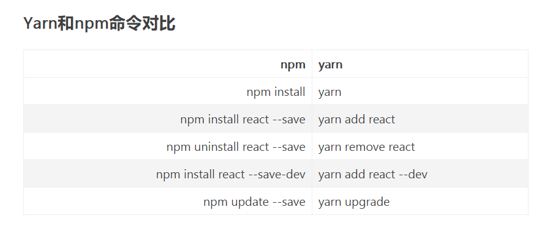

# NPM学习

## npm定义

npm是node.js中的一个包管理器(第三方插件) 类似于Java中maven的功能，用来管理前端的依赖模块，类似的包管理器还有cnpm(国内),yarn(更加先进 关系类比于maven和gradle)


## npm 切换成淘宝镜像的几种方式

- 1、临时使用

``` js
npm --registry https://registry.npm.taobao.org install express
```

- 2、持久使用

``` js
npm config set registry https://registry.npm.taobao.org
```

- 配置后可通过下面方式来验证是否成功

``` js
npm config get registry
```

- 3、通过cnpm使用

``` js
npm install -g cnpm --registry=https://registry.npm.taobao.org
```

- 之后的命令更改为：

``` js
cnpm install express
```

## 初始化vue项目失败

vue init webpack projectName 时一直显示是downloading template 程序被卡死 这是由于连接的是国外的网址，被墙了。这有两种解决方案：

- 1、找到一个畅通访问国外github的代理地址,在C:\Windows\System32\drivers\etc的host文件中添加**github.com**的
代理网站信息，host文件中添加如下信息：

```host
192.30.253.112[代理网址信息] github.com
151.101.88.249 github.global.ssl.fastly.net
```

- 2、安装好chromedriver，将下载地址配置到国内镜像上

```npm
npm config set chromedriver_cdnurl https://npm.taobao.org/mirrors/chromedriver
```

执行完成后，发现系统在“c:/users/用户名”目录下面，创建了一个.npmrc文件，里面加上了如下一句：

```.npmrc
chromedriver_cdnurl=https://npm.taobao.org/mirrors/chromedriver
```

然后再执行vue init webpack projectName，就没有报任何错误了。
