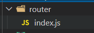

# vue-router

## 说明

vue是完全专注于视图层的框架，而vue-router是为了弥补vue的转发重定向功能而贴身定制的路由工具，vue可以不依托于vue-router而存在，但vue-router必须依附于vue才能真正展现其价值所在。
vue是完全组件化的，因此所谓的路由其实就是组件间的切换以及嵌套形成不同的页面的操作处理

## 准备操作

- 1、安装vue-router

```shell
npm i vue-router -s 
```

- 2、新建一个router文件夹用于管理router 并创建一个index.js文件用于作为操作路由的入口：



为什么要创建一个index.js而不是other.js呢?这是由于node中的require(要引入的路径)方法的加载机制导致的，它会默认加载文件夹下以index为文件名(后缀为.js .html .css[貌似])的文件,详情加载机制见阮一峰的讲解：<https://www.ruanyifeng.com/blog/2015/05/require.html>

- 3、在index.js中引入vue-router的依赖 使用Vue调用它(它是一个工具模块，Vue使用模块需要注明！当然，所有的模块也可以在vue的main.js入口模块中统一注明，便于管理) 并写好路由配置

```index.js
import Route  from "vue-router";
import Vue from "vue";

Vue.use(Route)

const router = new Route({
  // 路由模式：hash 路径带# history路径不带# 很干净 
  mode: 'history',
  routes: [{
    path: "/",
    redirect: "/login"
  }, {
    path: "/login",
    component: login,
    alias: ['/manage', '/administer', '/administrate']
  }, {
    path: "/main",
    // 旧
    // component:main,
    // 新
    component: resolve => require(['../components/main'], resolve),
    children: [
      // 当使用“this.$router.push({name:路由名,params:{参数对象}})”进行跳转时必须使用到路由的名字，否则无法传参
      //如果使用的是router-link 的to属性传值 则需要使用:to="{name:路由名,params:{参数对象}}"绑定
      //当然 还可以使用pros进行传值 前后跳转组件相当于以父子组件的传值方式进行路由参数接收 只需要在跳转后的路由上加上 props:true 的配置即可在该路由跳转的组件上通过props属性进行路由参数接收
      {
        path: "/select01",
        name: "select01",
        component: resolve => require(['../components/select01'], resolve)
      },
      {
        path: "/select02",
        name: "select02",
        // 路由开启使用pros进行传值
        props: true,
        component: resolve => require(['../components/select02'], resolve)
      }
    ]
  }, {
    //404错误页面 所有无法匹配的页面都会跳转至此
    path: "*",
    component: resolve => require(['../components/NotFound'], resolve),
  }, {
    //提醒用户登录界面
    path: "/pleaseLogin",
    component: resolve => require(['@/components/pleaseLogin'], resolve),
  }]
});
```

最后不要忘记导出它，否则别人无法使用呀！

```index.js
export default router;
```

- 4、后面在需要使用到路由的地方(例如 main.js)中使用它即可，为啥在router文件夹下创建index.js的入口文件，通过加载也能略见端倪的吧，index文件默认加载哈哈。

```main.js
import router from "./router"
```

- 5、当然，我们也能使用vue-router自带的路由钩子函数来创建一个向java过滤器一样的前端路由拦截器，它常常被用于校验用户的登陆。

```index.js
//全局路由拦截转发
router.beforeEach(function (to, from, next) {
  if (!localStorage.getItem("loginName")) {
    if (to.path != "/login" && to.path != "/" && to.path != "/pleaseLogin") {
      return next("/pleaseLogin");
    }
  }
  next();
});
```

顾名思义，to就是要进入的路由，from就是从哪个路由过来，next就是是否拦截路由还是放行。拦截就是next(跳转路径),放行就是直接next()调用就行。需要注意的一点是，next方法还有这样一种使用方式：

```vue component
next(vm=>{vm.getData();})
```

这表示他能够访问并调用vue的视图控制对象中的参数和方法,他常常被用于进行Vue组件路由跳转前的请求数据操作。

没错！Vue的每个component中都有beforeRouteEnter和beforeRouteLeave两个钩子函数,类似于这样：

```vue component
export default{
    props:[],
    name:"hello",
    data(){
        return{
            msg:""
        }
    },
    beforeRouteEnter:(to, from, next)=>{
        console.log("进入路由之前");
    },
    beforeRouteLeave:(to, from, next)=>{
        console.log("离开路由之前");
    }
}
```
